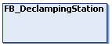

# FB\_DeclampingStation - General Information

## Overview

|  |  |
| --- | --- |
| Type: | Function block |
| Available as of: | V1.0.0.0 |
| Inherits from: | [FB\_CoreStandardStation](StandardStations-F040E185.html#StandardStations-F040E185__PropHiddenFB-3654CE9D) |
| Implements: | – |

## Task

Implementing a station where pairs of carriers are declamped for releasing the transported product.

## Description

A declamping station can be used to unload a product that has been transported by two carriers. After declamping, the carriers move out of the station either as single carriers or as pairs of carriers keeping the gap within the pair.

NOTE: For the correct functioning of the station, the carriers must be paired when they are handed over to the declamping station. In the moving direction, the second (connected) carrier must be behind the first carrier of the pair.

|  |  |
| --- | --- |
|  | For a visual illustration of the declamping process, refer to the [DeclampingStation](../../../../../api/video?lang=en-US&bookKey=646b35560ad3f6dd2f6da6163bc584aef0f38056acad443509b763109147523a&videoName=MCRSLib_DeclampStat.mp4) video sequence. |

## Properties

| Name | Data type | Accessing | Description |
| --- | --- | --- | --- |
| xEnable | BOOL | Write | If xEnable is set to TRUE, the station is enabled (activated). |
| xError | BOOL | Read | Indicates TRUE if an error has been detected. For details, refer to etResult and sResultMsg. |
| xErrorQuit | BOOL | Write | When an error is detected, state machine is going to a WAITING state.  If xErrorQuit is set to TRUE, you leave this WAITING state and reset the error variables. |
| xStationReadyForDeclamping | BOOL | Read | Indicates TRUE if the pairs of carriers are ready for declamping and are waiting for the parameter iq\_xTriggerDeclamping  to become TRUE (see method [CyclicMotionCall](CycMotionCall-EB453A25.html#CycMotionCall-EB453A25) ). |
| xStationReadyForMoveOut | BOOL | Read | Indicates TRUE if the carriers in the station have declamped the product, are ready to move out of the station and are waiting for the parameter iq\_xTriggerMoveOut  to become TRUE (see method [CyclicMotionCall](CycMotionCall-EB453A25.html#CycMotionCall-EB453A25) ). |
| The following properties come from the hidden function block [FB\_CoreStandardStation](StandardStations-F040E185.html#StandardStations-F040E185__PropHiddenFB-3654CE9D): | | | |
| etResult | [ET\_Result](ET_Result-CB42A938.html#ET_Result-CB42A938) | Read | Provides diagnostic and status information as a numeric value.  If xError = FALSE, etResult provides status information. If xError = TRUE, etResult provides diagnostic/error information. |
| ifAdditionalControls | [IF\_ControlStandardStation](CtrlGroupStation-EED16FBE.html#CtrlGroupStation-EED16FBE) | Read | Access to the interface IF\_ControlStandardStation that provides methods for controlling the standard station. |
| sResultMsg | STRING [255] | Read | The event-triggered property sResultMsg provides additional diagnostic and status information as a text message. |
| xActive | BOOL | Read | Indicates TRUE if the function block is enabled. |
| xReady | BOOL | Read | Indicates TRUE if the function block is enabled and no error is active.  Indicates FALSE if the function block is enabled and an error is active or if the function block is disabled. |

EIO0000004643.03