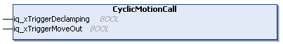

# FB\_DeclampingStation - CyclicMotionCall (Method)

## Overview

|  |  |
| --- | --- |
| Type: | Method |
| Available as of: | V1.0.0.0 |

## Task

Handling the carriers in the declamping station.

## Description

With the method CyclicMotionCall, you can control the carrier movement in the declamping station:  

* the start of the declamping movement when the property xStationReadyForDeclamping indicates that the carriers in the process are in standstill and are ready for declamping
* the start of the leaving movement when the property xStationReadyForMoveOut indicates that the carriers in the process are in standstill and are ready for moving out

The input iq\_xTriggerMoveOut is only evaluated when the property xStationReadyForMoveOut is TRUE.

When the input iq\_xTriggerMoveOut is already set to TRUE or has a rising edge:

* the MoveOut command is triggered
* the carriers are logically handed over
* both signals iq\_xTriggerMoveOut and xStationReadyForMoveOut are reset to FALSE

The method CyclicMotionCall must be called cyclically.

NOTE: Before executing the method CyclicMotionCall, the function block FB\_DeclampingStation must be enabled and the methods [SetMotionParameter](SetMotionPara-EAA1A5CA.html#SetMotionPara-EAA1A5CA), [SetDeclampParameter](SetDeclampPara-EB41579A.html#SetDeclampPara-EB41579A), and [SetStationParameter](SetStationPara-EABD5D80.html#SetStationPara-EABD5D80) must be called at least once.

## Inputs/Outputs

| Input | Data type | Description |
| --- | --- | --- |
| iq\_xTriggerDeclamping | BOOL | Event-triggered Boolean command to start declamping when the parameter xStationReadyForDeclamping is TRUE (see [FB\_DeclampingStation](FBDeclampStation-EE3BBD74.html#FBDeclampStation-EE3BBD74__Properties-EE3BD044)).  The parameter iq\_xTriggerDeclamping is reset to FALSE when the carriers have declamped the product.  When the declamping is done, the parameter xStationReadyForDeclamping is reset to FALSE and the parameter xStationReadyForMoveOut  is set to TRUE. |
| iq\_xTriggerMoveOut | BOOL | Event-triggered Boolean command to start moving the carriers out of the station when the parameter xStationReadyForMoveOut  is TRUE (see [FB\_DeclampingStation](FBDeclampStation-EE3BBD74.html#FBDeclampStation-EE3BBD74__Properties-EE3BD044)). |

EIO0000004643.03