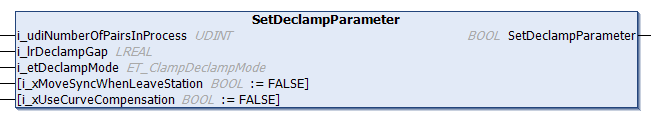

# FB\_DeclampingStation - SetDeclampParameter (Method)

## Overview

|  |  |
| --- | --- |
| Type: | Method |
| Available as of: | V1.0.0.0 |

## Task

Setting the parameters for the declamping of carriers.

## Description

With the method SetDeclampParameter, you can specify the parameters of the declamping station.

NOTE: Before executing the method [CyclicMotionCall](CycMotionCall-EB453A25.html#CycMotionCall-EB453A25), the method SetDeclampParameter must be called at least once.

The return value SetDeclampParameter of type BOOL indicates TRUE if the setting of the parameters has been executed successfully.

## Inputs

| Input | Data type | Description |
| --- | --- | --- |
| i\_udiNumberOfPairsInProcess | UDINT | Specifies the number of carrier pairs that are expected to declamp in the declamping process. |
| i\_lrDeclampGap | LREAL | Specifies the gap inside a pair of carriers after the declamping process. |
| i\_etDeclampMode | [ET\_ClampDeclampMode](ET_ClampDeclMode-EA9786D7.html#ET_ClampDeclMode-EA9786D7) | For defining the mode of declamping: which carrier(s) move(s) during the declamping process. |
| i\_xMoveSyncWhenLeaveStation | BOOL | If i\_xMoveSyncWhenLeaveStation is set to TRUE, the carriers leave the station by pairs that keep the declamping gap defined by the parameter lrDeclampGap. The first carrier of the pair moves out with the move command MoveGapControl and the second carrier moves out with the move command MoveSync.  For more information on the aforementioned move commands, refer to [MoveGapControl](../../../../../api/crossBook?lang=en-US&virtualBookName=MLSLib&topicID=IF_MoveGapControl_5B81ACFA) and [MoveSync](../../../../../api/crossBook?lang=en-US&virtualBookName=MLSLib&topicID=IF_MoveSyncPathFromStandstill_5B839E78) in the Multicarrier library (see EcoStruxure Machine Expert, Multicarrier Library Guide).  If i\_xMoveSyncWhenLeaveStation is set to FALSE, the carriers leave the station as single carriers.  By default, the parameter i\_xMoveSyncWhenLeaveStation is set to FALSE. |
| i\_xUseCurveCompensation | BOOL | If i\_xUseCurveCompensation is set to TRUE, the second carrier of a carrier pair is synchronized to the first carrier of the pair and additionally a curve compensation is executed via the method StartCurveCompensationToCarrierInFront.  As a precondition, the parameter i\_xMoveSyncWhenLeaveStation must be set to TRUE.  For more information on curve compensation with the method StartCurveCompensationToCarrierInFront, refer to the [Multicarrier library](../../../../../api/crossBook?lang=en-US&virtualBookName=MLSLib&topicID=IF_MoveSyncPathFromStandstill_Start_58861273).  NOTE: The ToolPivotPoint settings are not part of the FB\_DeclampingStation and must be set separately. For more information on the ToolPivotPoint settings, refer to the [Multicarrier library](../../../../../api/crossBook?lang=en-US&virtualBookName=MLSLib&topicID=CarrConfigSetPiv_E1EA1065).  If i\_xUseCurveCompensation is set to FALSE, no curve compensation is executed.  By default, the parameter i\_xUseCurveCompensation is set to FALSE. |

## Outputs

The method has no outputs.

EIO0000004643.03