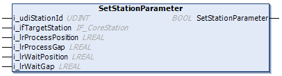

# FB\_DeclampingStation - SetStationParameter (Method)

## Overview

|  |  |
| --- | --- |
| Type: | Method |
| Available as of: | V1.0.0.0 |

## Task

Setting the parameters of the declamping station and specifying the target station to which the carriers will be handed over.

## Description

With the method SetStationParameter, you can specify the following parameters:

* the target station to which the carriers will be transferred
* the process position for declamping as well as the gap between the carriers in process position
* the waiting position and the gap between the carriers in waiting position

For more information on the waiting position and the process position, refer to the general description of [Standard Stations](StandardStations-F040E185.html#StandardStations-F040E185).

NOTE: Before executing the method [CyclicMotionCall](CycMotionCall-EB453A25.html#CycMotionCall-EB453A25), the method SetStationParameter must be called at least once.

The return value SetStationParameter of type BOOL indicates TRUE if a target station has been assigned successfully.

NOTE: Ensure that enough space remains between the process position and the waiting position for executing the declamping movement. The ProcessGap and the WaitGap of the station as well as the RefMinGap of the carriers must be considered.

## Inputs

| Input | Data type | Value range | Unit | Description |
| --- | --- | --- | --- | --- |
| i\_udiStationId | UDINT | – | – | Specifies the ID of the station. |
| i\_ifTargetStation | [IF\_CoreStation](IF_CoreStation-CE432D70.html#IF_CoreStation-CE432D70) | – | – | Input for assigning the target station. |
| i\_lrProcessPosition | LREAL | 0.0 ≤ i\_lrProcessPosition ≤ lrTrackLength(1) | mm | Specifies the process position. |
| i\_lrProcessGap | LREAL | ≥ 0.0 | mm | Specifies the gap between the carrier pairs at the process position. |
| i\_lrWaitPosition | LREAL | 0.0 ≤ i\_lrWaitPosition ≤ lrTrackLength(1) | mm | Specifies the waiting position before the process position. |
| i\_lrWaitGap | LREAL | ≥ 0.0 | mm | Specifies the gap between the carrier pairs at the waiting position. |
| **(1)** For more information on the TrackLength, refer to the [Multicarrier library](../../../../../api/crossBook?lang=en-US&virtualBookName=MLSLib&topicID=FeedbConfig_D619B88F). | | | | |

## Outputs

The method has no outputs.

EIO0000004643.03