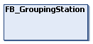

# FB\_GroupingStation - General Information

## Overview

|  |  |
| --- | --- |
| Type: | Function block |
| Available as of: | V1.0.0.0 |
| Inherits from: | [FB\_CoreStandardStation](StandardStations-F040E185.html#StandardStations-F040E185__PropHiddenFB-3654CE9D) |
| Implements: | – |

## Task

Defining groups of carriers.

## Description

With the function block FB\_GroupingStation, you can define:

* the number of groups
* the gaps between the groups

  NOTE: The gap between the groups can be defined for each group separately.
* the number of carriers for each group
* the gaps between the carriers within a group

  NOTE: The gap between the carriers within a group can be defined for each carrier separately.
* the number of groups that leave the station

## Properties

| Name | Data type | Accessing | Description |
| --- | --- | --- | --- |
| ifPattern | IF\_GroupingPattern | Read | Access to the interface IF\_GroupingPattern  that provides methods for creating group patterns (see [IF\_GroupingPattern](IFGroupPattern-EEB73D60.html#IFGroupPattern-EEB73D60)). |
| xEnable | BOOL | Write | If xEnable is set to TRUE, the station is enabled (activated). |
| xError | BOOL | Read | Indicates TRUE if an error has been detected. For details, refer to etResult and sResultMsg. |
| xErrorQuit | BOOL | Write | When an error is detected, state machine is going to a WAITING state.  If xErrorQuit is set to TRUE, you leave this WAITING state and reset the error variables. |
| xStationReadyForMoveOut | BOOL | Read | Indicates TRUE if all carriers have been grouped according to the defined pattern and if all carriers in the groups are in standstill, ready for moving out of the station.  The carrier groups wait that the parameter iq\_xTrigger from the method [CyclicMotionCall](CycMotionCall-EC493E53.html#CycMotionCall-EC493E53) becomes TRUE. |
| The following properties come from the hidden function block [FB\_CoreStandardStation](StandardStations-F040E185.html#StandardStations-F040E185__PropHiddenFB-3654CE9D): | | | |
| etResult | [ET\_Result](ET_Result-CB42A938.html#ET_Result-CB42A938) | Read | Provides diagnostic and status information as a numeric value.  If xError = FALSE, etResult provides status information. If xError = TRUE, etResult provides diagnostic/error information. |
| ifAdditionalControls | [IF\_ControlStandardStation](CtrlGroupStation-EED16FBE.html#CtrlGroupStation-EED16FBE) | Read | Access to the interface IF\_ControlStandardStation that provides methods for controlling the standard station. |
| sResultMsg | STRING [255] | Read | The event-triggered property sResultMsg provides additional diagnostic and status information as a text message. |
| xActive | BOOL | Read | Indicates TRUE if the function block is enabled. |
| xReady | BOOL | Read | Indicates TRUE if the function block is enabled and no error is active.  Indicates FALSE if the function block is enabled and an error is active or if the function block is disabled. |

EIO0000004643.03