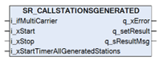
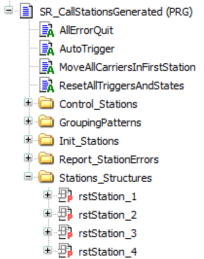

# SR\_CallStationsGenerated (Program)

## Overview

|  |  |
| --- | --- |
| Type: | Subroutine (program) |
| Available as of: | V1.3.0.0 |

## Task

Running generated stations.

## Description

The program SR\_CallStationsGenerated contains function blocks for the stations that you have added in the Multicarrier Configuration editor.

You must call the program cyclically. When you call SR\_CallStationsGenerated, the program initializes the stations, move the carriers to the first station and waits for the start command.

For using, triggering or stopping stations, you can use the visualization of the station, which is generated inside the Visualizations folder, or use the corresponding property of the program SR\_CallStationsGenerated inside the subfolder Stations\_Structures.

NOTE: The program is generated every time you activate the Update > To Code command. The update overwrites user-defined code and deletes actions, methods or properties that may have been added. If you need to modify the code, deactivate the option Create Code for Stations in the project settings (for more information, refer to [Menu Commands Online Help](../../../../../api/crossBook?lang=en-US&virtualBookName=SoMMenu&topicID=TPC_MLS_Config_Tools_Options_D995A499)).

## Inputs

| Input | Data type | Description |
| --- | --- | --- |
| i\_ifCarrier | MCR.IF\_Carrier | Accessing the carrier interface IF\_Carrier from the Multicarrier library.  For more information, refer to the [Multicarrier library](../../../../../api/crossBook?lang=en-US&virtualBookName=MLSLib&topicID=IF_Carrier_E050ABF7). |
| i\_xStart | BOOL | A rising edge of the input starts the program. |
| i\_xStop | BOOL | A rising edge of the input stops the stations and resets the program. |
| i\_xStartTimerAllGeneratedStations | BOOL | Indicates TRUE if the generated stations are triggered automatically by a timer.  Indicates FALSE if the generated stations wait for a user-initiated trigger action. |

## Outputs

| Output | Data type | Description |
| --- | --- | --- |
| q\_xError | BOOL | Indicates TRUE if an error has been detected. For details, refer to q\_etResult and q\_sResultMsg. |
| q\_setResult | STRING [255] | Indicates the first detected error. If q\_xError indicates FALSE, the value of q\_setResult is OK. |
| q\_sResultMsg | STRING [255] | Provides additional diagnostic and status information as a text message. |

## Properties

The properties provide references to the structures defined in the program. The type of properties depends on the type of station. The names and numbers of the structures correspond to the names and numbers of the stations defined in the Multicarrier Configuration editor.

| Name | Data type | Accessing | Description |
| --- | --- | --- | --- |
| rst{Station\_Name} (for example rstStationClamping) | REFERENCE TO [ST\_ClampingStation](STClampStation-E1AD5138.html#STClampStation-E1AD5138) | Read | Reference to the structure ST\_ClampingStation  that is used as input/output of the visualization frame [FR\_ClampingStation](FRClampStation-E1C58FA0.html#FRClampStation-E1C58FA0). |
| rst{Station\_Name} (for example rstStationDeclamping) | REFERENCE TO [ST\_DeclampingStation](STDeclampStation-E1B18BA4.html#STDeclampStation-E1B18BA4) | Read | Reference to the structure ST\_DeclampingStation  that is used as input/output of the visualization frame [FR\_DeclampingStation](FRDeclampStation-E1CBAD12.html). |
| rst{Station\_Name} (for example rstStationGrouping) | REFERENCE TO [ST\_GroupingStation](STGroupStation-E1B22BA2.html#STGroupStation-E1B22BA2) | Read | Reference to the structure ST\_GroupingStation that is used as input/output of the visualization frame [FR\_GroupingStation](FRGroupStation-E1CCDC2E.html#FRGroupStation-E1CCDC2E). |
| rst{Station\_Name} (for example rstUserStation) | REFERENCE TO [ST\_UserStation](STUserStation-E1B71F9C.html#STUserStation-E1B71F9C) | Read | Reference to the structure ST\_UserStation  that is used as input/output of the visualization frame [FR\_UserStation](FRUserStation-E1CD17A3.html#FRUserStation-E1CD17A3). |

## Actions

The program SR\_CallStationsGenerated contains different actions which are not intended to be called outside the program, except for AllErrorQuit and ResetAllTriggersAndStates.

| Name | Description |
| --- | --- |
| AllErrorQuit | Acknowledges the detected errors of the stations and of the program. The action can be used for resetting the detected errors. |
| AutoTrigger | Triggers the stations if the input i\_xStartTimerAllGeneratedStations is TRUE. |
| MoveAllCarriersInFirstStation | Moves the carriers to the first station after the initialization of the stations. |
| ResetAllTriggersAndStates | Resets the generated stations and deletes the corresponding carriers from the program. |
| Control\_{Station\_Name} | Actions defined for each station (except the user station). The actions are called by the program and are used to hold or stop the process, execute the station process and move the carriers out of the station or restart the station, based on the value of the property: rst{Station\_Name}. For more information, refer to [Properties](#SRCallStationsGenerated-E3E2C410__Properties-E3E2E7DD)  NOTE: You can also use the visualization of the corresponding station for sending commands to the program. |
| Init\_{Station\_Name} | Actions defined for each station. They are used to initialize the station, using the parameters defined in the Multicarrier Configuration editor. |
| Init\_StationsAll | Starts the initialization of the stations. |
| ReportError\_{Station\_Name} | Used to report detected errors in the corresponding station to the program. |
| ReportAllErrors | Calls the detected errors report of all stations. |

EIO0000004643.03