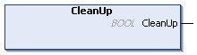

# FB\_UserStation - CleanUp (Method)

## Overview

|  |  |
| --- | --- |
| Type: | Method |
| Available as of: | V1.3.0.0 |

## Task

Resetting the user-defined station.

## Description

With the method CleanUp, you can delete the carriers from the user-defined station and reset the state machine of the station. You can extend the method to include the resetting of internal triggers.

The return value CleanUp of type BOOL indicates TRUE if the clean-up has been done successfully.

NOTE: The method CleanUp is automatically called when the instance of the station function block FB\_UserStation is deleted.

## Inputs

The method has no inputs.

## Outputs

The method has no outputs.

EIO0000004643.03