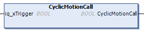

# FB\_UserStation - CyclicMotionCall (Method)

## Overview

|  |  |
| --- | --- |
| Type: | Method |
| Available as of: | V1.3.0.0 |

## Task

Handling the carriers in the user-defined station.

## Description

With the method CyclicMotionCall, you can control the carrier movement in the user-defined station, for example, how many carriers are sent or which move command is used.

When you use the Update > To Code command, code is generated within the method. You can modify or overwrite the generated code according to your requirements.

In the generated code, the property xStationReadyForJob (see [FB\_UserStation](FB_UserStation-Gen-E453134E.html#FB_UserStation-Gen-E453134E)) indicates if the carriers are in standstill and ready for moving out. The input iq\_xTrigger is only evaluated when the property xStationReadyForJob is TRUE.

When the input iq\_xTrigger is already set to TRUE or has a rising edge:

* the MoveOut command is triggered
* the carriers are logically handed over
* both signals iq\_xTrigger and xStationReadyForJob are reset to FALSE

  

The method CyclicMotionCall is called cyclically by the program [SR\_CallStationsGenerated](SRCallStationsGenerated-E3E2C410.html#SRCallStationsGenerated-E3E2C410).

NOTE: Before executing the method CyclicMotionCall, the function block FB\_UserStation must be enabled and the method [SetStationParameter](UserStationSetStationPara-E459035B.html#UserStationSetStationPara-E459035B) must be called at least once.

## Inputs/Outputs

| Input | Data type | Description |
| --- | --- | --- |
| iq\_xTrigger | BOOL | Event-triggered Boolean command to move the carriers out of the station. |

EIO0000004643.03