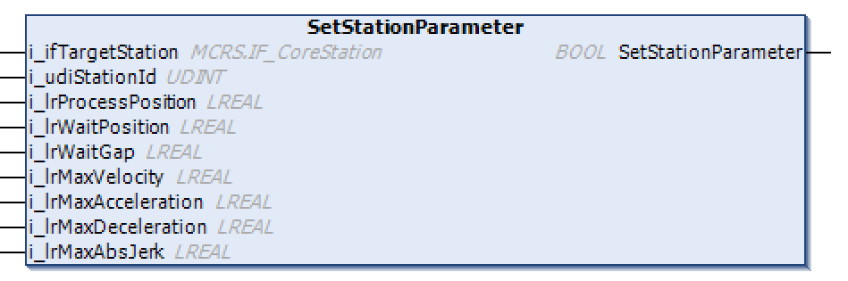

# FB\_UserStation - SetStationParameter (Method)

## Overview

|  |  |
| --- | --- |
| Type: | Method |
| Available as of: | V1.3.0.0 |

## Task

Setting the parameters of the user-defined station.

## Description

With the method SetStationParameter, you can specify the parameters of the station, such as the waiting position or the process position.

The method SetStationParameter is called by the program during the initialization.

NOTE: Before executing the method [CyclicMotionCall](CycMotionCall-F5DE7204.html#CycMotionCall-F5DE7204), the method SetStationParameter must be called at least once.

The return value SetStationParameter of type BOOL indicates TRUE if the parameters have been assigned successfully.

## Inputs

| Input | Data type | Value range | Unit | Description |
| --- | --- | --- | --- | --- |
| i\_ifTargetStation | [IF\_CoreStation](IF_CoreStation-CE432D70.html#IF_CoreStation-CE432D70) | – | – | Input for assigning the target station. |
| i\_udiStationId | UDINT | – | – | Specifies the ID of the station. |
| i\_lrProcessPosition | LREAL | 0.0 ≤ i\_lrProcessPosition ≤ lrTrackLength(1) | mm | Specifies the process position. |
| i\_lrWaitPosition | LREAL | 0.0 ≤ i\_lrWaitPosition ≤ lrTrackLength(1) | mm | Specifies the waiting position before the process position. |
| i\_lrWaitGap | LREAL | ≥ 0.0 | mm | Specifies the gap between the carriers at the waiting position. |
| i\_lrMaxVelocity | LREAL | MCR.GCL.Gc\_lrMinVelocity ≤  i\_lrMaxVelocity ≤  MCR.GCL.Gc\_lrMaxVelocity (2) | mm/s | Specifies the maximum velocity (change of position per time unit). |
| i\_lrMaxAcceleration | LREAL | MCR.GCL.Gc\_lrMinAcceleration ≤  i\_lrMaxAcceleration ≤  MCR.GCL.Gc\_lrMaxAcceleration (2) | mm/s2 | Specifies the maximum acceleration (change of velocity per time unit). |
| i\_lrMaxDeceleration | LREAL | MCR.GCL.Gc\_lrMinDeceleration ≤  i\_lrMaxDeceleration ≤  MCR.GCL.Gc\_lrMaxDeceleration (2) | mm/s2 | Specifies the maximum deceleration (change of velocity per time unit). |
| i\_lrMaxAbsJerk | LREAL | MCR.GCL.Gc\_lrMinAbsJerk ≤  i\_ lrMaxAbsJerk ≤  MCR.GCL.Gc\_lrMaxAbsJerk (2)  AND  i\_ lrMaxAbsJerk ≥  i\_lrMaxAcceleration (3) × 10 (4) | mm/s3 | Specifies the maximum jerk (change of acceleration per time unit). |
| **(1)** For more information on the TrackLength, refer to the [Multicarrier library](../../../../../api/crossBook?lang=en-US&virtualBookName=MLSLib&topicID=FeedbConfig_D619B88F).  **(2)** For more information on the value range, refer to the Global Constants List (GCL) of the [Multicarrier library](../../../../../api/crossBook?lang=en-US&virtualBookName=MLSLib&topicID=GlobalConstantsListGCL_50A754B1).  **(3)** Internally, it is determined which value is greater between i\_lrMaxAcceleration and i\_lrMaxDeceleration. The greater value is used for this calculation.  **(4)** The value of i\_ lrMaxAbsJerk must be greater than or equal to 10 times the value of i\_lrMaxAcceleration (or i\_lrMaxDeceleration, whichever of the two is greater). If this is not the case, it is internally set to a value that is 10 times the value of i\_lrMaxAcceleration (or i\_lrMaxDeceleration). | | | | |

## Outputs

The method has no outputs.

EIO0000004643.03