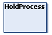

# IF\_ControlStandardStation - HoldProcess (Method)

## Overview

|  |  |
| --- | --- |
| Type: | Method |
| Available as of: | V1.0.0.0 |

## Task

Holding the process of the station.

## Description

With the method HoldProcess, you can hold the process of the station.

* If the station is ready to move out the carriers, a trigger on the method CyclicMotionCall is ignored.
* If not all carriers have arrived at the process position, no further carriers are moved into the process. New carriers arriving must wait at the waiting position.

For reactivating the process, you must call the method [Restart](Restart-EED689B5.html#Restart-EED689B5).

## Inputs

The method has no inputs.

## Outputs

The method has no outputs.

EIO0000004643.03