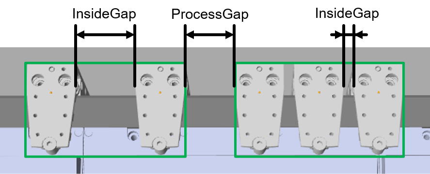
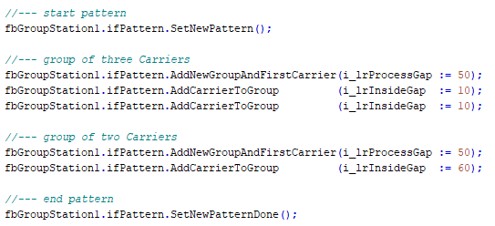
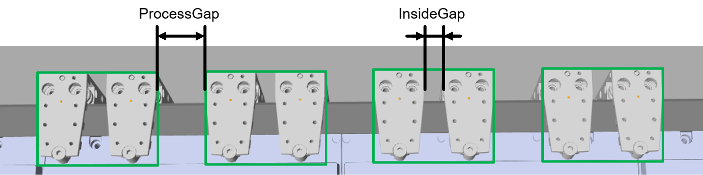
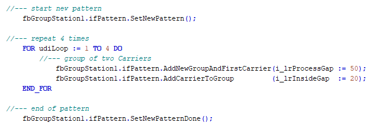

# IF\_GroupingPattern - General Information

## Overview

|  |  |
| --- | --- |
| Type: | Interface |
| Available as of: | V1.0.0.0 |
| Inherits from: | - |

## Task

Interface with methods for creating grouping patterns.

## Description

With the methods of the interface IF\_GroupingPattern, you can create a pattern for the grouping of carriers. This pattern is loaded inside the function block [FB\_GroupingStation](FBGroupStation-EE41D516.html#FBGroupStation-EE41D516).

NOTE: Per station, only one active pattern is possible.

While the grouping process is running, you can prepare a second grouping pattern. This second pattern is automatically loaded when the previous groups have left the process position.

The methods for setting up a new pattern must be called in a certain order. Not all provided pattern methods are mandatory.

The required order for the (mandatory and optional) pattern methods is as follows:

* [SetNewPattern](SetNewPattern-EEC08A09.html#SetNewPattern-EEC08A09) (mandatory)
* [AddNewGroupAndFirstCarrier](AddNewGroup-EEC3AB17.html#AddNewGroup-EEC3AB17) (mandatory)
* [AddCarrierToGroup](AddCarrToGroup-EEC49485.html#AddCarrToGroup-EEC49485) (optional)
* [SetLeavingStationParameters](SetLeavStat-EECDF88F.html#SetLeavStat-EECDF88F) (optional)
* [SetNewPatternDone](SetNewPattDone-EEC1F9A6.html#SetNewPattDone-EEC1F9A6) (mandatory)

By default, the defined carrier groups are sent to the target station with the move command MoveGapControl and the groups use their process gap as the target gap when the group moves to the target station.

If you want to change the default behavior,

* you can use the method [IF\_GroupingPattern - SetLeavingStationParameters](SetLeavStat-EECDF88F.html#SetLeavStat-EECDF88F)
* if the pattern is already loaded, you can use the method [FB\_GroupingStation - ChangeLeavingStationParameters](ChangeLeavStat-EE52AABC.html#ChangeLeavStat-EE52AABC).

## Example: Method Order

The following example demonstrates the order for calling the mandatory methods.

Example pattern:

* two groups of carriers
* the first group consists of three carriers
* the second group consists of two carriers
* the carrier gap within the first group (InsideGap): 10 mm
* the carrier gap within the second group (InsideGap): 60 mm
* the gap between the groups (ProcessGap): 50 mm

Code example 

## Example: Repeating Groups

The following example demonstrates the repetition of carrier groups.

Example :

* four groups of carriers
* two carriers in each group
* ProcessGap between the groups: 50 mm
* InsideGap within the group: 20 mm

Code example 

## Properties

| Name | Data type | Accessing | Description |
| --- | --- | --- | --- |
| rstFeedback | REFERENCE TO [ST\_FeedbackPattern](STFeedbPattern-EEB88A56.html#STFeedbPattern-EEB88A56) | Read | Feedback on the loaded and prepared grouping pattern. |

EIO0000004643.03