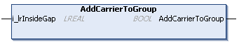

# IF\_GroupingPattern - AddCarrierToGroup (Method)

## Overview

|  |  |
| --- | --- |
| Type: | Method |
| Available as of: | V1.0.0.0 |

## Task

Adding a carrier to a group and setting the gap to the previously added carrier.

## Description

With the method AddCarrierToGroup, you can add a carrier to an existing carrier group and set the gap to the first carrier of the group added by the method [AddNewGroupAndFirstCarrier](AddNewGroup-EEC3AB17.html#AddNewGroup-EEC3AB17) or to the previously added carrier within the group.

The method AddCarrierToGroup is not a mandatory method. It can be called after the method AddNewGroupAndFirstCarrier.

The return value AddCarrierToGroup of type BOOL indicates TRUE if a carrier has been successfully added to the group.

## Inputs

| Input | Data type | Value range | Unit | Description |
| --- | --- | --- | --- | --- |
| i\_lrInsideGap | LREAL | ≥ 0.0 | mm | Specifies the gap to the previously added carrier. |

## Outputs

The method has no outputs.

EIO0000004643.03