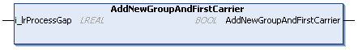

# IF\_GroupingPattern - AddNewGroupAndFirstCarrier (Method)

## Overview

|  |  |
| --- | --- |
| Type: | Method |
| Available as of: | V1.0.0.0 |

## Task

Adding a new group with a first carrier to the group pattern.

## Description

With the method AddNewGroupAndFirstCarrier, you can create a new group with a first carrier. For adding more carriers to the group, you have to call the method [AddCarrierToGroup](AddCarrToGroup-EEC49485.html#AddCarrToGroup-EEC49485).

The method AddNewGroupAndFirstCarrier is a mandatory method for creating a group pattern. When starting to create a new group pattern, you must first call the method SetNewPattern (see [SetNewPattern](SetNewPattern-EEC08A09.html#SetNewPattern-EEC08A09)) and then the method AddNewGroupAndFirstCarrier.

The return value AddNewGroupAndFirstCarrier of type BOOL indicates TRUE if a group with a first carrier has been successfully added to the pattern.

## Inputs

| Input | Data type | Value range | Unit | Description |
| --- | --- | --- | --- | --- |
| i\_lrProcessGap | LREAL | ≥ 0.0 | mm | Specifies the gap to the next carrier in moving direction. |

## Outputs

The method has no outputs.

EIO0000004643.03