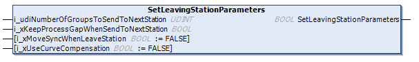

# IF\_GroupingPattern - SetLeavingStationParameters (Method)

## Overview

|  |  |
| --- | --- |
| Type: | Method |
| Available as of: | V1.0.0.0 |

## Task

Setting the parameters for the carrier groups that leave the station.

## Description

The method SetLeavingStationParameters is not a mandatory method. The method can be called when a group pattern has been defined.

By default, the defined carrier groups are sent to the target station with the move command MoveGapControl and the groups use their process gap as the target gap when the group moves to the target station.

If you want to change the default behavior,

* you can use the method SetLeavingStationParameters
* if the pattern is already loaded, you can use the method [FB\_GroupingStation - ChangeLeavingStationParameters](ChangeLeavStat-EE52AABC.html#ChangeLeavStat-EE52AABC).

With the input i\_xKeepProcessGapWhenSendToNextStation, you can define the gap at the waiting position of the target station:  

* When the input i\_xKeepProcessGapWhenSendToNextStation is set to TRUE, the groups keep the process gap from the sending station also for the waiting position of the target station.
* When the input i\_xKeepProcessGapWhenSendToNextStation is set to FALSE, the groups use the waiting gap of the target station.

NOTE: The gap within the carrier groups is not influenced and remains unchanged.

|  |  |
| --- | --- |
|  | For a visual illustration of the input  i\_xKeepProcessGapWhenSendToNextStation, refer to the [KeepGap](../../../../../api/video?lang=en-US&bookKey=646b35560ad3f6dd2f6da6163bc584aef0f38056acad443509b763109147523a&videoName=MCRSLib_KeepGap.mp4) video sequence. |

With the input i\_udiNumberOfGroupsToSendToNextStation, you can send a certain number of groups to the waiting position of the target station.

|  |  |
| --- | --- |
|  | For a visual illustration of the option to send out a certain number of groups, refer to the [NumberOfGroups](../../../../../api/video?lang=en-US&bookKey=646b35560ad3f6dd2f6da6163bc584aef0f38056acad443509b763109147523a&videoName=MCRSLib_NoOfGroups.mp4) video sequence. |

The return value SetLeavingStationParameters of type BOOL indicates TRUE if the parameters for leaving the station have been set successfully.

## Inputs

| Input | Data type | Value range | Description |
| --- | --- | --- | --- |
| i\_udiNumberOfGroupsToSendToNextStation | UDINT | 0 < i\_udiNumberOfGroupsSendToNextStation ≤ number of groups defined by the parameter udiNumberOfGroupsInStation (see structure [ST\_Pattern](ST_Pattern-EECFA3E4.html#ST_Pattern-EECFA3E4)) | The number of carrier groups that will be sent from the process position of the station to the waiting position of the target station. |
| i\_xKeepProcessGapWhenSendToNextStation | BOOL | – | If i\_xKeepProcessGapWhenSendToNextStation is set to TRUE, the process gap of the sending station is used as target gap in the target station.  If i\_xKeepProcessGapWhenSendToNextStation is set to FALSE, the waiting gap of the target station is used as target gap.  For more information on the target gap, refer to the [Multicarrier library](../../../../../api/crossBook?lang=en-US&virtualBookName=MLSLib&topicID=IF_MoveGapControl_5B81ACFA) . |
| i\_xMoveSyncWhenLeaveStation | BOOL | – | If i\_xMoveSyncWhenLeaveStation is set to TRUE, the carriers leave the station as a group with the first carrier of the group moving out with the move command MoveGapControl and the other carriers of the group moving out with the move command MoveSync.  If i\_xMoveSyncWhenLeaveStation is set to FALSE, the carriers of a group move out with the move command MoveGapControl.  For more information on the aforementioned move commands, refer to [MoveGapControl](../../../../../api/crossBook?lang=en-US&virtualBookName=MLSLib&topicID=IF_MoveGapControl_5B81ACFA) and [MoveSync](../../../../../api/crossBook?lang=en-US&virtualBookName=MLSLib&topicID=IF_MoveSyncPathFromStandstill_5B839E78) in the Multicarrier library (see EcoStruxure Machine Expert, Multicarrier Library Guide). |
| i\_xUseCurveCompensation | BOOL | – | If i\_xUseCurveCompensation is set to TRUE, the second carrier of a group is synchronized to the first carrier of the group and additionally a curve compensation is executed via the method StartCurveCompensationToCarrierInFront.  The preconditions for using the input i\_xUseCurveCompensation are as follows:  * The parameter i\_xMoveSyncWhenLeaveStation must be set to TRUE. * The group of carriers consists only of two carriers.  If the group consists of more than two carriers, the input i\_xUseCurveCompensation is ignored.  For more information on curve compensation with the method StartCurveCompensationToCarrierInFront, refer to the [Multicarrier library](../../../../../api/crossBook?lang=en-US&virtualBookName=MLSLib&topicID=IF_MoveSyncPathFromStandstill_Start_58861273).  NOTE: The ToolPivotPoint settings are not part of the FB\_GroupingStation and must be set separately. For more information on the ToolPivotPoint settings, refer to the [Multicarrier library](../../../../../api/crossBook?lang=en-US&virtualBookName=MLSLib&topicID=CarrConfigSetPiv_E1EA1065).  If i\_xUseCurveCompensation is set to FALSE, no curve compensation is executed.  By default, the parameter i\_xUseCurveCompensation is set to FALSE. |

## Outputs

The method has no outputs.

EIO0000004643.03