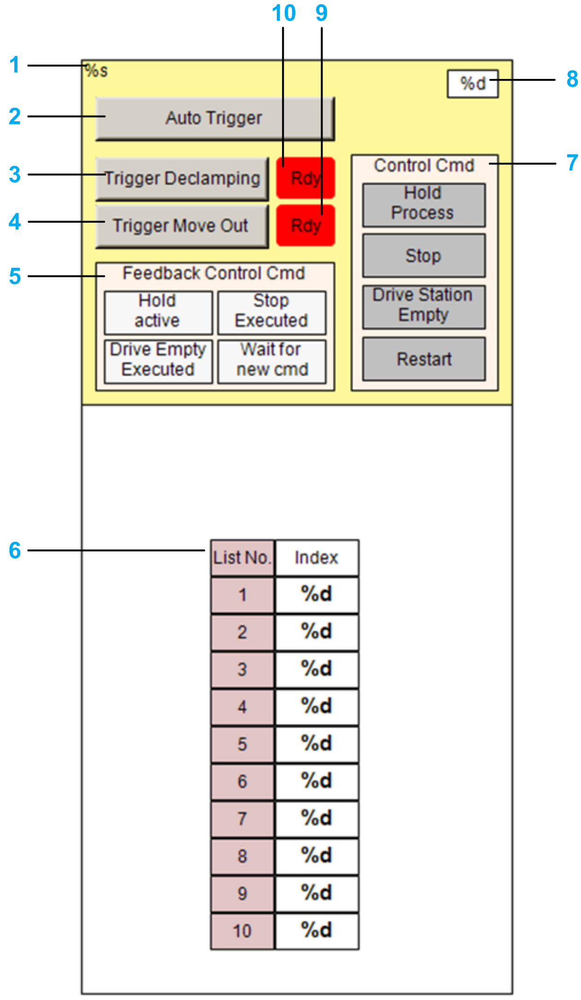

# FR\_DeclampingStation

## Overview

|  |  |
| --- | --- |
| Type: | Visualization frame |
| Available as of: | V1.3.0.0 |

## Task

Controlling a declamping station from a visualization.

## Description

The visualization frame FR\_DeclampingStation allows you to control a declamping station from a visualization.

As input/output, the frame uses the structure [ST\_DeclampingStation](STDeclampStation-E1B18BA4.html#STDeclampStation-E1B18BA4) and the function block [FB\_DeclampingStation](DeclampStation-EAB87928.html#DeclampStation-EAB87928).

The visualization frame is created when using the Update > To Code command in the Multicarrier Configuration editor.

The following example displays the visualization for a declamping station:

| Item | Description |
| --- | --- |
| **1** | Indicates the name of the station. |
| **2** | Button for activating the auto-triggering of the station. |
| **3** | Button for triggering the declamping process. |
| **4** | Button for triggering the process that moves the carriers out of the station. |
| **5** | Indicates whether the corresponding control command for the station (see item 7) is activated or not. |
| **6** | Indicates the ordered list of carriers inside the station. |
| **7** | Buttons for triggering the corresponding control command. For more information on the options for controlling the processes at the station, refer to the methods HoldProcess, StopProcess, DriveProcessEmpty, and Restart of the interface [IF\_ControlStandardStation](CtrlGroupStation-EE542522.html#CtrlGroupStation-EE542522). |
| **8** | Indicates the number of carriers in the station. |
| **9** | Indicates whether the moving out process can be triggered or not. |
| **10** | Indicates whether the declamping process can be triggered or not. |

EIO0000004643.03