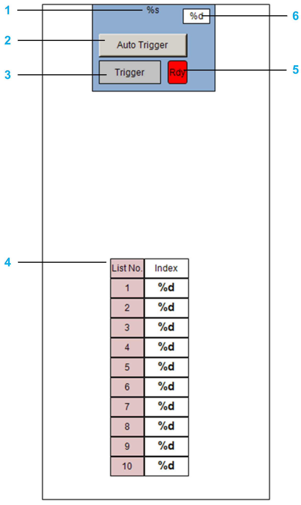

# FR\_UserStation

## Overview

|  |  |
| --- | --- |
| Type: | Visualization frame |
| Available as of: | V1.3.0.0 |

## Task

Controlling a user-defined station from a visualization.

## Description

The visualization frame FR\_UserStation allows you to control a user-defined station from a visualization.

As input/output, the frame uses the structure [ST\_UserStation](ST_UserStation-E1AC462B.html#ST_UserStation-E1AC462B) and a function block that inherits the function block [FB\_CoreStation](FB_CoreStation-CB436CE9.html#FB_CoreStation-CB436CE9).

The visualization frame is created when using the Update > To Code command in the Multicarrier Configuration editor.

The following example displays the visualization for a user station:

| Item | Description |
| --- | --- |
| **1** | Indicates the name of the station. |
| **2** | Button for activating the auto-triggering of the station. |
| **3** | Button for triggering the process that moves the carriers out of the station. |
| **4** | Indicates the ordered list of carriers inside the station. |
| **5** | Indicates whether the moving out process can be triggered or not. |
| **6** | Indicates the number of carriers in the station. |

EIO0000004643.03