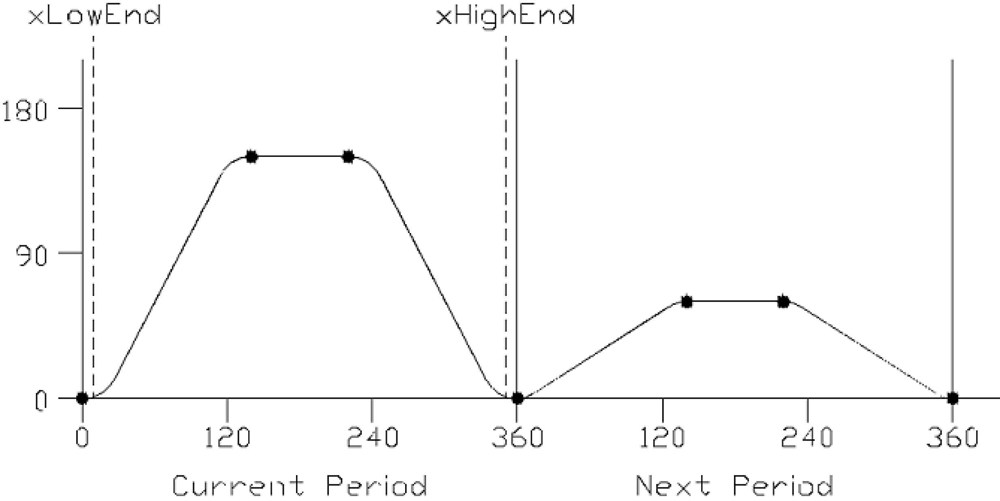

# Description

Description

This function will retrieve the status of the new cam signal of the axis specified by the iq\_stAxis­ModuleItf input. The new cam signal, once set to true, will cause the axis to reload the cam points specified by the currently selected MultiCam table and run the changes on the next cycle as shown below.

The axis will reset the new cam signal to false at the start of the next cycle if the new cam points are accepted.

The default MultiCam table is specified with the [FC\_InitCamParameter](Functions-10.htm#XREF_D_SE_0077167_1) function.

The new cam signal can be set TRUE with the [FC\_SetNewCam](Functions-29.htm#XREF_D_SE_0077205_1) function.