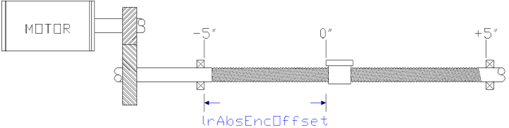

# Description

Description

This function specifies that an axis, when already homed, will be homed by writing values to the axis’s motor encoder. This method is used to provide a “service reference” to synchronize the position of the encoder to its associated mechanism and is typically used after the motor is connected to the equipment.

This function sets etMode to PDL.ET\_HomeMode.WriteAxisEncoder

The distance between the negative end position and the position to which the encoder was written is transferred to the function via the i\_lrAbsEncOffset input as shown below. The following figure explains it.

oEncoder Position = Encoder Value \* Feed Constant \* Gear In / Gear Out

oEncoder Value is in turns between ( 0 - 1 or 0 - 4096)

oEncoder Period = (1 or 4096) \* Feed Constant \* Gear In / Gear Out