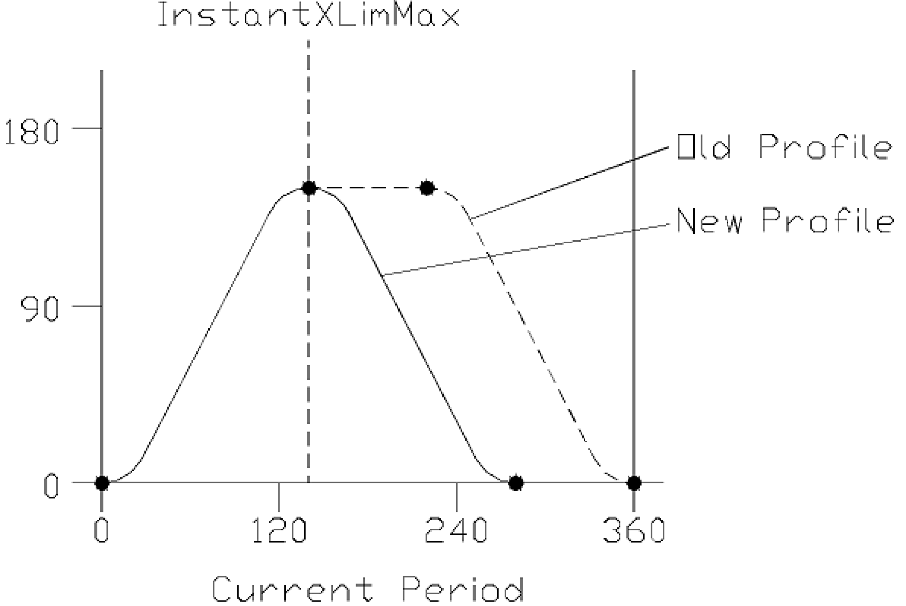

# Description

Description

Using this function, the InstantXLimMax position (transfer point) can be set within the AxisModu­leInterface structure. The structure assigned to a specific axis is transferred to the function via the input/output iq\_stAxisModuleItf. The xInstantNewCam signal will cause the axis to reload the cam points specified by the currently selected MultiCam table and run the changes in the current cycle as shown below.

The new cam data takes effect at the InstantXLimMax blend point.