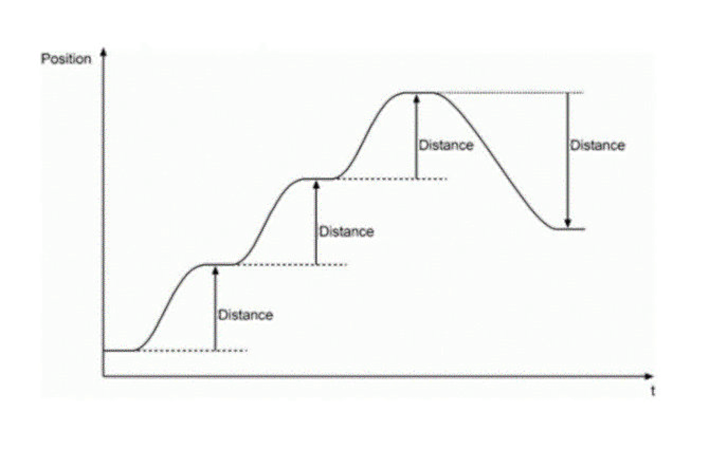

# Relative

Relative

The axis moves the distance of the target and the position of the axis is (starting position + target). Then the movement is done as illustrated in Figure\_.\_.

Relative Trace of the Positioing

