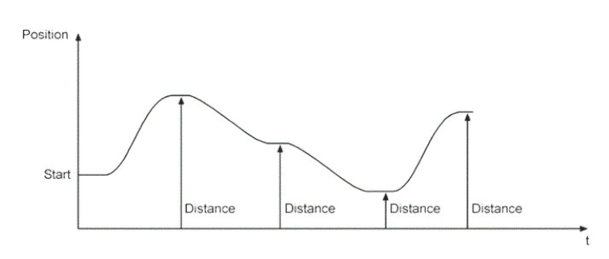
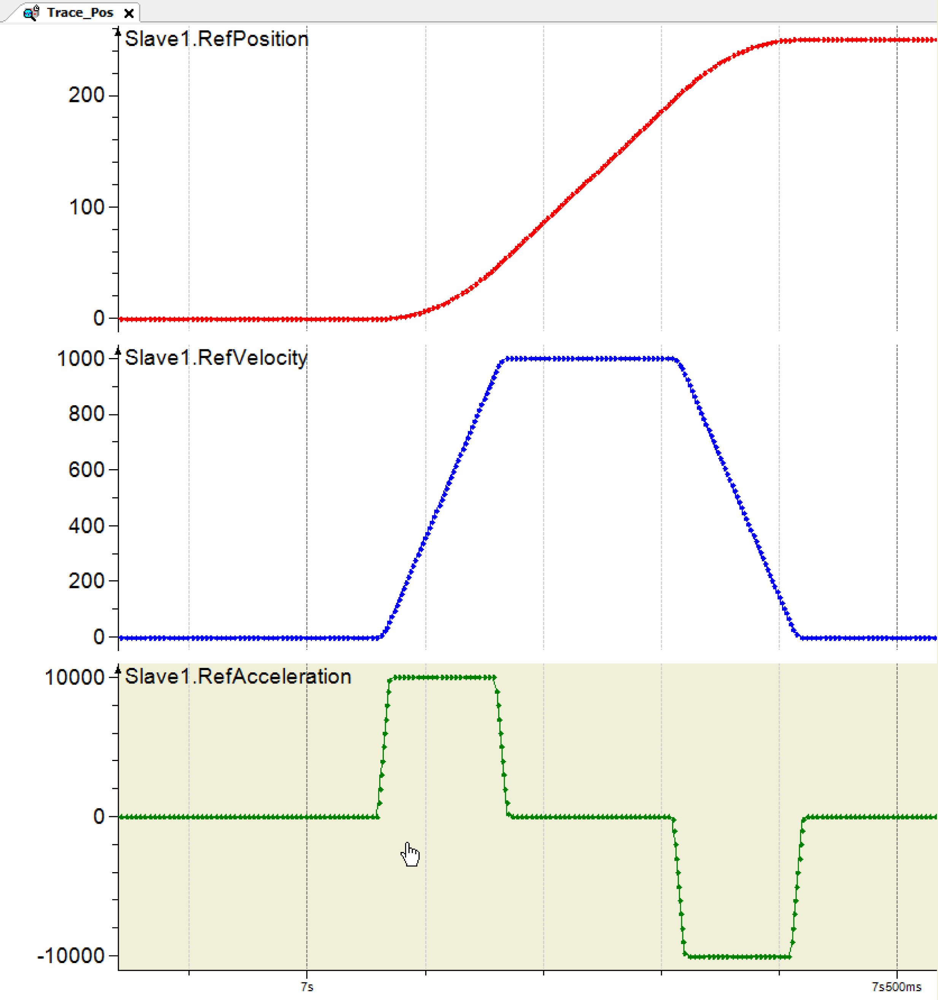

# Absolute

Absolute

The position of the axis is not changed and the movement is (target – starting position). Figure\_.\_ gives an example of Absolute Trace.

Absolute Trace of the Positioning

Table \_\_.\_\_ displays a summary of the parameters and the return values of the OpMode\_Posi­tioning .

| Variable | Data Type | Description |
| --- | --- | --- |
| i\_etPosMode | SystemInterface.ET\_PosMode | Positioning mode.  SystemInterface.ET\_PosMode.Relative  SystemInterface.ET\_PosMode.Endless  SystemInterface.ET\_PosMode.Absolute |
| i\_lrTarget | LREAL | Travel distance or targets of the motion in the units are dependent on i\_etPosMode. |
| i\_lrVel | LREAL | Velocity (change of position) in units/s. |
| i\_IrAcc | LREAL | Acceleration (change of velocity)in units/s2. |
| i\_lrDec | LREAL | Deceleration (change of velocity) in units/s2. |
| i\_lrJerk | LREAL | Jerk (change of acceleration/deceleration) in units/s3. |

The Op\_Mode Positioning Trace (Figure \_.\_) and source code demonstrate how an axis can be positioned using the given commands:

Positioning Trace Example

