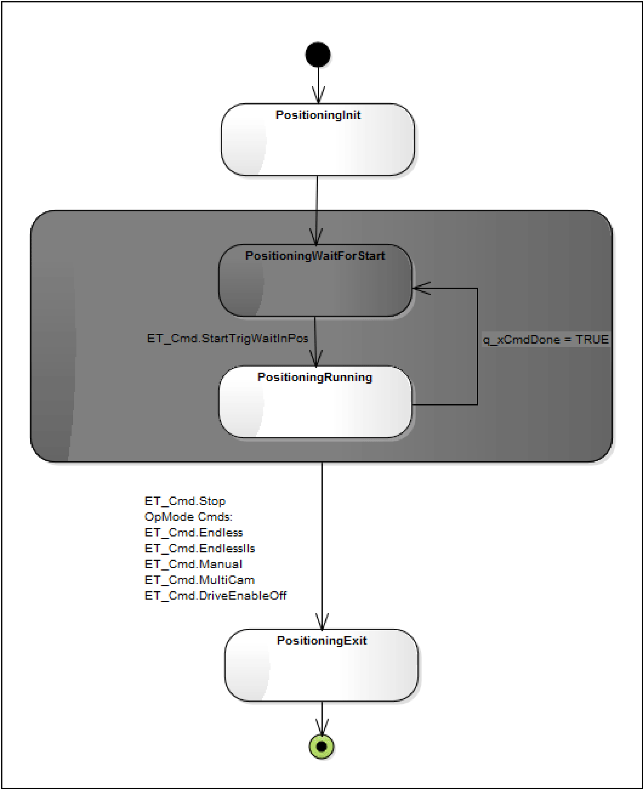

# Command Execution and Signal

Command Execution and Signal

ET\_Cmd.Start or ET\_Cmd.StartTrig: q\_xCmdDone = TRUE

Note:The command execution can also be done using ET\_Cmd.Start or ET\_Cmd.StartTrig.

The shading of the OpMode Homing Chart is white and dark gray.

White States are transition states.

 For example: a sent command is being executed.Dependent on the execution time, it can be possible that these states do not appear in the monitoring .

Dark Gray States are final states.

For example: a sent command is executed successfully. The module is waiting for a next command to be sent by the user.

stm OpMode\_Positioning

