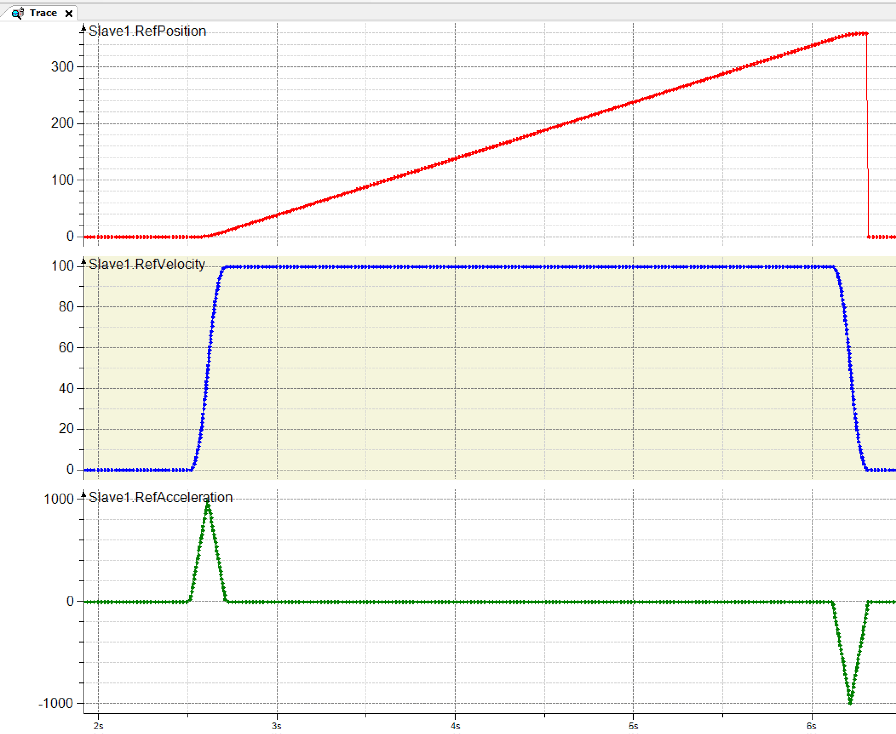
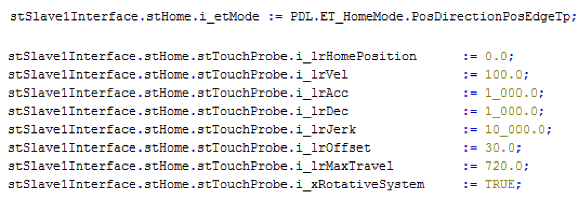

# General

General

The reference position of a Touchprobe signal is moved to the reference position when it is detected by a sensor connected to the input i\_ifTouchProbe. The reference position counts as detected, if the sensor changes to the condition defined by the mode in the indicated direction.

Example:

....PosEdge...: i\_ifTouchProbe.Value = A rising edge will be detected (normally open contact)

....NegEdge...: i\_ifTouchProbe.Value = A falling edge will be detected (normally closed contact)

The homing trace in Figure\_.\_ and the paramters in Figure \_.\_ display...

Homing Trace Example

Homing TouchProbe Parameters

