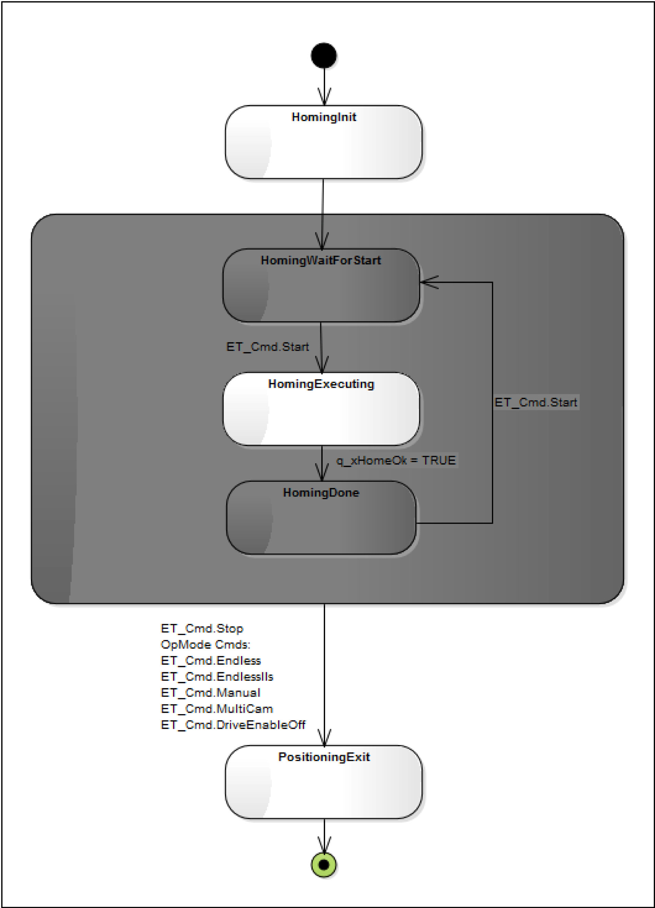

# Command Execution and Signal

Command Execution and Signal

ET\_Cmd.Start : q\_xHomeOk = TRUE

The shading of the OpMode Homing Chart is white and dark gray.

White States are transition states.

For example: a sent command is being executed. The module is waiting for a next command to be sent by the user.

Dark Gray Statesare final states.

For example: a sent command is executed successfully. The module is waiting for a next command to be sent by the user.

stm OpMode\_Homing

