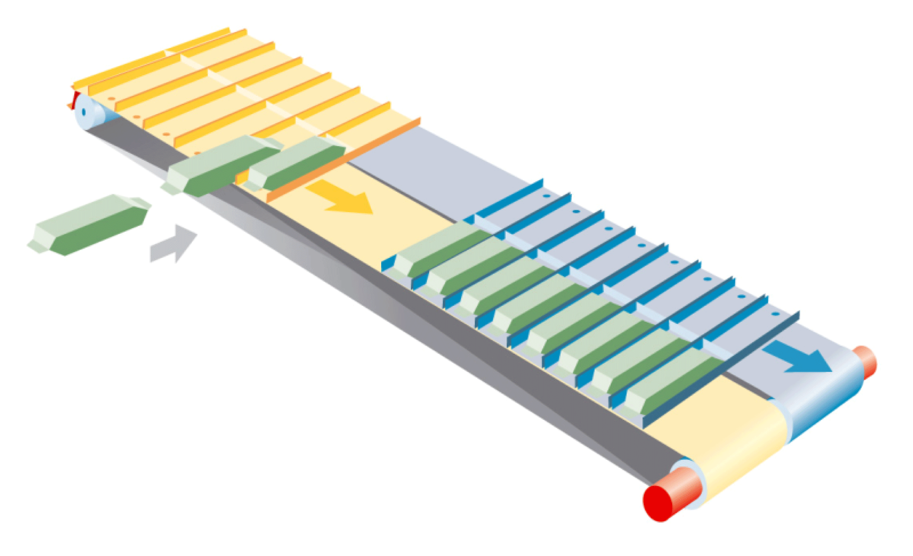
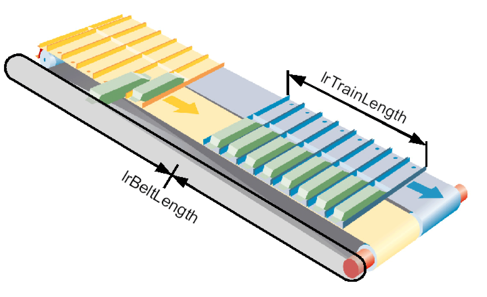

# Principles

## Overview

Configure the MultiBelt as DualBelt.



The MultiBelt library provides the functionality to group or phase products with belts that work parallel. From two belts onwards, the number of belts can be configured as desired.

The main purpose of the MultiBelt is to couple two packaging machines, or two parts of a packaging machine, with each other working at different speeds.

## Example for a Typical Field of Application

* **Grouping products**

  A primary packaging machine (e.g. Flowwrapper) supplies the product flow that cannot be stopped. A robot should insert the product in a secondary packaging process. The MultiBelt is placed between the primary packaging machine and the robot. The MultiBelt receives the product flow and groups the product to enable the robot to take them on.
* **Infeed**

  A primary packaging machine supplies a random product flow of individual products. The MultiBelt takes on the product flow and passes the individual products on to the next machine with defined distances or in set pattern with the correct phase. A product flow with random distances is passed on into another product flow with defined distances.

  In this case, the MultiBelt can act as a product buffer.

## Principle

Each MultiBelt application has at least two stations where the products can be processed (e.g. products are taken on or delivered). The movements that the trains carry out in the stations are generally identical. This is the reason why the same function module is used in each station. Therefore, the same parameter is available for both stations. The result is that the motion of the trains can be selected as required.

Example: The arrangement displayed above is with two trains using two stations. One is for loading the trains, where the product arrives individually and randomly and one is for unloading the products where a robot unloads the grouped product in one processing sequence.

Up to 8 stations can be defined where all of them can be parameterized in a different way.

Further information for the [stations](D-SE-0077879.html#D-SE-0077879).

## Mechanic

lrBeltLength - lrTrainLength



The following points are important when assembling the mechanics and for the general parameterization of the mechanics. The mechanical parameters are set in the structure stGeneral.

* The mechanic consists of at least two belts that run parallel. See uiNumOfBelts
* At least one train is mounted to each belt. If more than one train is mounted per belt, the trains must be positioned with an accurate displacement by lrBeltLength / uiTrainsPerBelt. See uiTrainsPerBelt
* Mechanically seen, all trains have the same length. See lrTrainLength
* The belts must have the same lengths. See lrBeltLength
* The direction of rotation of the motor must be adjusted so that the position of each axes that drives a belt is larger when the belt moves from one station with smaller lrStationPos to another station with larger lrStationPos. In most cases, the positive direction of the axes position is therefore the same as the product flow of the product.

A whole number must be a multiple of the length of a tooth or chain link in the **Feedconstant** (scope of the drive shaft on the gear discharge side) of the axis as well as in the parameter lrBeltLength. Therefore, the Feedconstant of the axes / length of a chain link must result in a whole number. In the same way, lrBeltLength / length of a chain link must result in a whole number.

NOTE: If lrBeltLength and the **Feedconstant** are not set in the respective manner specified, after a while the position of the trains will not correspond with the mechanics as the MultiBelt has not been re-referenced during the operation.

## Using Arrays

Several arrays are used in the configuration of the MultiBelt. The following behavior has been set for the arrays to enable you to make the entries:

* If the 0 position of an array is described, then this value is valid for all positions of the array.
* If the 0 position is equal to 0, then the other values from 1 onwards are used.

Therefore, e.g. this enables the steps to be reduced considerably as the following example shows:

```
 uiNumOfSteps = 5;
alrSteps[0] := 50;
```

is equivalent to:

```
 uiNumOfSteps = 5;
alrSteps[1] := 50;
alrSteps[2] := 50;
alrSteps[3] := 50;
alrSteps[4] := 50;
alrSteps[5] := 50;
```

This behavior applies to the following arrays:

* alrSteps
* auiProductsPerStep

EIO0000002654.02