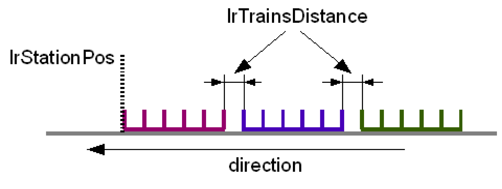

# Stations - General

## Overview

Stations move the trains in a way that has been defined by the user. The motion of the trains results from the motion parameters set. However, several fundamental settings must be followed.

## General Parameterization

* At least 2 stations have to be defined. See uiNumOfStations.
* Each station required a Basis-Position: lrStationPos. They mark the reference position of the station. If a train moves over the lrStationPos with its rear edge, the train departs from the station and is handed over to the next station.
* The position of the stations must be in an ascending sequence. Therefore, lrStationPos from station 1 < lrStationPos from station 2 < lrStationPos from station 3, etc. The mechanical sequence must therefore correspond to the sequence of the parameterization.
* Allocate 0 to the first station so that you have a mechanical reference to the zero point. Therefore, the first loading position in station 0 is equivalent to the zero point.

## Steps

One train carries out a certain number of steps in the station. The number of steps is specified by the uiNumOfSteps parameter. The different step sizes are set in the alrSteps array. If all steps have the same size, the step size can be entered in alrSteps[0]. If the steps have different sizes, these have to be alrSteps[0] := 0 and the step sizes are entered individually from alrSteps[1] to alrSteps[uiNumOfSteps-1]. The size of the last step does not have to be entered as the train with the last step moves directly to the next station.

The array auiProductsPerStep can be used if several products should be loaded into a compartment on a train. The following also applies here: If the same amount of products should be loaded into each compartment, the auiProductsPerStep[0] can be set to quantity. auiProductsPerStep[0] := 0 must be set for different quantities of products and the amount can be defined individually in auiProductsPerStep[1] to auiProductsPerStep[uiNumOfSteps].

In the case of a synchronous station, all steps must be equal. Therefore, only the value alrSteps[0] may be used. In addition, several products per compartment are not permissible in a synchronous station.

See also: [Using arrays](D-SE-0077877.html#D-SE-0077877)

## Start Signals (xStart / ginStartSensor)

A start signal triggers a step where all of the trains that are in the station at the moment take part. A station can receive two different types of start signals: Simple bit signals direct from the user (xStart) or direct from a Touchprobe input (ginStartSensor).

* **Bit signal xStart:**

  The bit xStart can be set by the user for, e.g. carrying out regular steps and therefore to feed out products with the same distance on a belt. The MultiBelt only reacts to positive edges of a signal. It can be used to simulate the functionality of the application without the product.
* **Touchprobe ifTPStart:**

  A Touchprobe input can be connected to this input. An additional logical encoder for carrying out time measurements must be transferred to stIndexed.lencHelp. Using the xSensorEdge, the edge can be defined that reacts to the input. TRUE = rising edge, FALSE = falling edge.

Both start signals can be locked or released using the parameter etStartLock.

NOTE: If you use touchprobes of TM5 modules, you can capture either the rising edge or the falling edge, depending on the setting in ST\_Station.xSensorEdge. The value of the ST\_StationFeedback.lrLengthOfLastProduct variable remains 0 in this case.

## Station Types

The following types of stations are available:

* **Indexed Station:**

  Moves the trains indexed. This means that after a start signal, a positioning is carried out across the length of a compartment.
* **Synchronous Station:**

  Moves the trains synchronously. This means that the trains are controlled by a master and moving in accordance with a specified law of motion.
* **PassBy Station:**

  Switches the station to run-through mode. The trains pass by the station without stopping.

## Indexed Station

The station carries out a step after a signal has been detected. In doing so, the signal can originate from a measurement input or can be set via a bit from the user. Refer to [Indexed Station](D-SE-0077880.html#D-SE-0077880) for more information.

Application:

* For loading or unloading the train in indexed time controlled operation.

## Synchronous Station

The station carries out a step synchronously with a master after a start signal has been detected or travels automatically synchronously with the master. Click here for more information.

Application:

* Loading or unloading the trains synchronously with a master. In so doing, the products may be positioned on phase.

## PassBy Station

The station moves the incoming trains to the following station without stopping. Click here for more information.

Application:

* Deactivating a station for testing purposes
* Brake or accelerate the trains at a certain position for the purpose, e.g. of moving the train slower around a corner than in straight sections.

## Gap Between the Trains (lrTrainsDistance)

The parameter specifies the distance between the trains that all trains receive in the waiting line. Whereas the train closes the gap, the distance is reduced until the train has approached lrTrainsDistance of the train moving in front. The value of lrTrainsDistance must be larger than lrCrashDistance. The parameter can be set separately for each station.

When mechanically possible, the value of lrTrainsDistance should be selected as small as possible. When a train starts to move to the next station, the following train must move the length of the last step + lrTrainsDistance to be able to reach the first position.

## Accept the Start Signals (lrStartAcceptOffset)

|  |  |
| --- | --- |
|  |  |
| Start signals are ignored | Start signals are accepted |

The parameter specifies the Offset from the point where the start signals are accepted from a train. If a train moves into an empty station, the front edge of the train has to be closer to lrStationPos as the specified Offset. The position where the train begins to accept start signals are calculated from lrStationPos + lrStartAcceptOffset. Therefore, this has to be lrStartOffset <= 0.

Using the parameter, you can accurately set the point when the train begins to move and makes the first step. With stations that start with deceleration, increase the value so that the product can be received when it is still in motion.

## lrTrainTimeOut

|  |  |
| --- | --- |
|  |  |
| xTrainTimeOut := FALSE | xTrainTimeOut := TRUE |

The parameter lrTrainTimeOut specifies the point where the distance of the rear edge of the last train becomes the bit xTrainTimeOut = TRUE in a station. The bit can be used to retrieve a train from the preceding station and to close up behind before the station is empty. This may be necessary when, e.g. the feed belt to the station cannot be stopped and a train should therefore always be positioned ready for loading in the station. The parameter can be used to call a second train into the station within due time before the last train is full and departs from the station.

The signal xTrainTimeOut is in the [Feedback structure](D-SE-0077771.html#D-SE-0077771) of every station.

## Distance Alerts (lrWarningDistance / lrStopDistance)

|  |  |  |
| --- | --- | --- |
|  |  |  |
| xWarningDistance := FALSE | xWarningDistance := TRUE | xWarningDistance := TRUE |
| xStopDistance := FALSE | xStopDistance := FALSE | xStopDistance := TRUE |

The parameter lrWarningDistance and lrStopDistance are used to control the distance alert functions xWarningDistance and xStopDistance. In the example displayed, train 1 is already in the next station and train 2 is being loaded. If train 2 moves closer to train 1 than lrWarningDistance or lrStopDistance, then xWarningDistance or xStopDistance will be TRUE in the [Feedback structure](D-SE-0077771.html#D-SE-0077771) station.

For example, the lrWarningDistance and lrStopDistance can be used to help prevent a moving train from colliding with a stationary train.

## lrAdditionalStep

|  |  |
| --- | --- |
|  |  |
| lrAdditionalStep > 0 | lrAdditionalStep := 0 |

**Indexed Station:**

The parameter lrAdditionalStep can be used so that the train can be moved with stStep.lrVel after the last step and only after stStep.lrVel accelerated to stDeparture.lrVel.

**Example for an INDEXED STATION:** If lrAdditionalStep > 0 is set, then the train starts after the last start (1) with stStepMove Parameters until the rear edge of the train lrStationPos + lrAdditionalStep is reached (2). Then the train starts with stDepartureMove Parameters to the next station.

If lrAdditionalStep: = 0, then the train starts with stStepMove Parameters first and changes to stDepartureMove Parameter as soon as stStepMove.lrVel is reached.

If lrAdditionalStep: = -1, then the train starts directly with the stDepartureMove Parameters. Here, the following must be true: stDepartureMove.lrAcc > stStepMove.lrAcc and stDepartureMove.lrJerk  > stStepMove.lrJerk.

**Synchronous station:**

The parameter lrAdditionalStep indicates the distance which the train continues to travel synchronously with the master after having received the most recent start signal. Thereafter, the train changes over to the stDepartureMove parameters. As long as the train is in the additional step, the compensation motions of the station are followed.

If lrAdditionalStep: = 0, then the train remains synchronous to the master until the end of the last synchronous phase and then it starts with the stDepartureMove Parameters. The minimum lrAdditionalStep value thus corresponds to stStation.alrSteps[0]-stStation.stSynchron.lrSynchronEnd.

EIO0000002654.02