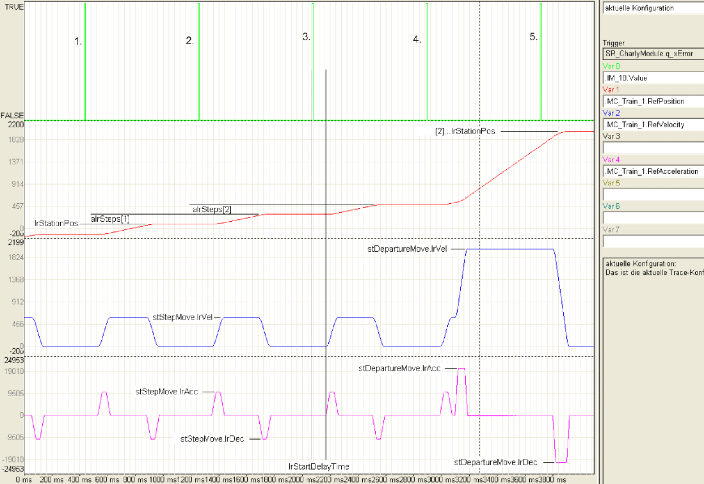
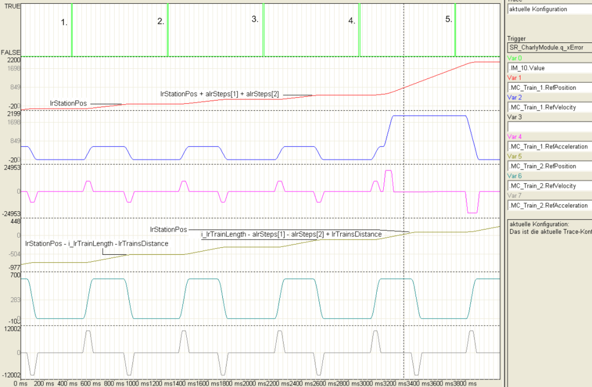
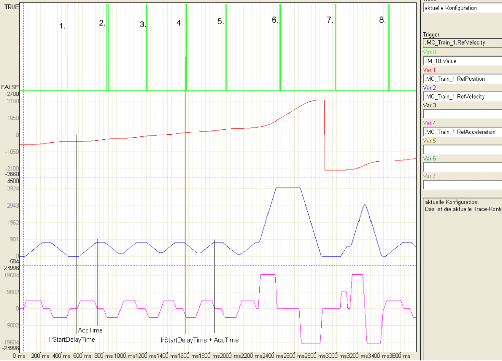
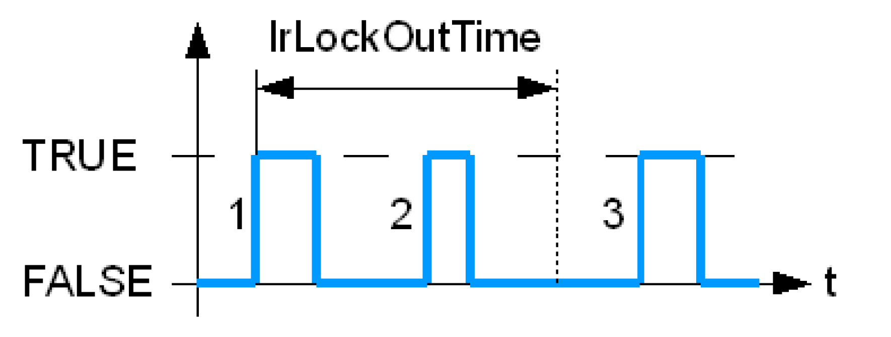
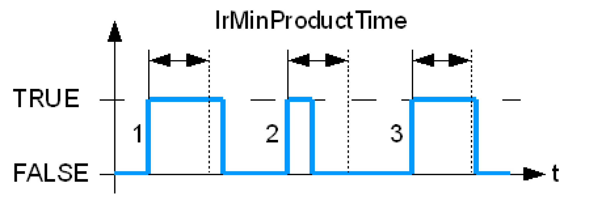
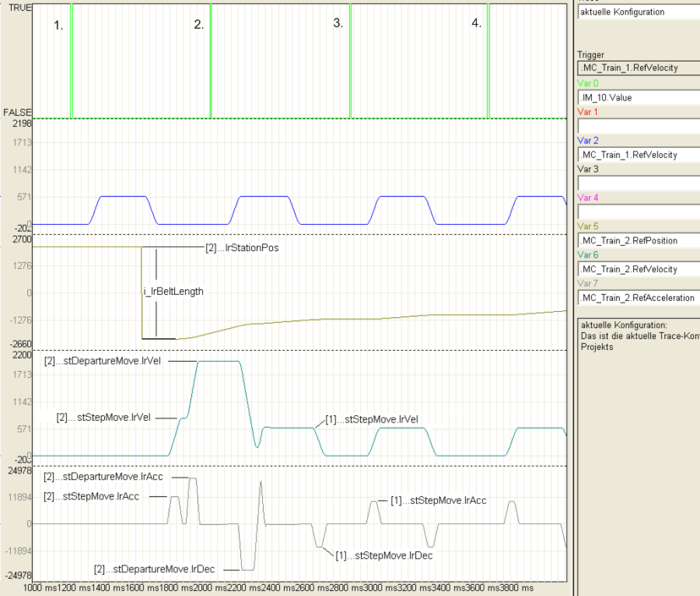

# Indexed Station

## Overview

An indexed station moves the trains indexed and time controlled. The station receives the start signal from a Touchprobe input or via a bit and after a defined time of the lrStartDelayTime, the trains move a step further on and wait for the next start signal.

In this chapter, we will only be talking about a loading station or the loading of the trains with products. This should only be viewed as an example and applies to all stations.

## Motion Parameter (stStepMove / stDepartureMove)

The following illustration shows the sequence of a motion of a train in the indexed stations. The start signals are displayed in the start signals, under it, the position, velocity and acceleration.

The train makes 3 steps in the station (loads 3 products) and starts to the next station after the last start signal.

| 1. | Start signal: The train is activated and moves to lrStationPos that is the first loading position of the station. Before the train is traced here, the proceeding train starts to move to the next station (see 4). |
| 2. | Start signal: The first product has been loaded in the train and it starts to lrStartDelayTime on lrStationPos + alrSteps[1]. |
| 3. | Start signal: The second product has been loaded in the train and it starts to lrStationPos + alrSteps[1] + alrSteps[2] on lrStartDelayTime. The waiting time lrStartDelayTime is entered graphically here. |
| 4. | Start signal: The third product has been loaded in the train and the train is therefore full and be started to the next station. The train behind the motion traced here moves to lrStationPos and receives the next product. Therefore, the start signal 4. is equivalent to 1. traced here, that is only for different trains. The cycle starts from the beginning. |
| 5. | Start signal: When this start signal appears, the train is already in the next station. This does not have any influence to the motion of the traced train any more but to the motion of the following train. It corresponds to start signal 2. |

Indexed Station - Motion parameter

The following illustration accurately shows the same sequence, only that 2 trains are traced here.

Indexed Station - Two trains

## Plateau Velocity

The plateau velocity designates the velocity that a train reaches with each step. These are either set by the velocity that is reached by the smallest velocity or by the specifications of stStepMove.lrVel. They will be displayed in the feedback structure under stActiveStepMove.lrVel.

Therefore, the parameter stStepMove.lrVel can be used in two ways:

| 1. | Application: The steps should be carried out as quick as possible and a plateau break is not necessary, e.g. the products are loaded from the side into the train and are held in compartments. The motion should be carried out as quick as possible after a start signal. The velocity does not have to be limited here and stStepMove.lrVel can be set higher. |
| 2. | Application: The steps should be carried out at a certain velocity, e.g. the products should be transferred almost synchronously and the train moves during the loading. In doing so, the train should run at the same velocity as the feed belt while the product is being taken over. To be able to achieve this, stStepMove.lrVel should be set to the velocity of the feed belt. This application can be viewed in the illustration above. |

## lrStartDelayTime

After a start signal, the trains wait in a station for a period of lrStartStartDelay [ms] until the motion is started. The parameter can be used to set the time that a product is detected by a Touchprobe sensor up until the start of the motion passes.

If the train is standing, the complete time is awaited (see 1.). If the train still has not stopped after the lrStartDelayTime has passed then the train is started within due time to ensure that the plateau velocity is always reached at the same time (see 4). The distance between the start signal and the point where the plateau velocity is reached is constant.

Indexed Station - lrStartDelayTime

## Loading Train When in Motion (xStartOnVelocity)

If the trains have to be loaded in the station when in motion, in order to achieve an almost synchronous transfer, enter the lrStartDelayTime when the plateau velocity is reached rather than at the start of the motion.

* FALSE (default): lrStartDelayTime specifies the time from the product detection up until the start of the motion.
* TRUE: lrStartDelayTime specifies the time from the product detection up until the plateau velocity is reached. For this purpose, the lrStartDelayTime must be greater than the time that the train requires to accelerate to the plateau velocity.

## Switch Off the Touchprobe Sensor (lrLockOutTime)

The parameter lrLockOutTime specifies how long the Touchprobe sensor should be deactivated after a product has been detected. This can be used to handle products that have been detected by the sensor more than once. The parameter is only effective in conjunction with Touchprobe signals.

lrLockOutTime

| 1. | Edge: A start signal has been detected and the sensor for lrLockOutTime [ms] is deactivated. |
| 2. | Edge: The 2. edge is not detected because it occurs in the lrLockOutTime. |
| 3. | Edge: The 3. edge releases a normal start signal again. The sensor is deactivated for lrLockOutTime [ms] again. |

## Minimum Product Length (lrMinProductTime)

The parameter lrMinProductTime specifies the minimum product length in [ms]. To enable a start signal to be detected, the Touchprobe sensor must be covered longer than lrMinProductTime. The parameter is only effective in conjunction with Touchprobe signals.

lrMinProductTime must be smaller than lrStartDelayTime and is only relevant in conjunction with a product detection on the rising edge (beginning of the product). The parameter can be used to filter out extraneous objects (such as airborne particulate matter) that trigger the sensor.

lrMinProductTime

| 1. | Edge: The signal from the TouchProbe input is longer than TRUE as lrMinProductTime and is therefore a valid start signal. |
| 2. | Edge: The signal is shorter than lrMinProductTime and is therefore disregarded. |
| 3. | Edge: The signal is longer than lrMinProductTime and is therefore a valid start signal. |

## Maximum Product Length (lrMaxProductTime)

The parameter lrMaxProductTime indicates the time in [ms] that a product must cover the Touchprobe sensor so that the bit xMaxProductTime turns to TRUE in the feedback structure of the station. You can use lrMaxProductTime to register a product jam under the sensor.

## The Train is Ready (lrReadyForStepOffset)

The parameter lrReadyForStepOffset specifies the position where the bit becomes xReadyForStep := TRUE. After the next start signal, it swaps back to FALSE until the train approaches its target closer than lrReadyForStepOffset.

Using the parameter, you can set how much earlier you want to be informed before the train is ready to make a step. The default setting is 0 and is, e.g. only relevant when the train has to be completely stationary because it is being unloaded from above in the station by the robot. The signal xReadyForStep can be used as the start signal for the robot.

The parameter only sets the point when the signal xReadyForStep is TRUE. See lrStartAcceptOffset for the determination when a start signal is accepted.

|  |  |
| --- | --- |
|  |  |
| xReadyForStep := FALSE - The train moves into an empty station | xReadyForStep := TRUE - The train moves into an empty station |
|  |  |
| xReadyForStep := FALSE - The train receives a start signal and moves to alrSteps[1] | xReadyForStep := TRUE - The train receives a start signal and moves to alrSteps[1] |

## Wait For a Train (xWaitForTrainInQueue)

This bit can be used to help prevent the fully loaded train from moving off and that it waits until the following train has closed the gap.

* FALSE (default): A train that has been fully loaded starts to the next station immediately.
* TRUE: The train that is fully loaded waits until the following train has closed the gap or has approached the station closer than lrStartAcceptOffset.

Intended applications are stations that store the products for loading the trains. If the station is completely free, the products are pressed into the operating zone of the train.

A list of the parameters in an indexed station can be found under ST\_Indexed.

## Explanation of the Motion Sequence

In the trace logging, you can view the motion sequence of a train when this draws up to a train running upfront. The MultiBelt traced comprises of 2 trains and 2 stations.

At the beginning of the logging, train 2 is positioned in station 2 and waits for a start signal. Train 1 is in station 1 and continues to pulse with the start signals traced above. The start signal (1.) only has an influence on train 1, because train 2 is in station 2. Shortly afterwards, train 2 also receives a start signal (not traced here) and then starts to move to the first station. As station 2 is the station with the highest station position, the position of the train is set back to lrBeltLength before moving off. After the lrStartDelayTime has elapsed, the train then starts to the first position. You can notice that train 2 starts with stStepMove parameters first and then, only after reaching the plateau phase, changes to the stDepartureMove parameter.

Whereas train 2 moves into station 1, a new start signal (2) is received and train 1 carries out a step. Train 2 adds this step to the draw up motion and changes to stStepMove.lrVel as soon as it is near to train 1. Train 2 ends the step later than train 1.

With the 3 and 4 start signals, train 2 has already been coupled and moves the steps synchronously to train 1.

EIO0000002654.02