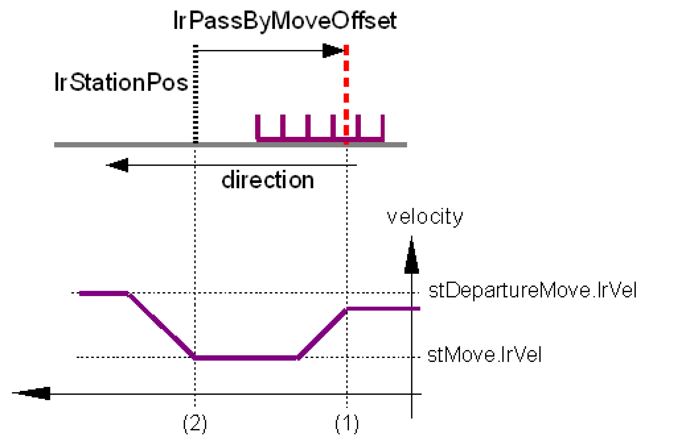

# PassBy Station

## Overview

A PassBy station moves the trains through the station without stop and control signals. There is a possibility of changing the motion parameters of the trains at certain positions.

A PassBy station can be used to switch off the station completely and allows all oncoming trains to simply "pass through". Another possibility is that the trains can be braked or accelerated at a certain position (e.g. for moving the trains slower around a corner than in straight sections).

## Run-Through the Station

For parameterizing a simple pass-by, only the etStationType has to be set to ET\_StationTyp.PassBy and no other parameters have to be described.

## Change the Velocity

The following illustration indicates an example for a short term reduction of the velocity with subsequent acceleration, e.g. for slower motions around "cams" or over the drive shaft.

PassByStation - Change the velocity

* The train approaches from the previous station with departure velocity.
* Once the front edge of the train reaches ST\_Station.lrStationPos + ST\_PassBy.lrPassByMoveOffset (1), a new motion is started with the parameters from ST\_PassBy.stMove.
* Once the front edge of the train reaches ST\_Station.lrStationPos (2), the departure motion to the next station is started with ST\_PassBy.stDepartureMove. The train is passed on to the next station.

See ST\_PassBy for a list of all parameters of a PassByStation.

EIO0000002654.02