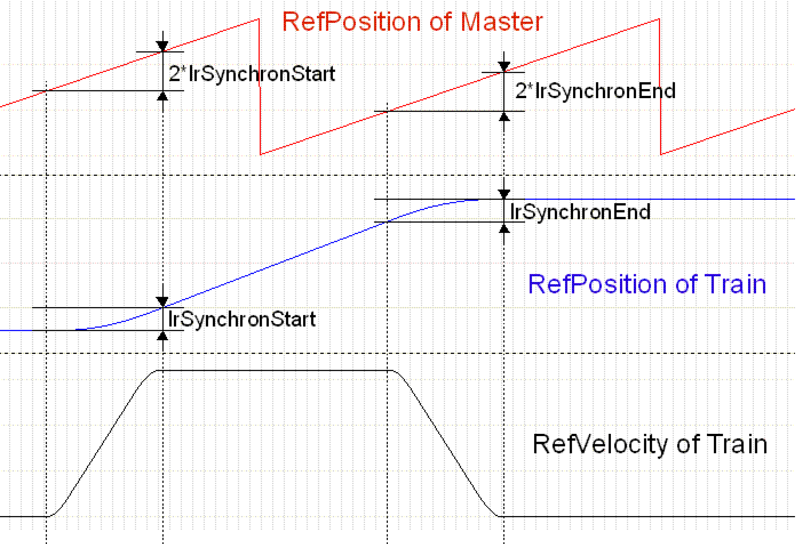
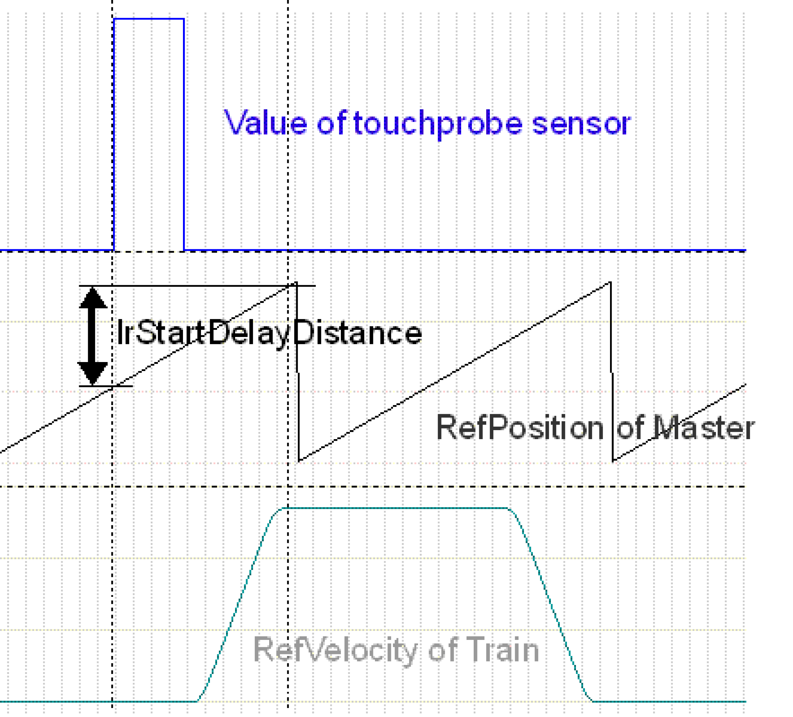
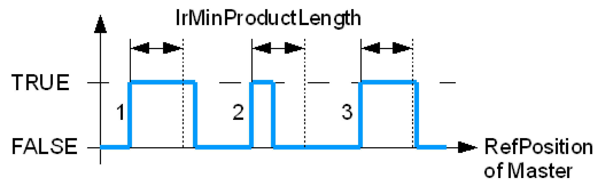
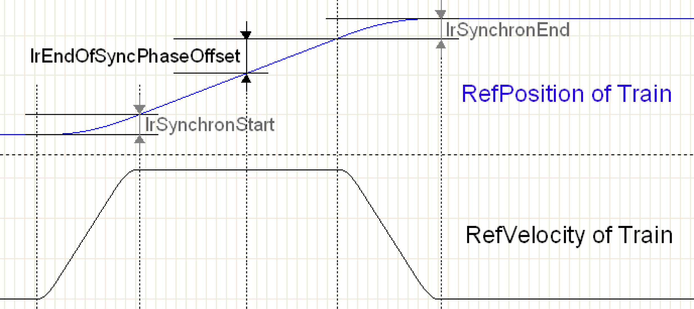

# Synchronous Station

## Overview

A synchronous station moves the trains via electronic cams synchronously to a master. Just as in an indexed station, the trains also move in individual steps. The motion profile of the steps is defined by a law of motion as well as the parameters ST\_Synchron.lrSynchronStart and ST\_Synchron.lrSynchronEnd.

## Motion Process (Cam / stDepartureMove)

The motion process of a synchronous station results from the parameterization. The principal parameters here are etEventTrigger and ST\_Synchron.etLawOfMotion. The motion process is described in [Synchronous Station - Motion Sequence](D-SE-0077883.html#D-SE-0077883).

## Law of Motion of the Cam (etLawOfMotion)

The parameter ST\_Synchron.etLawOfMotion determines by means of which law of motion the trains follow the master axis. The following laws of motion have been implemented.

* ModAccTr: modified acceleration trapezoid (default)
* InclSin: inclined sine line
* SystemCam: user-defined CAM

|  |  |
| --- | --- |
| **Modified acceleration trapezoid** | **Inclined sine line** |
|  |  |

The graphical illustration shows the position, velocity and acceleration curves for the laws of motion. In contrast with the inclined sine line, the modified accelerated trapezoid features an acceleration that is lower by approximately 20%, and which has been applied over a longer period of time. This lower acceleration is achieved by a slightly higher jerk, as can be seen from the gradient of the acceleration.

In addition, there is the option to move along a user-defined cam. This must be defined as a dwell/dwell cam; otherwise the cam may cause shocks to the mechanism, and may further result in equipment damage.

| NOTICE | |
| --- | --- |
|  | BROKEN MECHANICAL DRIVE TRAIN  When using a user-defined cam, ensure that the cam is defined as a dwell/dwell cam.  Failure to follow these instructions can result in equipment damage. |

The user-defined cam can be stored by means of the normal system functions. The logical address of the cam must be passed to the parameter diUserCamId.

In order to move along the user-defined cam, the following has to be done:

* Create cam in memory
* Set ST\_Synchron.etLawOfMotion := SystemCam
* Set ST\_Synchron.diUserCamId to the logical address of the cam

## Set the Start and Stop Ramps (lrSynchronStart, lrSynchronEnd)

The parameters ST\_Synchron.lrSynchronStart and ST\_Synchron.lrSynchronEnd define the ramp by means of which the trains accelerate to master velocity or decelerate from master velocity to 0. The parameters provide the path which the train travels during acceleration. The master travels twice the distance during the acceleration phase. Normally both values should be equal so that a symmetrical motion is generated. During loading and unloading, the trains travel with these preset ramps. Even compensation motions will be executed by means of these ramps.

lrSynchronStart - lrSynchronEnd

The graphic indicates the change of the train position in relation to the master position. In addition, the velocity of the train is recorded. The path of the master during the acceleration or deceleration phase is twice as long as that of the train. In between, master and train travel synchronously 1:1. In the example shown here the gear factor is ST\_Synchron.lrGearFactor = 1.

## Type of the Start Signals (etEventTrigger)

A synchronous station can evaluate different types of start signals and generate therefrom the motion of the trains. The parameter etEventTrigger determines which type of start signals is used. For a more detailed description see [Synchronous Station - Motion Sequence](D-SE-0077883.html#D-SE-0077883)

**etEventTrigger := StartOnSignal**

The trains execute a step if a signal arrives from the specified Touchprobe or is given by the bit ST\_Station.xStart. With this setting, the operation of the synchronous station is similar to that of an indexed station. After a product has been detected, a cam is output which, after the master has moved on by ST\_Synchron.lrStartDelayDistance, is synchronous. The phase position of the product is of no relevance here. The motions for compensating different distances between products result from the overlaying of steps.

**StartOnSignal** is suitable for transferring a random product flow to the MultiBelt. Arriving products need not have any phase position. If the products have the distance ST\_Station.alrSteps[0] \* lrGearFactor on the feed belt, this results automatically in a straight line without any compensation motions.

**etEventTrigger := SyncToPhase**

The trains execute one step per master period. This is done automatically, there is no need for a start signal from outside. Here, products are stored onto the phase defined by ST\_Synchron.lrPhase.

**SyncToPhase** is suitable for in-phase placing of the products from the MultiBelt onto a conveyor.

**ET\_EventTrigger := MasterSelectPos**

The operation mode corresponds to that of the DualBelt in synchronous mode. The products **must** be fed in correct phase to the MultiBelt. At a position ST\_Synchron.lrMasterSelectPos of the master period, it is verified whether a product covers the Touchprobe sensor. If this is the case synchronicity is built up in the next period. If the sensor is not occupied, synchronicity is removed if present. No compensation motions are executed.

**MasterSelectPos** is suitable for transferring a product flow that is already ordered to the MultiBelt.

If the train is supposed to follow the master with a 1:1 straight line, then the following must be ensured:

ST\_Synchron.lrMasterPeriod = ST\_Station.alrSteps[0] \* lrGearFactor and ST\_Synchron.lrSynchronStart = ST\_Synchron.lrSynchronEnd

## Distance of the Touchprobe Sensor (lrStartDelayDistance)

ST\_Synchron.lrStartDelayDistance indicates the distance of the Touchprobe sensor from the transfer position. The distance is also maintained if the xStart bit is used for starting. The distance must be stated if ET\_EventTrigger = StartOnSignal or MasterSelectPos.

lrStartDelayDistance

The graphical illustration shows the Touchprobe sensor (at the top), which detects the product. The sensor detects a product, and after the master has moved on by ST\_Synchron.lrStartDelayDistance, the train has reached the synchronous phase. Thus, the measurement is not carried out until the start of the motion, but until the start of the synchronous phase. This allows the start ramp to be changed without adapting ST\_Synchron.lrStartDelayDistance. ST\_Synchron.lrStartDelayDistance is measured in units of the master.

## Minimum Length of a Product (lrMinProductLength)

The parameter ST\_Synchron.lrMinProductLength determines the minimum product length in units of the master. In order for a start signal to be detected, the Touchprobe sensor must be covered for longer than ST\_Synchron.lrMinProductLength. The parameter is only effective in conjunction with Touchprobe signals.

ST\_Synchron.lrMinProductLength must be smaller than ST\_Synchron.lrStartDelayDistance - 2\*ST\_Synchron.lrSynchronStart. The parameter can be used to filter out extraneous objects (such as airborne particulate matter) that trigger the sensor.

lrMinProductLength

| 1. | Edge: The signal from the Touchprobe input is TRUE longer than ST\_Synchron.lrMinProductLength and thus is a valid start signal. |
| 2. | Edge: The signal is shorter than ST\_Synchron.lrMinProductLength and is therefore rejected. |
| 3. | Edge: The signal is longer than ST\_Synchron.lrMinProductLength and thus is a valid start signal. |

## Gearbox Factor

Via the variable lrGearFactor, the gear factor can be defined which defines the ratio between master path and subordinate path. The default value is 1, this causes the trains to move a 1:1 straight line to the master encoder. This ratio can be adapted so that the trains move faster or slower than the master.

The following graphical illustration shows three different gear factors and their effect on velocity and acceleration of the trains. At the topmost position the position of the master is marked in red. Then the velocity of the trains in blue, and finally the acceleration of the trains in black.

|  |  |  |
| --- | --- | --- |
| **Gear factor = 0.6** | **Gear factor = 1** | **Gear factor = 2** |
|  |  |  |
| Required master path for one step  180 / lrGearfactor = 300 | Required master path for one step  alrSteps[0] + 2\*lrSynchronEnd = 180  140 + 2\*20 = 180 | Required master path for one step  180 / lrGearfactor = 90 |
| Train velocity reached  200 \* lrGearFactor = 120 | Train velocity reached  Velocity Of Master = 200 | Train velocity reached  200 \* lrGearFactor = 400 |
| Train acceleration reached  1220 \* lrGearFactor² = 439.2 | Train acceleration reached  Determined by law of motion and master velocity = 1220 | Train acceleration reached  1220 \* lrGearFactor² = 4880 |

The parameters ST\_Synchron.lrSynchronStart and ST\_Synchron.lrSynchronEnd refer to the path of the train and are still valid as before. The trains thus accelerate in the same path to master velocity \* gear factor. As can be seen from the table, the acceleration of the trains changes in terms of a square to the preset gear factor. The jerk increases exponentially. In order to soften the jerk, it is possible to increase the parameters ST\_Synchron.lrSynchronStart and ST\_Synchron.lrSynchronEnd to obtain a longer acceleration or deceleration phase.

## End of SynchronPhase

lrEndOfSyncPhaseOffset

The synchronous phase can be terminated and a compensation motion can be started from the point defined by lrEndOfSyncPhaseOffset. This happens only if the start signals follow so closely upon each other that excessive velocity is necessary to compensate the shorter distance.

If the start signals follow too closely upon each other, the step is no longer completed with the set cam law; the job is terminated and a 5th order polynomial is used for the compensation motion.

ST\_Synchron.lrPhase is used for the compensation motion of the last step of a train in a station, as the motion lrTrainsDistance has to be compensated for. In addition, the Poly5 compensation motion is used in every step if etEventTrigger = StartOnSignal.

The higher ST\_Synchron.IrPhase, the softer the compensation motions between individual steps and the shorter the remaining synchronous phase. If ST\_Synchron.lrPhase is lower, the compensation motion is harder and the synchronous phase is longer.

EIO0000002654.02