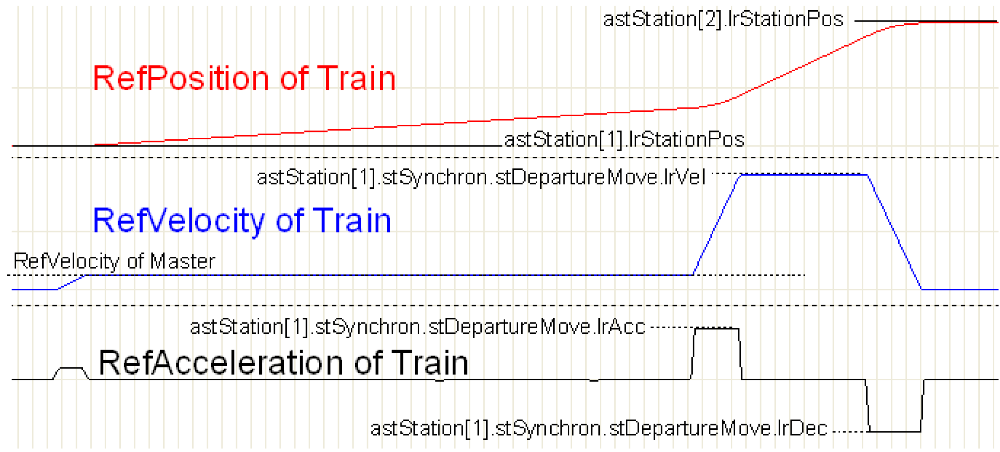
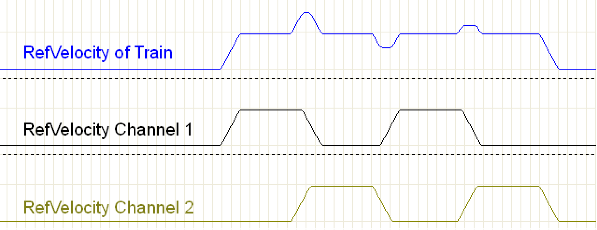
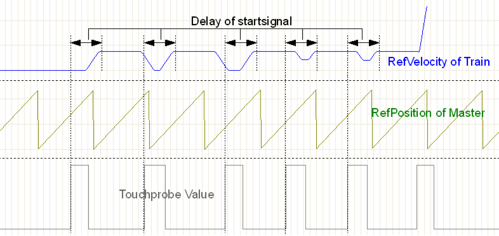
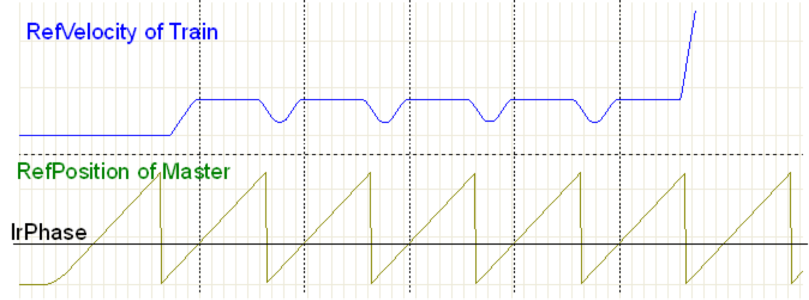
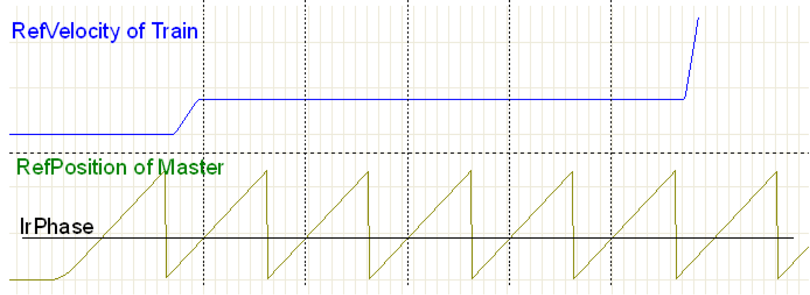
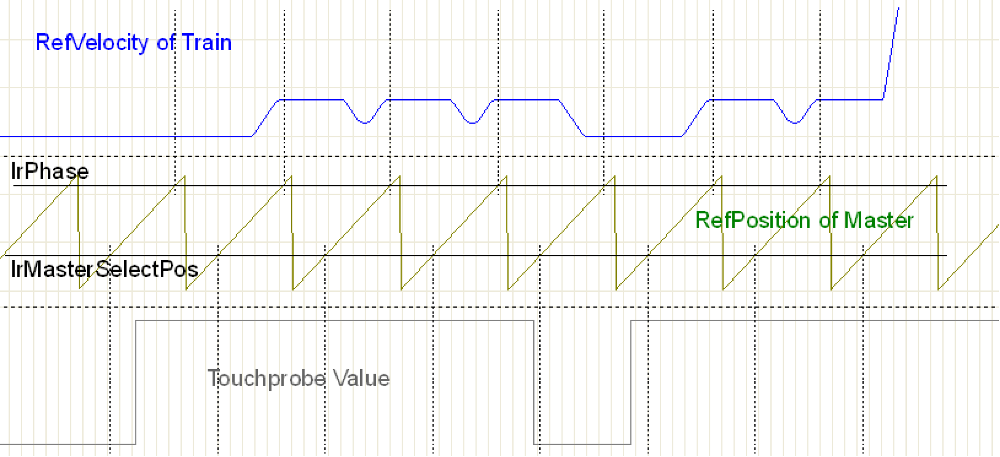
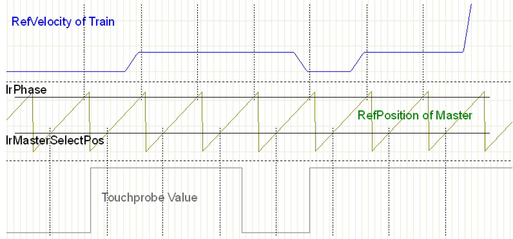

# Synchronous Station - Motion Sequence

## Overview

A synchronous station can evaluate different types of start signals and generate therefrom the motion of the trains. The parameter etEventTrigger determines which type of start signals is used.

**The following graphical illustrations are all drawn with a gear factor (lrGearFactor) of 1. Therefore, the velocity reached by the trains corresponds to that of the master.**

In general, the motion process of a synchronous station is as follows:

Motion sequence

The train is at astStation[1].lrStationPos and accelerates to the velocity of the master. From now on, the train moves in synchronicity with the master. In the case shown here, no compensation motions are required and the train follows the master encoder with a straight line. When the last compartment of the train has been processed and the synchronous phase of the last step has been executed, the train - by means of a positioning - is moved to the next station (astStation[2].lrStationPos). From the start of the positioning, the train is no longer synchronous to the master, but moves in a time-controlled fashion. The positioning is affected by means of the parameters defined in astStation[1].stSynchron.stDepartureMove.

## Overlaying of Steps

The basic principle of the motion is the overlaying of individual steps. The following graphical illustration shows four steps. The first line shows the velocity of the train. This velocity results from the addition of the two channels shown thereunder. Channel 1 and Channel 2 are completely independent of one another and do not influence each other. Summing the two channels yields the velocity of the train. The addition also yields automatically the compensation motions.

Overlaying by several channels

Each synchronous motion of the MultiBelt uses this principle. Thus, the motion consists in any case of individual steps. If the motions are started exactly in step length intervals, there results a straight line without compensation motions.

## etEventTrigger := MB\_GE\_START\_ON\_SIGNAL

MB\_GE\_START\_ON\_SIGNAL

The trains execute a step if a signal arrives from the specified Touchprobe or is transmitted by means of the bit xStart. With this setting, the operation of the synchronous station is similar to that of an indexed station. After a product has been detected, a cam is output which is synchronous after the master has moved on by lrStartDelayDistance. The phase position of the product is of no relevance here. The motions to compensate for the different distances between the products automatically result from the overlaying of the steps.

**MB\_GE\_START\_ON\_SIGNAL** is suitable for transferring a random product flow to the MultiBelt. Arriving products do not need to have a phase position. If the products have the distance alrSteps[0]\*lrGearFactor on the feed belt, this results automatically in a straight line without any compensation motions.

## etEventTrigger := MB\_GE\_SYNC\_TO\_PHASE

MB\_GE\_SYNC\_TO\_PHASE

The trains execute one step per master period. This is done automatically, there is no need for a start signal from outside. Here, products are stored onto the phase defined by lrPhase.

**MB\_GE\_SYNC\_TO\_PHASE** is suitable for placing products from the MultiBelt onto a belt in correct phase.

The following graphic shows the same course. However, in this case, the step length alrSteps[0]\*lrGearFactor equals the master period. This results in a straight line without any compensation motions.

MB\_GE\_SYNC\_TO\_PHASE without correction

## etEventTrigger := MB\_GE\_MASTERSELECTPOS

MB\_GE\_MASTERSELECTPOS

The operation mode corresponds to that of the DualBelt in synchronous mode. The products **must** be transferred in correct phase to the MultiBelt. At a position lrMasterSelectPos of the master period, it is verified whether a product covers the Touchprobe sensor. If this is the case, synchronicity is built up for the phase of the next period. If the sensor is not occupied, synchronicity is removed if present. No compensation motions are executed.

**MB\_GE\_MASTERSELECTPOS** is suitable for transferring an already ordered product flow to the MultiBelt.

The following graphic shows the same course. Only in this case the step length alrSteps[0]\*lrGearFactor equals the master period. This results in a straight line without any compensation motions.

MB\_GE\_MASTERSELECTPOS without corrections

## For all Motion Types

For all motion types, if the train is supposed to follow the master with a 1:1 straight line, then the following must be ensured:

lrMasterPeriod = alrSteps[0]\*lrGearFactor and lrSynchronStart = lrSynchronEnd

EIO0000002654.02