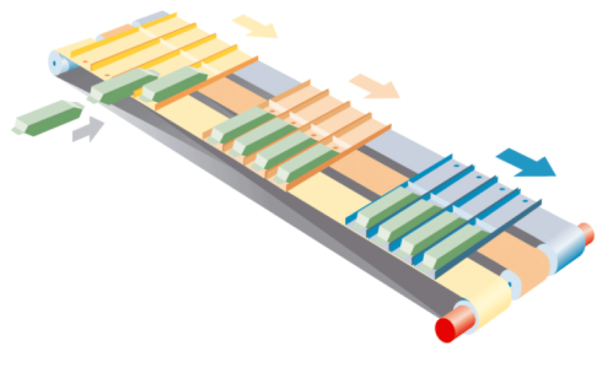
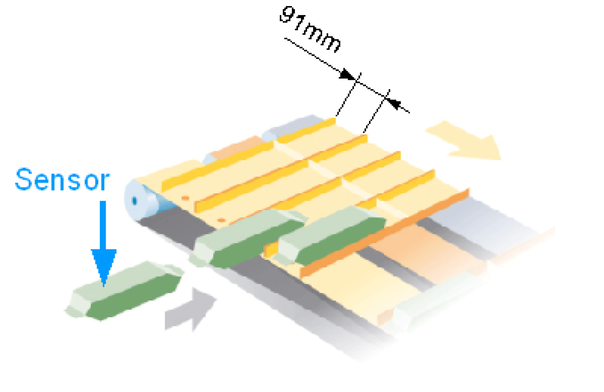
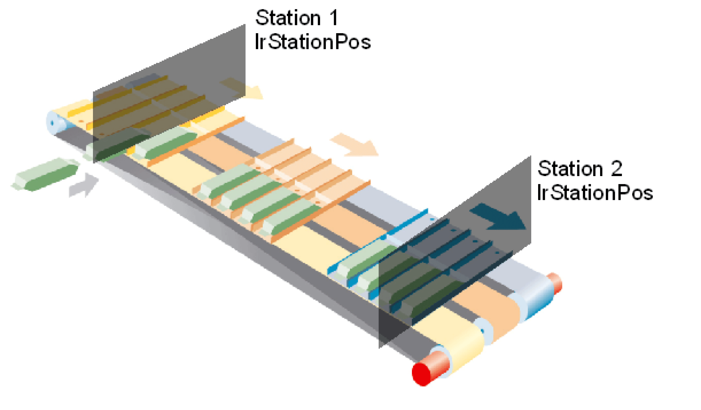

# Initial Start-Up

## Overview

This section should serve as an introduction aid for commissioning the MultiBelt and for determining the parameterization. The following configuration serves as an example.

MultiBelt



The displayed 3 trains should take on individual products and deliver them as a group to a robot.

The mechanic is defined as a belt drive with a tooth length of 10 mm.

## FeedConstant

The FeedConstant must be a whole number that has multiple of the length of a tooth. In our case, it is a multiple of 10 mm. You can count the teeth on the gear wheel that drives the belt and then multiply the length of a tooth on the belt.

Feedconstant = Number of teeth on the gear wheel \* Length of a tooth on the belt

In our case, the tooth gear has 25 teeth: 25 \* 10 mm = 250 mm.

## Belt Length

The parameter lrBeltLength specifies the length of a belt and will be set in the same way as the Feedconstant of the axis. This must also be a whole number that has multiple of the length of a tooth on the belt.

lrBeltLength = Number of teeth on the belt \* Length of a tooth

In our case, the belt has 396 teeth: 396 \* 10 mm = 3960 mm.

## Determining the Trains and Station

The next step should be the determination of the trains and the stations. The number of trains or belts are set using the parameter uiNumOfBelts. The number of stations with the parameter uiNumOfStations.

We have 3 trains here: uiNumOfBelts := 3

We require 2 stations, one for loading and one for unloading: uiNumOfStations := 2

The length of a train must be entered in the parameter lrTrainLength and only relates to the mechanics. They must at least correspond to the sum of all compartments.

In our case, a train is 364mm long: lrTrainLength := 364

## Collision Prevention

A collision prevention has been installed to help protect the mechanics. It is defined via the parameter IrCrashDistance. In our case, 5 mm is adequate that remain as a minimum distance after an Emergency Stop.

lrCrashDistance: = 5

In ControllerStopDec (parameter of the axis), the deceleration must be entered by an EmergencyStop. This must be greater than all other parameterized accelerations. In our case, we are defining 40000 as the Emergency Stop delay because the mechanics and the product must withstand this.

ControllerStopDec: = 40000

## Overview of the General Parameterization

```
stGeneral.i_lrBeltLength := 3960;
stGeneral.i_lrTrainLength := 364;
stGeneral.i_uiNumOfStations := 2;
stGeneral.i_uiNumOfBelts := 3;
stGeneral.i_lrCrashDistance := 5;
```

## Definition of the Loading Station

First the type of the station must be defined. In our case we want to have a clocked motion, therefore an [Indexed station](D-SE-0077880.html#D-SE-0077880).

etStationType: = ET\_StationType.Indexed

Loading station



The number of steps results from the number of stops that the train has to make in a station. In our case, there are 4 compartments mounted on a train that can take on one product each. Each compartment has a length of 91 mm.

uiNumOfSteps: = 4

alrSteps[0]: = 91

As an alternative, the steps can be defined individually:

alrSteps[0]: = 0

alrSteps[1]: = 91

alrSteps[2]: = 91

alrSteps[3]: = 91

The forth step does not have to be defined as the train with the forth product starts directly to the next station.

The products are detected by a sensor that is connected to an input of the Touchprobe. In our case the sensor is connected to a TP\_5.

ifTpStart: = TP\_5

The sensor reacts to the rising edge, therefore, the front edge of the product. The train should only start after the product has been completely filled in the train. For this purpose, a time delay can be set that allows the train to depart later. The time from the front edge of a product to the start of the train is 150 ms in our case.

stIndexed.lrStartDelayTime: = 150

The distance that the train is standing in the waiting line, lrTrainsDistance has been set with 10 mm.

Furthermore, a name should be set for the station. This name will be used in the exception text and visualization.

sName: = "Loading station"

Two different motions are carried out in the station. The motion during the step stStepMove can be set here as follows:

stIndexed.stStepMove.lrVel: = 1000

stIndexed.stStepMove.lrAcc: = 2000

stIndexed.stStepMove.lrDec: = 2000

stIndexed.stStepMove.lrJerk: = 1000000

The motion of the fully loaded train to the next station stDepartureMove is set as follows:

stIndexed.stDepartureMove.lrVel := 2000

stIndexed.stDepartureMove.lrAcc: = 3000

stIndexed.stDepartureMove.lrDec: = 3000

stIndexed.stDepartureMove.lrJerk: = 1000000

The motions are highly dependent on the products and the mechanics. For this purpose, you should begin with the lower values. Then, the value can be increased.

## Positions of the Stations

A necessary parameter has not been addressed until now: the basis position of the station. It defines the point on which the train stops to receive the product.



The figure shows the lrStationPos of station 1 and station 2. In our case, we define the lrStationPos as zero point. lrStationPos := 0. Therefore, the lrStationPos of station 2 of the distance between station 1 and station 2.

## Definition of the Unloading Station

We also parameterize a clocked processing station ([INDEXED STATION](D-SE-0077880.html#D-SE-0077880)) as an unloading station, however the parameterization is simplified as we only have a Stop / Step and no sensor that receives start signals from the station. In fact the station is controlled directly by the program.

The lrStationPos of the station is set as 1750.

We only require one stop in this station. uiNumOfSteps: = 1. With each start signal, a train moves to the next station which is the reason why no step length has to be specified.

The motion parameter is set in the same way as station 1 where the departure velocity is increased because the trains are empty and can run faster.

The motion towards the station (in case several trains are standing in a row) is set here as follows:

stIndexed.stStepMove.lrVel: = 2000

stIndexed.stStepMove.lrAcc: = 3000

stIndexed.stStepMove.lrDec: = 3000

stIndexed.stStepMove.lrJerk: = 1000000

The motion of the empty train to the first station stDepartureMove is set as follows:

stIndexed.stDepartureMove.lrVel: = 3000

stIndexed.stDepartureMove.lrAcc: = 4000

stIndexed.stDepartureMove.lrDec: = 4000

stIndexed.stDepartureMove.lrJerk: = 1000000

The trains should be unloaded by a robot in the unloading station. There are two signals for this purpose. The first is used to send the robot a message that the train is in the station and is ready to be unloaded. It is located in the Feedback structure of the station and is called xReadyForStep. The second is the start signal from the robot to the train as to when the train should start to the next station. It is called xStart and is located in the station configuration.

## Overview of the Station Parameterization

```
(* BeladeStation *)
stMultiBelt.astStation[1].sName := 'BeladeStation';
stMultiBelt.astStation[1].etStationType := ET_StationType.Indexed;
stMultiBelt.astStation[1].lrStationPos := 0;
stMultiBelt.astStation[1].lrTrainsDistance := 10;
stMultiBelt.astStation[1].uiNumOfSteps := 4;
stMultiBelt.astStation[1].alrSteps[0] := 91;
stMultiBelt.astStation[1].ifTpStart := TP_5; 
stMultiBelt.astStation[1].stIndexed.lrStartDelayTime := 150;
(* Step Movement Parameters *)
stMultiBelt.astStation[1].stIndexed.stStepMove.lrVel := 1000;
stMultiBelt.astStation[1].stIndexed.stStepMove.lrAcc := 2000;
stMultiBelt.astStation[1].stIndexed.stStepMove.lrDec := 2000;
stMultiBelt.astStation[1].stIndexed.stStepMove.lrJerk := 1000000;
(* Departure Movement Parameters *)
stMultiBelt.astStation[1].stIndexed.stDepartureMove.lrVel := 2000;
stMultiBelt.astStation[1].stIndexed.stDepartureMove.lrAcc := 3000;
stMultiBelt.astStation[1].stIndexed.stDepartureMove.lrDec := 3000;
stMultiBelt.astStation[1].stIndexed.stDepartureMove.lrJerk := 1000000;
(* EntladeStation *)
stMultiBelt.astStation[2].sName := 'EntladeStation';
stMultiBelt.astStation[2].etStationType := ET_StationType.Indexed;
stMultiBelt.astStation[2].lrStationPos := 1750;
stMultiBelt.astStation[2].lrTrainsDistance := 10;
stMultiBelt.astStation[2].uiNumOfSteps := 1;
(* Step Movement Parameters *)
stMultiBelt.astStation[2].stIndexed.stStepMove.lrVel := 2000;
stMultiBelt.astStation[2].stIndexed.stStepMove.lrAcc := 3000;
stMultiBelt.astStation[2].stIndexed.stStepMove.lrDec := 3000;
stMultiBelt.astStation[2].stIndexed.stStepMove.lrJerk := 1000000;
(* Departure Movement Parameters *)
stMultiBelt.astStation[2].stIndexed.stDepartureMove.lrVel := 3000;
stMultiBelt.astStation[2].stIndexed.stDepartureMove.lrAcc := 4000;
stMultiBelt.astStation[2].stIndexed.stDepartureMove.lrDec := 4000;
stMultiBelt.astStation[2].stIndexed.stDepartureMove.lrJerk := 1000000;
```

## Homing

After the parameterization of the station, the reference position between the mechanic and the software can be established. The homing makes sure that the mechanical position of the trains corresponds with the positions in the controller. In our case, we use a homing with Touchprobe sensors. For this purpose, each train must have been detected by a sensor. The distance between the sensor and the zero point, in our case the BasisPosition of station 1, must be specified: lrHomeTPOffset.

Furthermore, the following parameter must be set for the homing:

* The motion stMove carried out during the homing has to be parameterized.
* The train only triggers the Touchprobe signal once. iTPSignalsPerTrain: = 1
* The lrHomeTPOffset is based on the rising edge of the signal. xTpNegEdge: = FALSE

```
 stHomeOnTpParameter.stMove.lrVel := 100;
stHomeOnTpParameter.stMove.lrAcc := 1000;
stHomeOnTpParameter.stMove.lrDec := 1000;
stHomeOnTpParameter.stMove.lrJerk := 100000;
stHomeOnTpParameter.uiTPSignalsPerTrain := 1;
stHomeOnTpParameter.xTpNegEdge := FALSE;
```

After the homing has been carried out, the automatic mode can be started.

NOTE: During the initial start-up, operate the axes of the train with reduced power (UserCurrent / LimCurrent) to avoid mechanical damage in the event of incorrect parameterization.

## Train Configuration

The number of axes entered in the controller configuration must be transferred to the train configuration. In doing so, the trains must be entered in the correct sequence. Therefore, train 1 is positioned in front of train 2 that stands in front of train 3, etc. In addition, the respective sensor must be specified for the train for the Touchprobe homing. The train configuration appears as follows:

```
(* Zug 1 *)
stMultiBelt.astTrain[1].ifDrive := DRV_Train1;
stMultiBelt.astTrain[1].ifTpHome := TP_1;
stMultiBelt.astTrain[1].lrHomeTPOffset := 100;
(* Zug 2 *)
stMultiBelt.astTrain[2].ifDrive := DRV_Train2;
stMultiBelt.astTrain[2].ifTpHome := TP_2;
stMultiBelt.astTrain[2].lrHomeTPOffset := 100;
(* Zug 3 *)
stMultiBelt.astTrain[3].ifDrive := DRV_Train3;
stMultiBelt.astTrain[3].ifTpHome := TP_3;
stMultiBelt.astTrain[3].lrHomeTPOffset := 100;
```

Therefore train 1 is driven by the axis DRV\_Train1 and triggers TP\_1. The sensor is positioned 100 mm in front of the zero point, in our case 100 mm in front of lrStationPos of station 1.

EIO0000002654.02