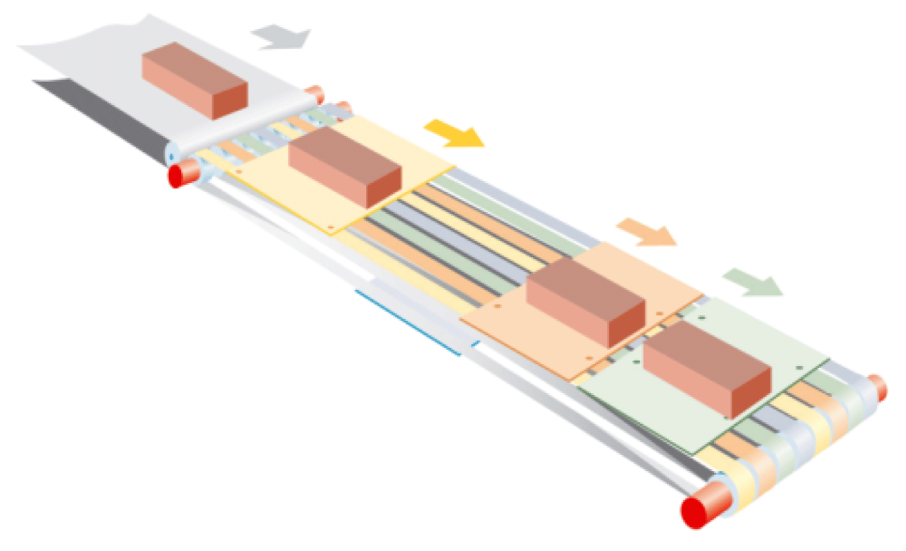

# General Information

## Description

This document describes the POUs contained in the PD\_MultiBeltModule library and its functionalities, including the necessary POUs for template integration.

NOTE: Only Controller OnBoard I/O touchprobes and drive touchprobes are supported by the functionalities of this library. TM5 module touchprobes are not supported.

## Characteristics of the Library

The following table indicates the characteristics of the library:

| Characteristic | Value |
| --- | --- |
| Library title | PD\_MultiBeltModule |
| Company | Schneider Electric |
| Category | Application |
| Component | PacDrive |
| Default namespace | MTBM |
| Language model attribute | [Qualified-access-only](../../../../../api/crossBook?lang=en-US&virtualBookName=SoLibref&topicID=D_SE_0081219) |
| Forward compatible library | Yes ([FCL](../../../../../api/crossBook?lang=en-US&virtualBookName=SoLibref&topicID=D_SE_0081226)) |

NOTE: For this library, qualified-access-only is set. This means, that the POUs, data structures, enumerations, and constants have to be accessed using the namespace of the library. The default namespace of the library is MTBM.

## Support

The chapter [Inserting a new MultiBelt equipment module](D-SE-0077916.html#D-SE-0077916) contains step-by-step instructions for inserting a new MultiBelt module into a template project.

The chapter [Example of an action Init\_MultiBeltModule](D-SE-0077917.html#D-SE-0077917) shows typical parameters for initializing a MultiBelt module.

The chapter [Example of a Cmd table](D-SE-0077918.html#D-SE-0077918) contains a typical command table for a MultiBelt module.

The respective functions are described in chapters [Teaching of stations](D-SE-0077919.html#D-SE-0077919) and [Operation mode Service](D-SE-0077920.html#D-SE-0077920).

EIO0000002656.01

© 2022

Schneider Electric.

All rights reserved.