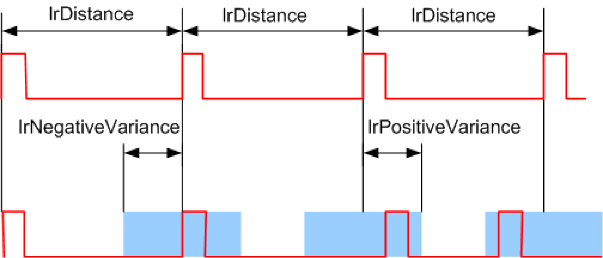
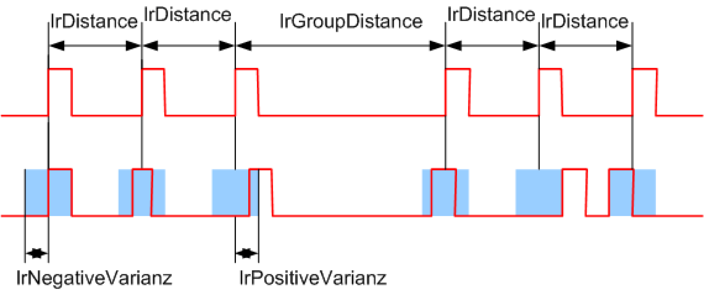
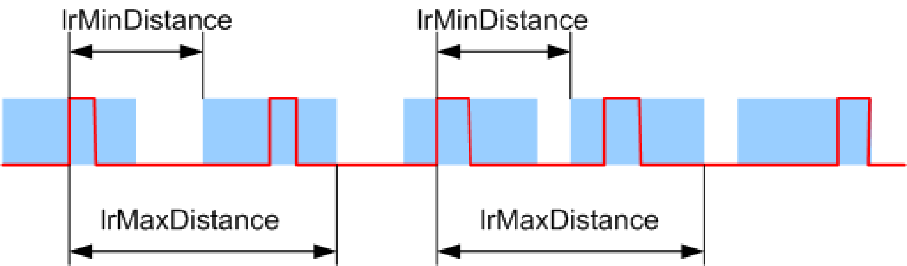
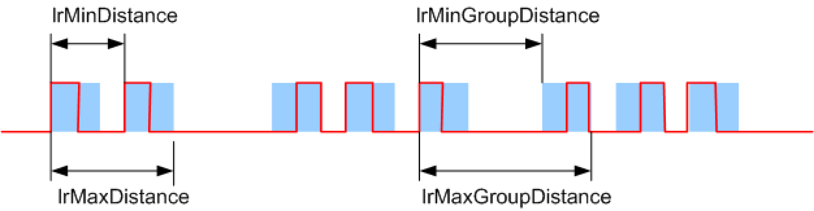

# FB\_StartSimulation - General Information

## Overview

|  |  |
| --- | --- |
| Type: | Function block |
| Available as of: | V1.0.4.0 |
| Versions: | Current version |

## Task

Function block for simulating the start signals of a station of the [MultiBelt](../../../../../api/crossBook?lang=en-US&virtualBookName=PD.Lib.MultiBelt&topicID=D_SE_0090072). It is used to simulate a product flow of a preceding machine, e.g. during commissioning or simulating the machine.

## Description

After Enable and Start, the POU generates signals at intervals that can be parameterized which can be used as start signals.

The type of signal generation is specified by the enumeration from ET\_StartSimulationMode and the ST\_StartSimulationParameter parameter structure.

## Interface

| Input | Data type | Description |
| --- | --- | --- |
| i\_xEnable | BOOL | A rising edge FALSE -> TRUE activates the POU, a falling edge TRUE -> FALSE deactivates the POU.  A deactivated POU does not execute any actions. |
| i\_xStart | BOOL | A rising edge starts signal generation. |

| Output | Data type | Description |
| --- | --- | --- |
| q\_xActive | BOOL | TRUE: The POU is active and has to be executed further.  FALSE: The POU is inactive. |
| q\_xReady | BOOL | TRUE: The POU is ready to operate and can accept user commands.  FALSE: The function block is not ready to accept user commands. |
| q\_etDiag | [GD.ET\_Diag](../../../../../api/crossBook?lang=en-US&virtualBookName=PD.Lib.GlobalDiagnostic&topicID=D_SE_0076228) | General library-independent statement on the diagnostic.  A value unequal to GD.ET\_Diag.Ok corresponds to a diagnostic message. |
| q\_etDiagExt | [ET\_DiagExt](D-SE-0079094.html#D-SE-0079094) | POU-specific output on the diagnostic.  q\_etDiag = GD.ET\_Diag.Ok -> status message  q\_etDiag <> GD.ET\_Diag.Ok -> diagnostic message |
| q\_sMsg | STRING[80] | Event-triggered message which gives more detailed information on the diagnostic state. |
| q\_xStartSignal | BOOL | Output for the start signals that have to be written on the *[ST\_ModuleStation.i\_rstParameter](../../../../../api/crossBook?lang=en-US&virtualBookName=PD.Lib.MultiBelt&topicID=D_SE_0077769)* parameter of the MultiBelt interface (see EcoStruxure Machine Expert, PD\_MultiBelt, Library Guide). |
| q\_xMissingSignal | BOOL | If the parameter xMissingSignals is TRUE, then the with lrPercentageOfSignalsMissing specified percentage of signals is given out on this output and not at q\_xStartSignal. |
| q\_lrSignalInterval | LREAL | The distance between the last signal and the next one. |
| q\_lrActualVariance | LREAL | In the simulation modes ET\_StartSimulationMode.Equidistant and ET\_StartSimulationMode.EquidistantGroups, the variance of the next signal from the reference position (time) is output. |

| Input/Output | Data type | Description |
| --- | --- | --- |
| iq\_stParameter | [ST\_StartSimulationParameter](D-SE-0079149.html#D-SE-0079149) | Input for the structure to parameterize the signal generation. |

## Description of the simulation modes

The simulation modes are described in more detail in the following. The addressed parameters must be entered in the ST\_StartSimulationParameter structure. In this structure, the simulation mode must be selected from the ET\_StartSimulationMode enumeration. By setting the parameter xUseTime to FALSE, the POU operates on position basis and the distance parameters have to be entered in the unit of the master belt. By setting the parameter xUseTime to TRUE, the function block operates on time basis and the distance parameters have to be entered in milliseconds.

**Equidistant**

In the **Equidistant** simulation mode, lrDistance signals are generated in fixed distances. By setting xStatisticalVariation, the signals are shifted in a window lrNegativeVariance to lrPositiveVariance. The specified reference position of the signal given by the lrDistance does not change. This avoids an addition of statistical deviations. Each signal is one program cycle long.

**EquidistantGroups**

In the **EquidistantGroups** simulation mode, a number of diSignalsPerGroup signals are generated as groups in fixed distances by lrDistance. A distance of lrGroupDistance is maintained between the groups. By setting xSubModeStatisticalVariation, the signals are shifted in a window lrNegativeVariance to lrPositiveVariance. The specified reference position of the signals given by lrDistance and lrGroupDistance does not change. This avoids an addition of statistical deviations. Each signal is one program cycle long.

**Random**

In the **Random** simulation mode, a random sequence of signals is generated. A signal follows the preceding signal in a random distance between lrMinDistance and lrMaxDistance. Each signal is one program cycle long. An addition of statistical deviations is not avoided. Each signal is one program cycle long.

**RandomGroups**

In the **RandomGroups** simulation mode, a random sequence of signals is generated as a group. The number of signals of a group is randomly set for every group between diMinSignalsPerGroup and diMaxSignalsPerGroup. Within a group, a signal follows the preceding signal randomly, in a distance from lrMinDistance to lrMaxDistance. The first signal of a following group follows the last signal of the preceding group in a random distance between lrMinGroupDistance and lrMaxGroupDistance. An addition of statistical deviations is not avoided. Each signal is one program cycle long.

## Diagnostic Messages

| q\_etDiag | q\_etDiagExt | Enumeration value | Description |
| --- | --- | --- | --- |
| OK | Disabled | 29 | The POU is disabled. |
| OK | Operation | 21 | The operation is being executed. |
| OK | WaitForStart | 20 | Waiting for starting command. |
| ControllerConditionInvalid | TimerInterfaceInvalid | 18 | The controller does not support the interface for the time functionalities. |
| InputParameterInvalid | ParameterInvalid | 13 | The parameter is invalid. |

## Disabled

|  |  |
| --- | --- |
| Enumeration name: | Disabled |
| Enumeration value: | 29 |
| Description: | The POU is disabled. |

The function block is disabled and executes no actions. i\_xEnable and q\_xActive are set to FALSE.

## Operation

|  |  |
| --- | --- |
| Enumeration name: | Operation |
| Enumeration value: | 21 |
| Description: | The operation is being executed. |

The start signals are generated.

## ParameterInvalid

|  |  |
| --- | --- |
| Enumeration name: | ParameterInvalid |
| Enumeration value: | 13 |
| Description: | The parameter is invalid. |

| Issue/Cause | Solution |
| --- | --- |
| An invalid parameter was transferred. | Further information can be found at the q\_sMsg output. |

## TimerInterfaceInvalid

|  |  |
| --- | --- |
| Enumeration name: | TimerInterfaceInvalid |
| Enumeration value: | 18 |
| Description: | The controller does not support the interface for the time functionalities. |

| Issue/Cause | Solution |
| --- | --- |
| The controller does not support the required time functionalities. | The POU cannot be executed on this controller. |

## WaitForStart

|  |  |
| --- | --- |
| Enumeration name: | WaitForStart |
| Enumeration value: | 20 |
| Description: | Waiting for starting command. |

The function block has completed its initialization and is waiting for a positive edge at the input i\_xStart before continuing the processing.

EIO0000002656.01

© 2022

Schneider Electric.

All rights reserved.