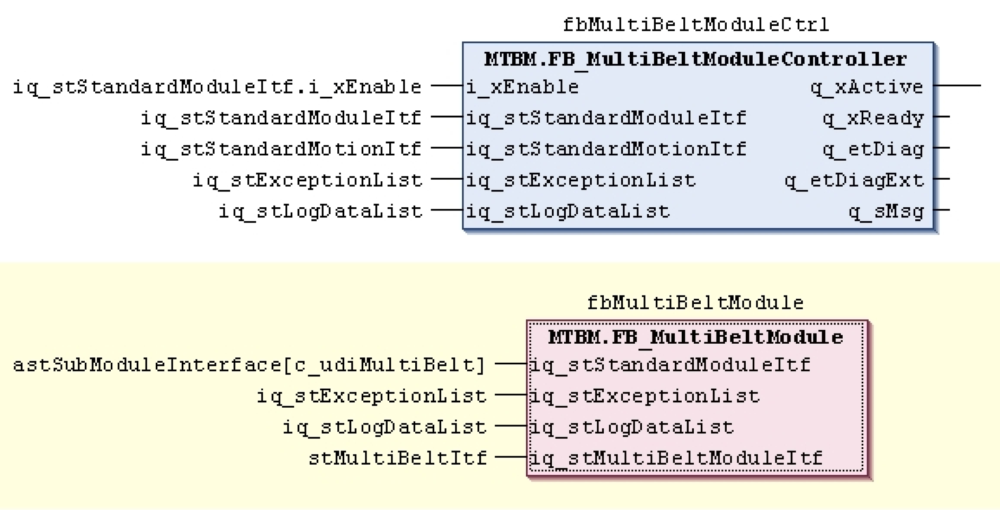
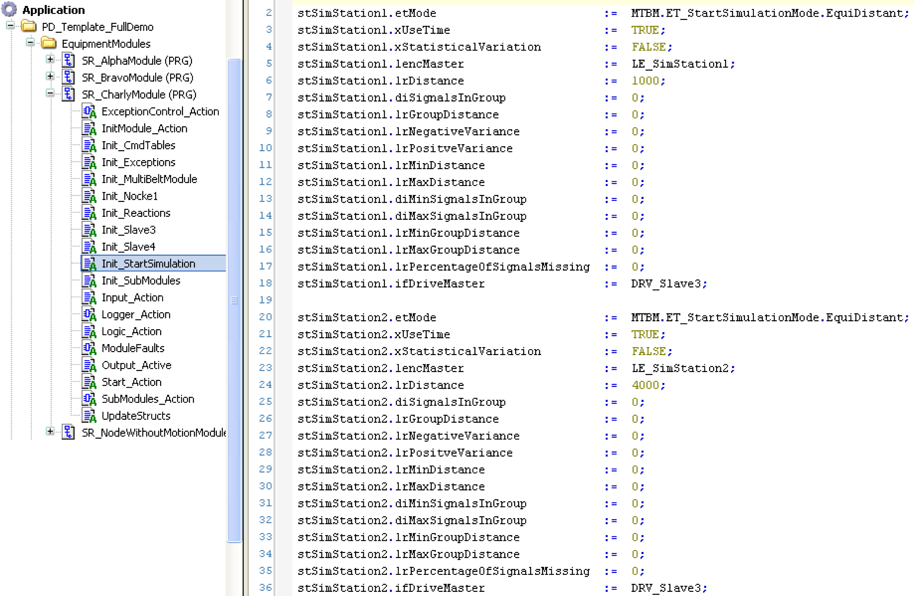
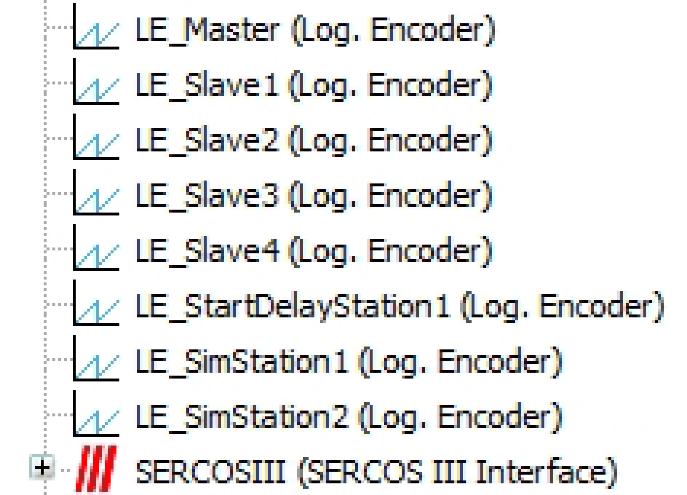
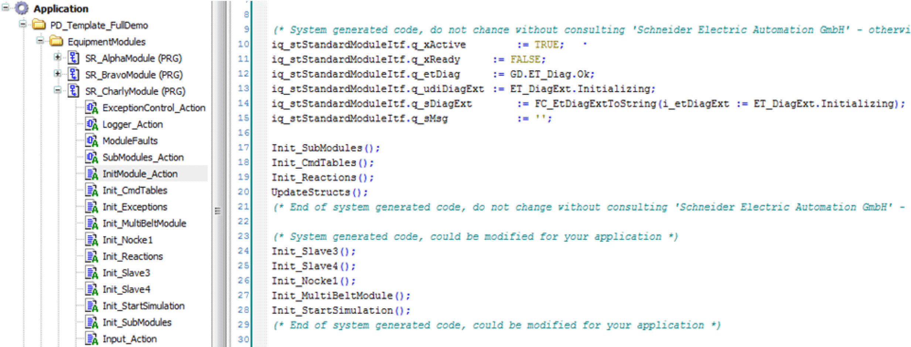
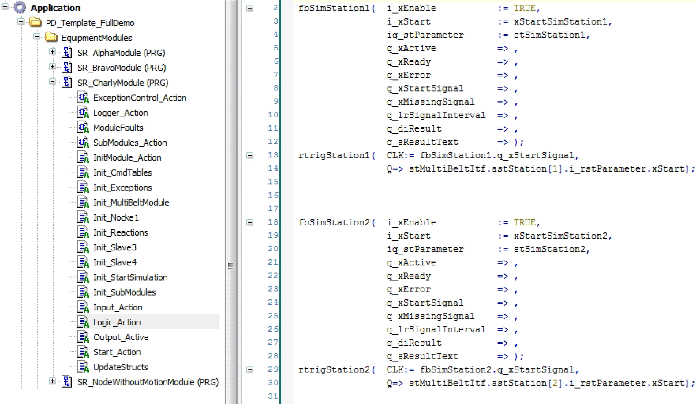
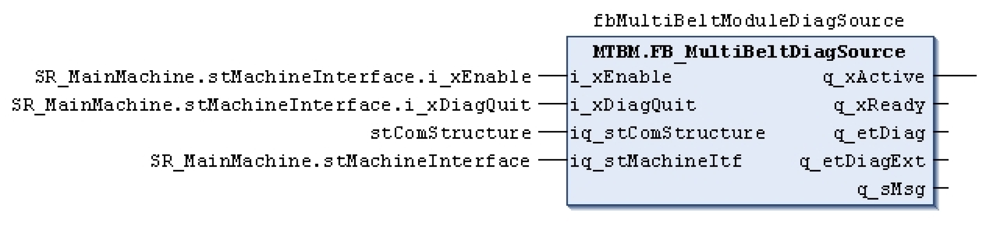

# Adding a New MultiBelt Equipment Module

## Overview

This chapter explains how to integrate a MultiBelt equipment module into a default PacDrive template.

The instructions refer to the project: PD\_Demoproject\_MultiBeltModule\_V2.0.4.0.project (or greater) and the PD\_Demoproject\_Template\_Full\_Demo\_V2.0.13.0.project (or greater).

**Requirement:**

PD\_Demoproject\_Template\_Full\_Demo\_V2.0.13.0.project as template, controller firmware version: 1.35.1.9 (or greater).

* Integrate necessary libraries

  Integrate the libraries of the PD\_MultiBeltModule 1.0.3.0 equipment module (or greater)
* as well as the libraries of the technology POUs PD\_MultiBelt 1.1.5.0 (or greater).
* Prepare the controller configuration.

  Define the required drives and logical encoders for the MultiBelt. The mechanical design of the MultiBelt determines which elements are required. An axis must be created for each train and a logical encoder for each indexed station if the start is performed via a Touchprobe. Also see example of an Init\_MultiBeltModule action

  In the following example, a MultiBelt is integrated with three stations and four trains. The names of the objects follow the name conventions of the templates.

  In the MultiBelt demo project, the designation for the axes of the trains is DRV\_Train1 to DRV\_Train4 and the designation of the logical encoder for the loading station is LE\_StartDelayStation1. The designation of the logical encoder for the unloading station is LE\_Master.
* Variable declaration

  The following variables must be created in the declaration section of the node, in which the MultiBeltModule should be located. In the demo project, the module is located in the SR\_CharlyModule module.

```
// MultiBelt Variables
   stMultiBeltItf : MTBM.ST_ModuleInterface;
   fbMultiBeltModule : MTBM.FB_MultiBeltModule;
   fbMultiBeltModuleCtrl : MTBM.FB_MultiBeltModuleController;

// Start Simulation
   fbSimStation1 : MTBM.FB_StartSimulation;
   fbSimStation2 : MTBM.FB_StartSimulation;
   stSimStation1 : MTBM.ST_StartSimulationParameter;
   stSimStation2 : MTBM.ST_StartSimulationParameter;
   xStartSimStation1 : BOOL;
   xNotEquidistandStation1 : BOOL;
   xNotEquidistandGroupsStation1 : BOOL;
   xNotRandomStation1 : BOOL;
   xNorRandomGroupsStation1 : BOOL;
   xStartSimStation2 : BOOL;
   xNotEquidistandStation2 : BOOL;
   xNotEquidistandGroupsStation2 : BOOL;
   xNotRandomStation2 : BOOL;
   xNorRandomGroupsStation2 : BOOL;
   rtrigStation1 : R_TRIG;
   rtrigStation2 : R_TRIG;
```

* Create constant

  The c\_udiNumberOfSubModules constant is increased by one in the declaration section of the node (3->4).

  A constant c\_udiMultiBelt: UDINT:= 4; is created.
* Call up FB\_MultiBeltModuleController and FB\_MultiBeltModule

  fbMultiBeltModuleCtrl and fbMultiBeltModule must be called up in the SubModules action of the node. Call up the controller before the module.



* Connect the controller and the module as shown in the figure above.
* Insert an action with the name Init\_MultiBeltModule into the node of the module and call it up in the InitModule\_Action step.

  An example for this action can be found in the chapter [Example of an Init\_MultiBeltModule action](D-SE-0077917.html#D-SE-0077917).
* Adapt the table commands in the Init\_CmdTables action of the node.

  For this purpose, use the commands of the ENUM MTBM.ET\_Cmd. An example for a table is located in the chapter [Example of a Cmd table](D-SE-0077918.html#D-SE-0077918).
* Call up the MTBM.FC\_UpdateAddInterfaceStruct function in the UpdateStructs action of the node. You can orient yourself using the example FC\_UpdateExampleLeafModuleAddInterfaceStruct.

```
   MTBM.FC_UpdateAddInterfaceStruct(
      i_pdwSubModuleAddInterfaces:= ADR(adwSubModuleAddInterfaces),
      i_udiSubModuleConstant:= c_udiMultiBelt,
      iq_stMultiBeltModuleItf:= stMultiBeltItf,
      q_etDiag=> etDiag,
      q_etDiagExt=> etDiagExt);
```

* Insert the following persistent variables into the folder GlobaleVariable/RestoreAxisPosition:

```
   lrLoadPosRetainStation1: LREAL;
```

```
   lrLoadPosRetainStation2: LREAL;
```

```
   lrLoadPosRetainStation3: LREAL;
```

```
   lrLoadPosRetainStation4: LREAL;
```

```
   lrLoadPosRetainStation5: LREAL;
```

```
   lrLoadPosRetainStation6: LREAL;
```

```
   lrLoadPosRetainStation7: LREAL;
```

```
   lrLoadPosRetainStation8: LREAL;
```

```
   astRestoreTrain: ARRAY[1..MTB.Gc_uiMaxNumberOfBelts] OF PDL.ST_HomeSetPos;
```

* Create an action with the name Init\_StartSimulation in the SR\_CharlyModule.



* Create the two logic encoders LE\_SimStation1 and LE\_SimStation2.



* Then, call up LE\_SimStation1 and LE\_SimStation2 in the action InitModule\_Action.



* Call up the start simulation in the action Logic\_Action.



## Integration into Template Visualization

* Integrate MTBM.FB\_MultiBeltModuleVisController

  Insert the following line in the declaration section of SR\_VisControl():

```
   vpq_xDisplaySetJogTargetButton: BOOL;
   vpiq_fbMultiBeltVisController: MTBM.FB_ModuleVisController;
```

* Insert the following code in the action SR\_VisControl.ModuleVisController:

```
   vpiq_fbMultiBeltVisController(
      i_xEnable:= vpq_xDoEnable,
      i_pstMachineStandardItf:= ADR(SR_MainMachine.stMachineInterface),
      i_pstCurrentStandardItf:= pstCurrent,
      i_dwCurrentAddItf:= dwCurrentAddInterface,
      i_xUpdateData:= xUpdateForOtherFBs,
      i_udiCurrentJogTarget:= G_udiManualModuleSelect,
      iq_stExceptionList:= G_stExceptionList,
      iq_stLogDataList:= G_stLogDataList,
      q_udiSetAsCurrentModule=> udiSetAsCurrentModule,
      q_udiSetAsJogTarget=> udiSetAsJogTarget);
```

```
   SetCurrentModule();
```

* Copy all visualizations from the folder Visualization/MultiBeltModule (Vis\_MultiBeltModule, Vis\_MultiBeltModule\_StationFeedback, Vis\_MultiBeltModule\_StationParameter, VIS\_MultibeltModule\_Train, Vis\_MultiBeltModule\_Simulation as well as the Vis\_MultiBeltModule\_Service) from the demo project to the current project.
* If not already available, copy the FR\_OtherModuleTypes frame from the Visualization/FramesProject folder from the demo project to the current project.

## Integration into Diagnostics

* Create an instance of the function block FB\_MultiBeltDiagSource in the declaration section of the program "SR\_Diagnostics".

```
   fbMultiBeltModuleDiagSource: MTBM.FB_MultiBeltDiagSource;
```

* In the program section of "SR\_Diagnostics", call up the instance of the diagnostic source.



EIO0000002656.01

© 2022

Schneider Electric.

All rights reserved.