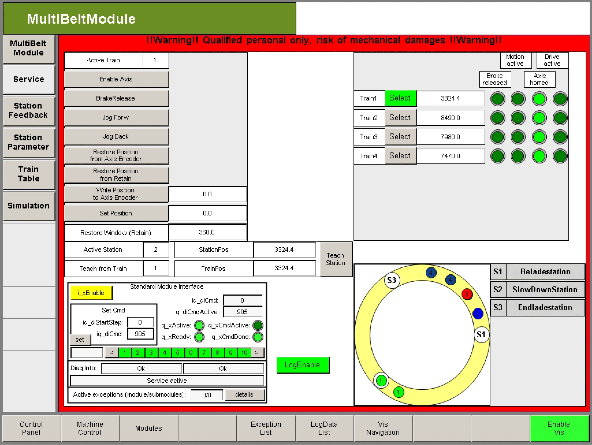

# Teaching of Stations

## Overview

In the Service operation mode, it is possible to teach the positions of the stations.

NOTE: Safety-related functions are deactivated in Service operation mode.

If the position of stations cannot be recorded numerically, they can be determined using the position of the train. For this purpose, the position of the train is written in the position variable of the station as well as in a retain variable. The position of the station is immediately active.

After a controller reset, the position is loaded from the retain memory back into the MultiBelt interface.

## Teaching the Position of a Station

The following steps must be carried out to teach a station.

* For the position of each station to be taught, an LREAL variable must be created in the retain memory of the controller.
* The address of the retain variables must be transferred to the respective station.

```
   stMultiBeltItf.astStation[2].iq_plrTeachStationPosRetain:= ADR(lrLoadPosRetainStation2);
```

* First, enable the operation mode Service in the MultiBelt visualization.
* You can move the train to the desired start position using the buttons **Jog Forw** or **Jog Back**.
* You can enter the number of the selected train and the station via the input fields 'Active Station' and 'Teach from Train'.
* By enabling the button **Teach Station**, the train position is allocated as station position.



## Restore a Position That Has Been Taught

After a controller reset, the position of the station is set to zero in the MultiBelt interface. Therefore, this must first be overwritten with the value in the retain memory.

This is performed by setting the parameter: stMultiBeltItf.stHome.i\_xUseTeachedStations:= TRUE. Once set to TRUE, the stMultiBeltItf.astStation[2].i\_rstParameter.lrStationPos parameter is overwritten and requires the function block to be reinitialized.

| NOTICE | |
| --- | --- |
|  | INCORRECT STATION POSITION  You must carry out a re-initialization of the function block after a station has been taught or after a station position has been restored.  Failure to follow these instructions can result in equipment damage. |

EIO0000002656.01

© 2022

Schneider Electric.

All rights reserved.