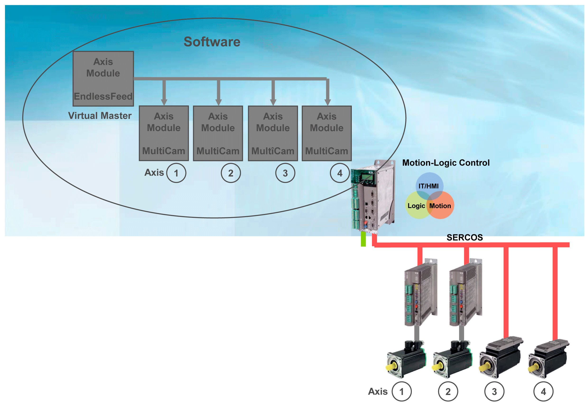

# Electronic Line Shaft - ELS

Electronic Line Shaft - ELS

Electronical MainShaft

The virtual master axis (Virtual Master) supplies the axis module with data of the electronic Line Shaft. The axis module generates the cam disk setpoint value or the individual axis using the motion function MultiCam. A large number of synchronized individual axis generate the motion process of the packing process.

In practice, it is often the case that the velocity and acceleration of an axis that are coupled with the Line Shaft have to be limited. The reasons are, for example, speed and torque limits of the drive, retention force on a product, etc.

There were two possibilities for this purpose:

oThe curve left areas where the velocity and acceleration limits were breached and re-synchronized when the critical sector had been left.

oThe slow velocity of the Line Shaft must be selected so that the limits are not breached.

Leaving the curve has the disadvantage that the synchrony to the Line Shaft (Virtual Master) will be lost. This is a risk for the packing process, especially when several slave axis are coordinated by this Line Shaft (master axis).

The slow velocity of the Line Shaft has the disadvantage that (when applicable) a single critical location in the process determines the velocity for the complete packing process. This can usually not be accepted.

The solution to this problem was the development of the Intelligent Line Shaft.