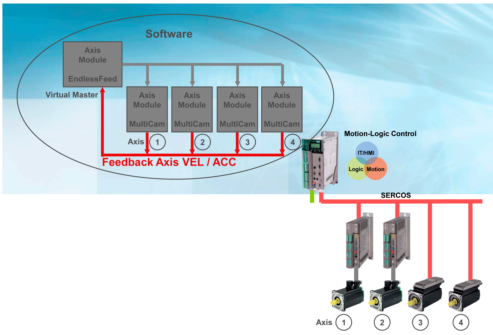

# Intelligent Line Shaft - ILS

Intelligent Line Shaft - ILS

With the ILS, the master axis no longer rotates with a fixed continuous velocity. During the cycle run, the master axis can run a velocity profile that considers partial weak points of individual slave axis. This maintains the synchronism to the Line Shaft. Furthermore, a high velocity of the Line Shaft can be selected as it will be decelerated "automatically" when necessary. If the critical motion phase of the slave axis has been completed, the master axis accelerates again automatically.

Intelligent Line Shaft

With the intelligent Line Shaft, the virtual master axis (Virtual Master) must receive information for the velocity and acceleration of the individual axis. The master axis looks ahead if the individual axis has a exceeded a defined limit value for the speed or the acceleration. It decelerates the master velocity before the critical motion phase early enough depending on the extent of the limit value expected to be exceeded.

The velocity and accelerating of the individual axis cannot be exceeded in the sequence of the respective limit value any more. Outside the critical motion phase, the virtual master axis increases its velocity to a value above the maximum velocity - up to the limit by the next "weak" link. The success: A new effective velocity above the maximum velocity without exceeding the defined maximum velocity or acceleration of the individual axis.

The sequence offers space for different optimization objectives. If only the velocity is the main focus, depending on the application, a velocity increase between 10 and 30 % can be implemented by "mitigating" the weakest link in the mechatronic chain. The objective could also be to increase the operating life of the machine or to reduce the forces acting upon the packing material or packing goods at a continuous velocity. In all cases, there is a possibility of achieving the optimization by limiting the maximum velocity and / or the maximum acceleration.

The advantages of the method are obvious. Their practical realizable use, a question of their implementation. In individual cases, the machine specific programming of the required algorithm can develop itself to an extensive and complicated matter.