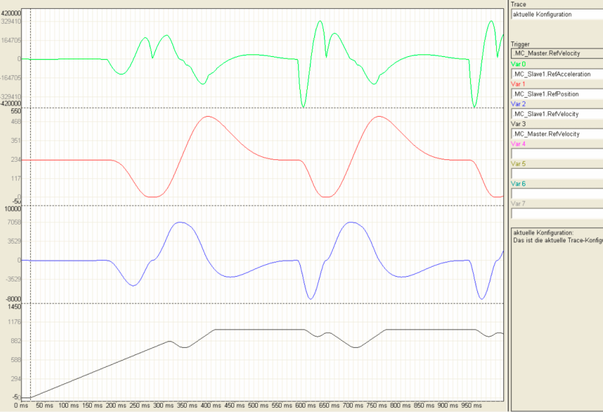
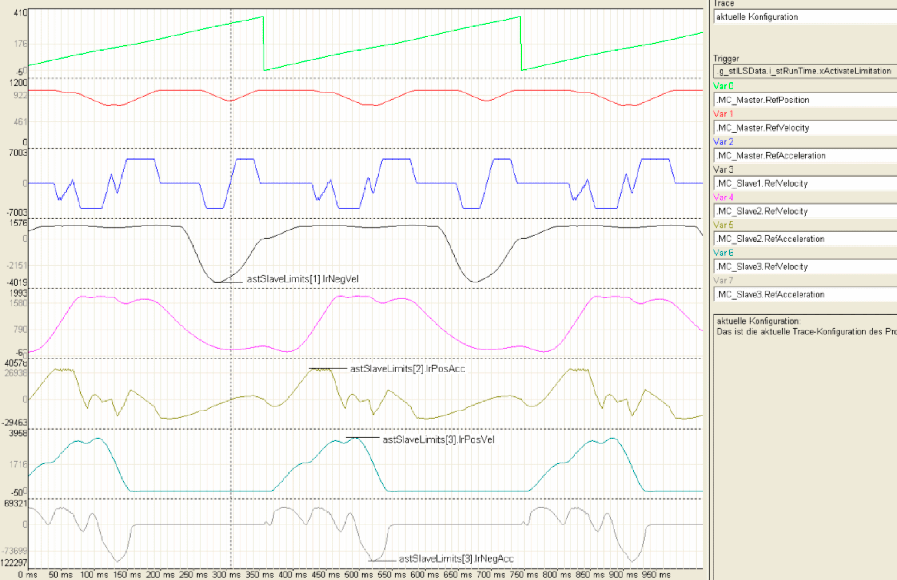

# Examples

Examples

The trace recording of an application with the Electronical Line Shaft is shown in the following illustration. The velocity (MC\_Slave1.RefVelocity) and acceleration (MC\_Slave1.RefAcceleration) of the slave axes result depending on the master velocity (MC\_Master.RefVelocity).

Electronical Line Shaft: Acceleration and velocity sequence of a slave axis depending on the master axes velocity.

Using the Intelligent Line Shaft, acceleration of the slave axis (MC\_Slave1.RefAcceleration) can be limited. For this, the master velocity (MC\_Master.RefVelocity) is reduced on the critical places of the motion ([Cam profile](../Function_Blocks_I_to_Q/Function_Blocks_I_to_Q-14.htm#XREF_D_SE_0087313_1)).

Intelligent Line Shaft: Acceleration and velocity sequence of a previous slave axis with acceleration limits through adapted master axes velocity.

It is also possible to limit the velocity (MC\_Slave1.RefVelocity) of the slave axes. Here the master velocity (MC\_Master.RefVelocity) is also reduced on the critical position of the motion (Curveprofile).

Intelligent Line Shaft: Acceleration and velocity sequence of the previous slave axis with velocity limits through adapted master axes velocity.

The Intelligent Line Shaft can observe several limits. The following trace recording indicates these limits:

onegative velocity of the slave axis 1 (MC\_Slave1.RefVelocity),

opositive acceleration of the slave axis 2 (MC\_Slave2.RefAcceleration),

opositive velocity of the slave axis 3 (MC\_Slave3.RefVelocity) and

onegative acceleration of the slave axis 3 (MC\_Slave3.RefAcceleration).

Intelligent Line Shaft: Acceleration and velocity sequence of several slave axes with acceleration and velocity limits through adapted master axes velocity.

