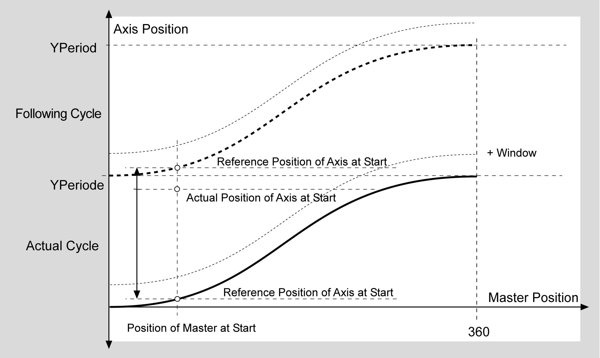

# Examples

Examples

WsMode StoredCamMoveAlwaysNoPositionCheck, NewCamMoveAlwaysNoPositionCheck

WSMode 0, 10: No checking, always move to reference position

In the above example, the curve has a YPeriod, and the distance from the axis position to the reference position of the previous curve is shorter than the distance to the reference position of the current curve. The axis is then moved backwards to the curve position. Thereafter, the position does not have a negative value, but the position value of the curve.

If xNoModuloSlaveAtStart = TRUE, the axis moves to the reference position of the current cam.

WsMode StoredCamMoveToCamPositonInWsWindow, NewCamMoveToCamPositonInWsWindow

WSMode 1, 11: Move to cam position (slave position) if the axis is within the WSWindow

In the above example, the cam has a YPeriod and the distance from the axis position to the reference position of the current cam is not within the window i\_lrWsWindow. However, the reference position of the following curve is inside the window and so will be started.

If xNoModuloSlaveAtStart = TRUE, you will receive the detected error message “Out of Window”.

WsMode StoredCamMoveForwardToCamPositon, NewCamMoveForwardToCamPositon

WSMode 2, 12: Move forwards only to the cam position

In the above example, the curve has a YPeriod and the axis position is outside of the window. In this case, the axis moves into the next period.