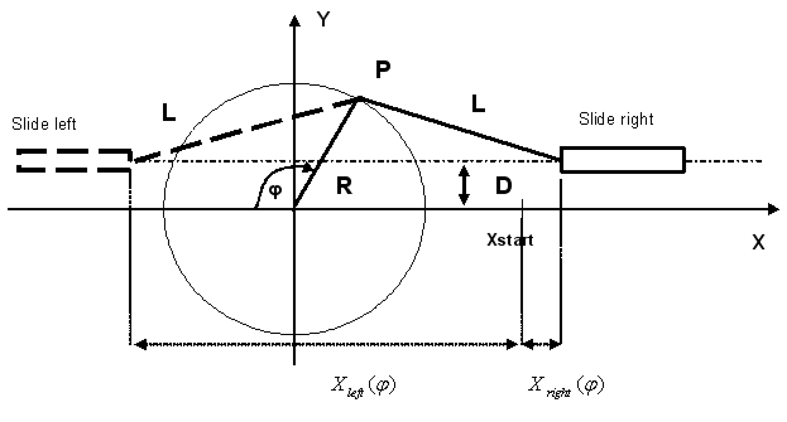
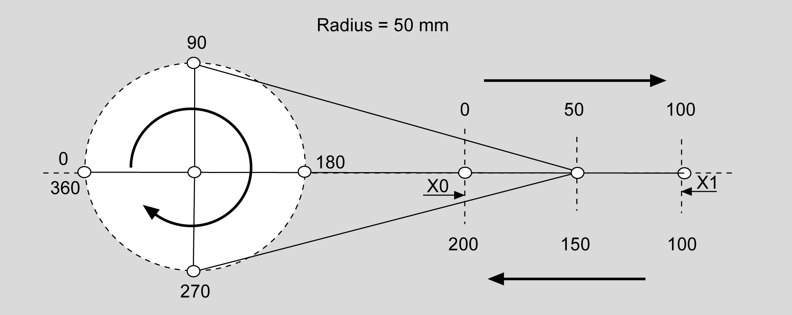
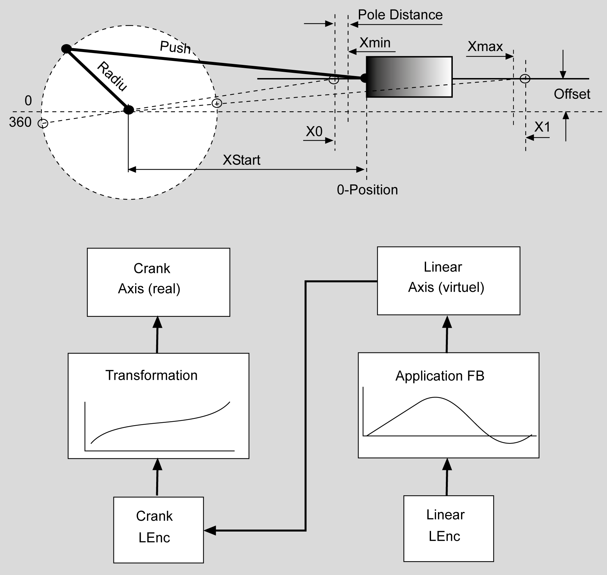

# Description

Description

The function block provides the following functionalities:

oAll variants of cranks can be handled. This also includes cranks which, because of the aspect ratios of R, L, and D, cannot complete a complete revolution and those for which the push rod is on the "left" side (represented with a dashed line).

oFree configuration of the interpolation intervals around the slide's reversing points and the use of variable straight segments when interpolation regions overlap.

Plant principle for FB\_Crank

Through this, the slide's linear motion is transformed into one rotation of the crank. The slide's movement can thus take place without consideration of the non-linearity of the drive.

Requirement:

The mechanics must be constructed in such a manner that the crank can complete its rotation (360° rotations) even if the complete path is not used.

Due to the drive's finite dynamic, the slide's path is not completely linearized. A distance PoleDistance is kept to the maximum values.

Both the upper part of the crank, lrPhiMin to lrPhiMax, and the lower part are linearized. General polynomials of the fifth degree are integrated between the linearized parts. This allows for operation beyond the linearized range. The crank function block allows all positions to be exceeded without limit in each direction.

The linear path is counted positively for one crank rotation. Even when the slide moves backwards in the lower range of the crank, the counting method is positive.

The period for the linear axis is 2 \* (X1 – X0). X1 is the right maximum position of the slide, and X0 is the left. The period for the crank is 360°.

Method of counting for the crank transformation

The crank position goes from 0° to 360°. The slide position goes from 0 mm to 100 mm, and then not backwards, but continues to 200 mm. Then, both the position of the crank and that of the slide start again at 0.

Linearization of the complete crank rotation (forward and reverse). A poly5com is used at the poles of the crank. The calculation requires about 10 ms; the cycle time monitoring function is set to 50 ms for the calculation.

Sketch of the system principle

NOTE: The above X-Y coordinate system may be oriented in the area as desired. Only the following needs to be taken into account: If it is viewed from above, the angle is measured clockwise against the negative X direction, as shown. The parameter "Motor Direction of the Crank Axis" must be set so that, during clockwise rotation, its position (when viewed from this perspective) gets larger.

Plant principle for FB Crank

A slide is positioned by a crank using a servo drive.

Block diagram for FB\_Crank

