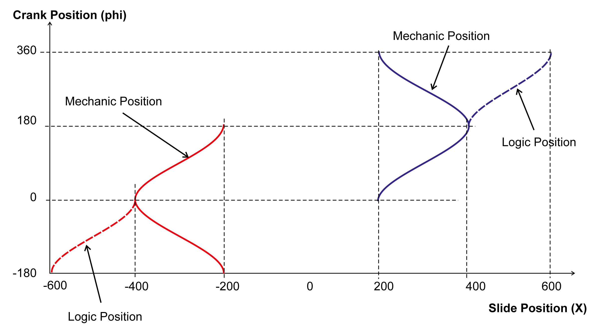
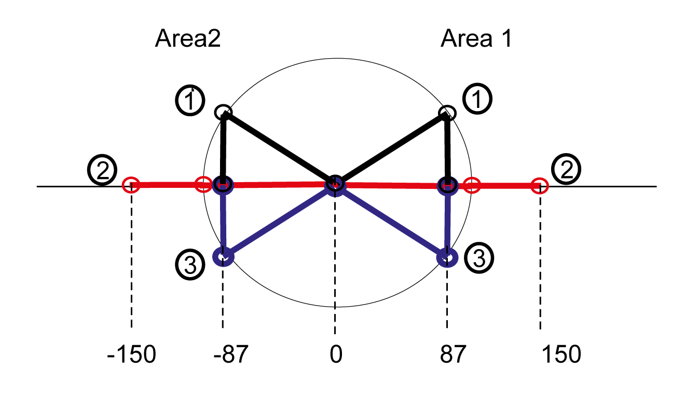
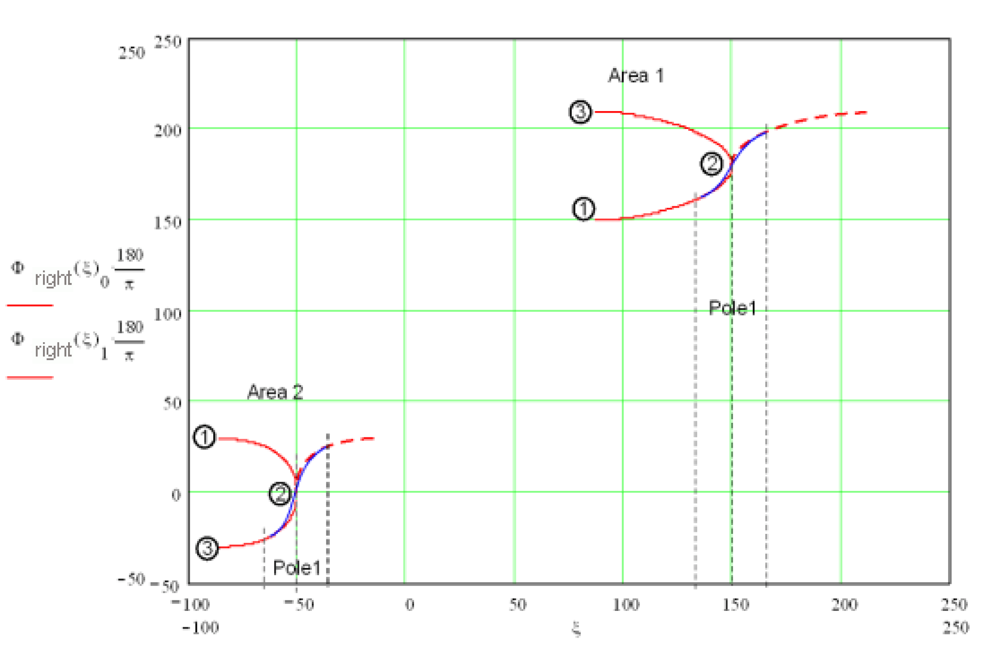
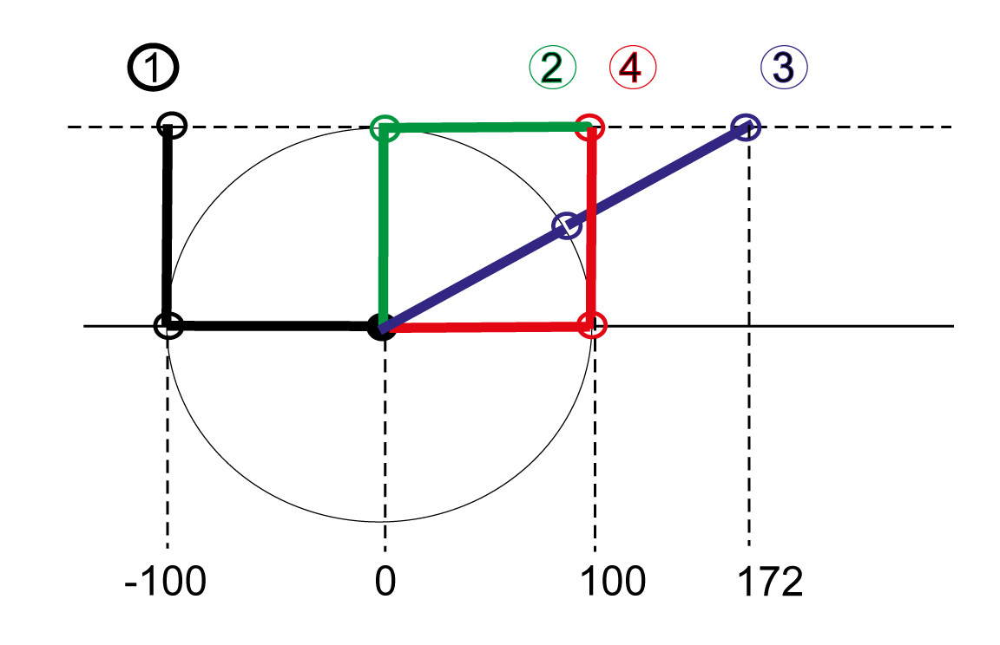
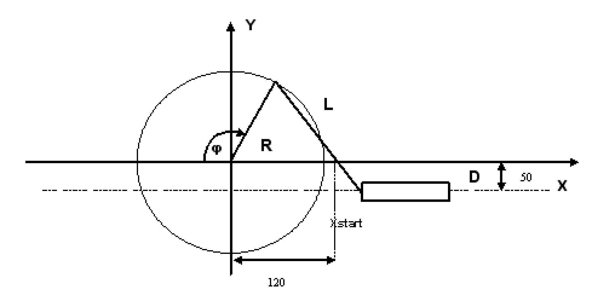
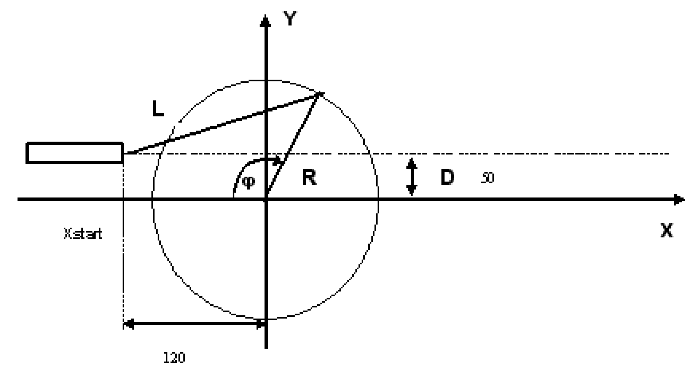
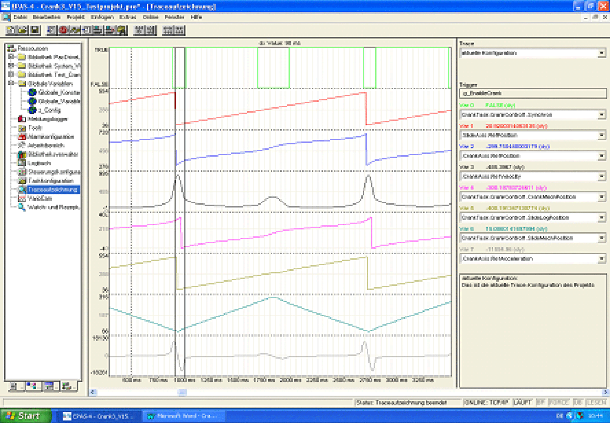
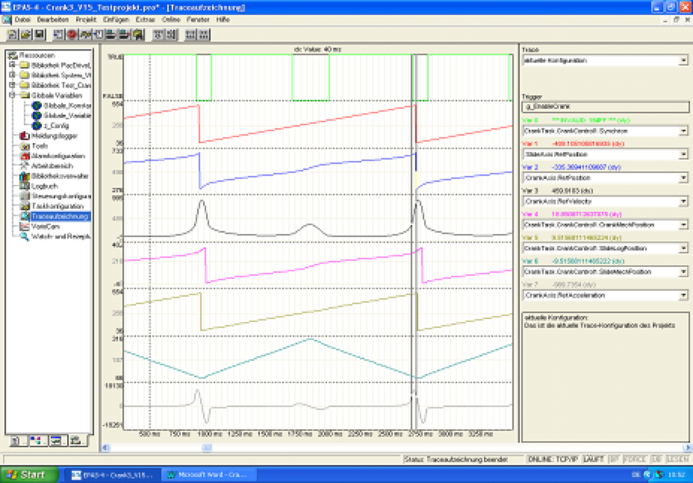

# Examples

Examples

olrRadius: 100 mm

olrPushRod: 300 mm

olrOffset: 0

olrXStart: 0 mm

This results in the above positioning progression, depending on whether the pushrod lies to the left (red) or the right (blue). The dashed lines are the "logical positions". These are a reflection of the "mechanical position" beyond the 2nd pole position. This is necessary in order to obtain an unambiguous mapping of the slide position to the crank position.

The range in which the crank is linearized can be determined using the parameters lrP5Pole1IntervalLow, lrP5Pole1IntervalHigh, lrP5Pole2IntervalLow and lrP5Pole2IntervalHigh. The gaps in the linearized ranges at the pole positions are connected via 'general polynomials of the fifth degree'.

Mechanic systems with limited rotational range.

Example1: Very short crank rod (lrPushRod)

olrRadius = 100

olrPushRod = 50

olrOffset = 0

olrXStart = 0

Here, there are two possible processing ranges for the crank.

Again, the dashed red line is the logical position, which is reflected at Pol1. The logical movement range of the slide is thus from approx. 87 to 213 mm and -87 to -13. The logical angle of the crank is thus in the range of 150 to 210 degrees and -30 to +30 degrees. The transition at the pole point is moved through by means of a "general polynomial of the 5th degree".

Example2: Relatively short crank rod (lrPushRod) and high lrOffset

olrRadius = 100

olrPushRod = 100

olrOffset = 100

olrXStart = 0

oCrank pushrod right

-> one processing range and limited rotation

Again, the dashed red line is the logical position, which is reflected at Pol1. The logical movement range of the slide is thus from approx. 87 to 213 mm and -87 to -13. The logical angle of the crank is thus in the range of 150 to 210 degrees and -30 to +30 degrees. The transition at the pole point is moved through by means of a 'general polynomial of the 5th degree'.

Programming example:

The parameters for Crank3 must be set before the POU is activated.

G\_stCrankData.lrRadius := 100;   
G\_stCrankData.lrPushRod := 300;   
G\_stCrankData.lrXStart := 200;   
G\_stCrankData.lrOffset := 0;   
G\_stCrankData.lrP5Pole1IntervalLow := 10;   
G\_stCrankData.lrP5Pole1IntervalHigh := 20;   
G\_stCrankData.lrP5Pole2IntervalLow := 20;   
G\_stCrankData.lrP5Pole2IntervalHigh := 10;   
G\_stCrankData.xCrankLeft := FALSE;   
G\_stCrankData.xRange := FALSE;

xCrankLeft = FALSE means that the crank rod is on the right.

XRange = FALSE means that when there are two processing ranges, range2 is used.

Sample configuring

In the following figures:

oR = 100mm

oL = 200mm

G\_stCrankData.lrRadius := 100;   
G\_stCrankData.lrPushRod := 200;   
G\_stCrankData.lrXStart := 170;   
G\_stCrankData.lrOffset := 50;   
G\_stCrankData.xCrankLeft := FALSE;

G\_stCrankData.lrRadius := 100;   
G\_stCrankData.lrPushRod := 200;   
G\_stCrankData.lrXStart := 120;   
G\_stCrankData.lrOffset := -50;   
G\_stCrankData.xCrankLeft := FALSE;

G\_stCrankData.lrRadius := 100;   
G\_stCrankData.lrPushRod := 200;   
G\_stCrankData.lrXStart := -120;   
G\_stCrankData.lrOffset := 50;   
G\_stCrankData.xCrankLeft := TRUE;

G\_stCrankData.lrRadius := 100;   
G\_stCrankData.lrPushRod := 200;   
G\_stCrankData.lrXStart := 150;   
G\_stCrankData.lrOffset := -50;   
G\_stCrankData.xCrankLeft := TRUE;

Example for the parameters lrP5Pole1IntervalLow, lrP5Pole1IntervalHigh, lrP5Pole2IntervalLow, lrP5Pole2IntervalHigh, lrP5RangeLow, lrP5RangeHigh

In the following example:

G\_stCrankData.lrRadius := 100;   
G\_stCrankData.lrPushRod := 200;   
G\_stCrankData.lrXStart := 0;   
G\_stCrankData.lrOffset := 50;   
G\_stCrankData.xCrankLeft := FALSE;

In this case, the crank can rotate without restrictions (thus, G\_stCrankData.xEndlessCrank = TRUE) and the following results for the range of the logical position

lrXLogMin = 86.6..., lrXLogSwitch = 295.8..., lrXLogMax = 505.0...

and for the logical angle

lrPhiLogMin = 330, lrPhiLogSwitch = 530.4..., lrPhiLogMax = 690

Furthermore, G\_stCrankData.xXLogDirPos = TRUE, e.g. lrXLogMin is equivalent to lrPhiLogMin and lrXLogMax is equivalent to lrPhiLogMax. If

G\_stCrankData.lrP5Pole1IntervalLow = 10   
G\_stCrankData.lrP5Pole1IntervalHigh = 20   
G\_stCrankData.lrP5Pole2IntervalLow = 30   
G\_stCrankData.lrP5Pole2IntervalHigh = 40

Then the following progression results. The ranges which are interpolated by means of 'general polynomials of the fifth degree' are marked with a cursor. The red trace represents the logical position of the linear axis, the blue trace represents the logical angle of the crank axis. As described further above, pole 1 is at lrPhiLogMin, pole 2 is at lrPhiLogSwitch.

Range which corresponds to lrP5Pole1IntervalHigh

Range which corresponds to lrP5Pole2IntervalLow

Range which corresponds to lrP5Pole2IntervalHigh

Range which corresponds to lrP5Pole1IntervalLow

The interpolation intervals for the poles were chosen here so that no overlapping occurred. Thus, the parameters lrP5RangeLow, lrP5RangeHigh were not active.

Now, lrP5Pole2IntervalHigh and lrP5Pole1IntervalLow were chosen large enough so that an overlapping occurred in the range lrXLogSwitch ... lrXLogMax. Because IrXLogMax - IrXLogSwitch = 209.2..., this is the case when

G\_stCrankData.lrP5Pole2IntervalHigh = 150   
G\_stCrankData.lrP5Pole1IntervalLow = 150

selected. This range will then be interpolated with three sections: Poly5 – Straight – Poly5. The length of the Poly5 sections is defined by the parameters lrP5RangeLow, lrP5RangeHigh. The choice

G\_stCrankData.lrP5RangeLow = 50   
G\_stCrankData.lrP5RangeHigh = 100

yields the following:

lrP5RangeLow

lrP5RangeHigh

