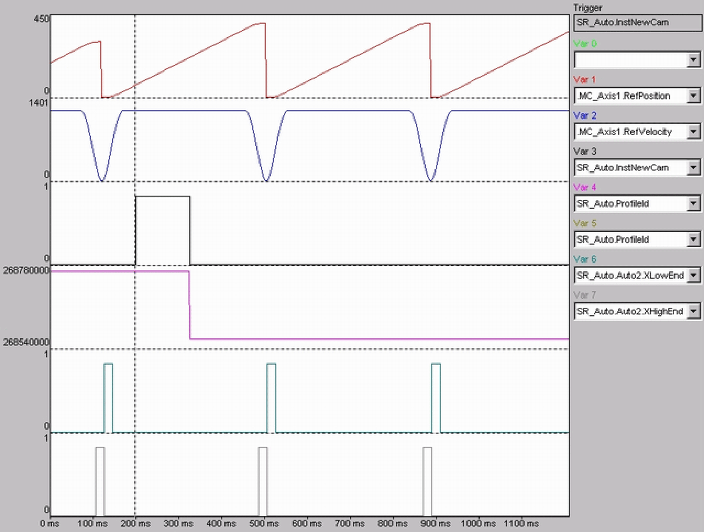

# Description

Description

Function block for motion tasks that can be defined by presetting the motion processes in segments. The description of the motion sequence is stored in a structure (type [ST\_MultiCam](../Structures/Structures-32.htm#XREF_D_SE_0087770_1)). It comprises the number of motion points (diNumberOfCamPoints maximum 32), and an array of points (type [ST\_CamPoint](../Structures/Structures-5.htm#XREF_D_SE_0087716_1)). By changing the existing structure, it is possible to switch various motion sequences to event-driven (for example, start cycle, continuous cycle, stop cycle, etc.).

Cold Start

Cold start means starting at the beginning of the motion sequence.

A cold start is executed with input i\_xStart = TRUE and input i\_xWsSelect = FALSE. There are various options (input variables i\_etCsModeSlave and i\_etCsModeMaster) for the cold start.

Analytical profile application

The analytical profiles of the PacDrive controller (simple sine, inclined sine, modified sine, modified acceleration trapezoid or the polynomial of the fifth degree) can be used as Rest-Rest, Rest-Velocity and Velocity-Rest profiles.

User profile application

In addition, any user profiles can be used. The profiles must be available as “<Name>.pp3 and can then be loaded in a normal manner.

NOTE: Used user profiles must be available on the flash disk. When replacing the flash disk, make sure that all profile data are copied.

NewCam

This abort is triggered using the input Iq\_xNewCam. Setting the iq\_xNewCam signalizes that a new profile is to be used in the next cycle. The function block resets the input iq\_xNewCam at the start of the new profile.

NewCam

NOTE: If the signal iq\_xNewCam is set too late, the cam switchover is not executed at the subsequent cycle but at the one after that.

If the signal is set by an asynchronous program task, the cycle time of the task must still be added to the time in which the FB is called.

The input iq\_xNewCam is only evaluated at the end of the current cam.

Example:

Program cycle time = 5 ms, SERCOS CycleTime = 2 ms, then TXend must be >= 7 ms.

InstantNewCam

If the current profile shall be interrupted to run another profile instead, this can be carried out at the master position i\_lrInstantXLimMax. For this purpose, a new structure ST\_MultiCam must be loaded. Also, the position, slope and curvature of both profiles must be equal for i\_lrInstantXLimMax and the input iq\_xInstantNewCam must be set. The function block resets the input iq\_xInstantNewCam at the start of the new profile.

|  |
| --- |
| NOTICE |
| SETPOINT JUMPS |
| oThe iq\_xInstantNewCam signal must be set before reaching the master encoder position i\_lrInstantXLimMax.  oPosition, gradient and curvature of the old and new profiles must match at the master encoder position i\_lrInstantXLimMax. |
| Failure to follow these instructions can result in equipment damage. |

InstantNewCam

