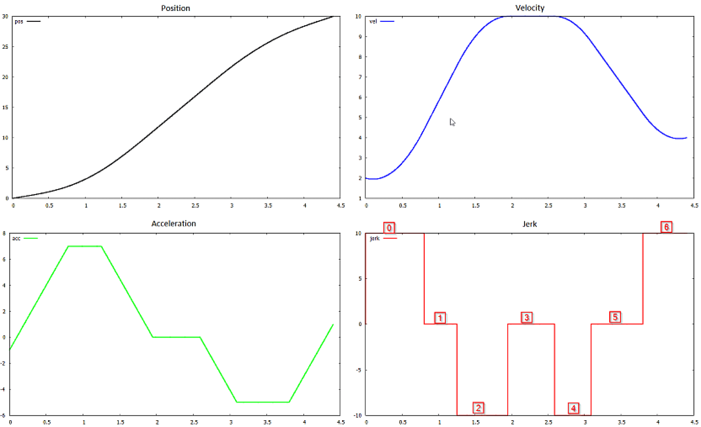
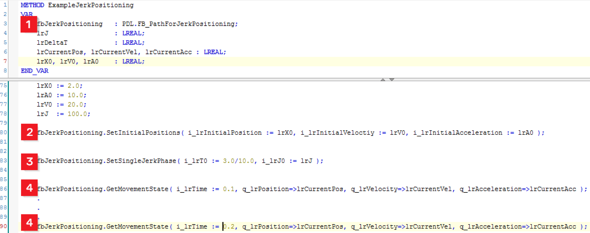

# Description

Description

Often positioning is done with movements that are composed by phases with linear acceleration.

Such movements can be constructed by applying phases with constant jerk.

The solution of the positioning job (x0,a0,v0)→(x1,v1,a1) is of such type with up to 7 jerk phases.

An example of such positioning is shown in graphic below.

There are some other movements that can be constructed with constant jerk phases as, for example, changing the velocity.

In this case 3 jerk phases are sufficient .

The function block FB\_PathForJerkPositioning allows a movement of up to 10 jerk phases.

Example of a 7-phase positioning. The jerk phases are assigned to the indices: 0, 1, …6.

But the concept of applying several phases of constant jerk is general. Thus the function block FB\_PathForJerkPositioning is used. It gets the initial state (x0,a0,v0) of a movement and several jerk phases, that are described with the jerk value j\_i and the duration t\_i of the phase. This defines the motion state for arbitrary time stamps during the jerk phases.

The function block FB\_PathForJerkPositioning is not a cyclic one. It is not necessary to traverse the path cyclically by calling the main body cyclically. The movement state can be checked in any order.

The function block FB\_PathForJerkPositioning is either the result of FB\_RgPosStartOp­timised or freely initialized by the specification of consecutive jerk phases.

FB\_PathForJerkPositioning uses seconds as time unit and a general length unit u.

Usage

oThe usage of this function block is explained by a simple project shown in figure below.

o1. Create an instance of FB\_PathForJerkPositioning.

o2. Initialize its starting point at t=0.

o3. Set the jerk phases (here just a single jerk phase).

o4. Then at any point of your program you can query the movement state at a specific time point t.

In case of FB\_PathForJerkPositioning as a result of FB\_RgPosStartOptimised the steps 2+3 are replaced by a simple assignment. Also refer to [FB\_RgPosStartOptimisedUsageStep 5](../Function_Blocks_R_to_Z/Function_Blocks_R_to_Z-8.htm#XREF_D_SE_0087349_1).

Exemplary usage of the function block FB\_PathForJerkPositioning

