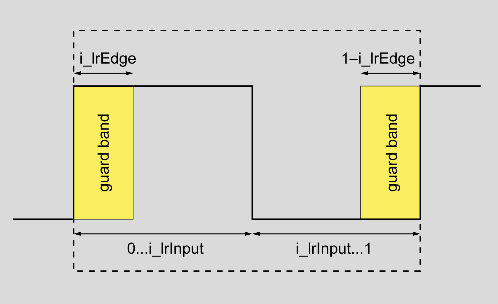

# Description

Description

The function implements a pulse width modulator (PWM). The PWM generates periodic BOOL output with the period 1/i\_timTimeBasis.

For an adjustable fraction i\_lrInput the output is TRUE.

A positive signal i\_xStart starts the modulation. The output begins with TRUE and holds this value for the duration i\_lrInput \* i\_timTimeBasis. Then it changes to FALSE for the duration (1-i\_lrInput) \* i\_timTimeBasis. This pattern is repeated periodically.

To prohibit too short TRUE-phases or too long FALSE-phases, there are guard bands with width i\_lrEdge placed at the borders of [0;1] (see figure below).

If i\_lrInput < i\_lrEdge the output is always set to FALSE.

If i\_lrInput > 1-i\_lrEdge the output is always set to TRUE.

If the signal at i\_xStart is removed, the output signal remains at its value until the function block is restarted through a positive signal at i\_xStart.

The more often the function block is called up cyclically during the duration of i\_timTimeBase, the more exactly the output periods correspond to the input signal.

Because of the cyclic behaviour of the function block the desired and achieved pulse properties might differ sligtly.

Assume c the cycle time, n to be the smallest integer with nc>i\_timTimeBasis and m the smallest integer with nc>i\_lrInput \* i\_timTimeBasis.

Then the TRUE-fraction of the output is m/n.

The value of i\_lrEdge should be in the range of 0...0.5.

