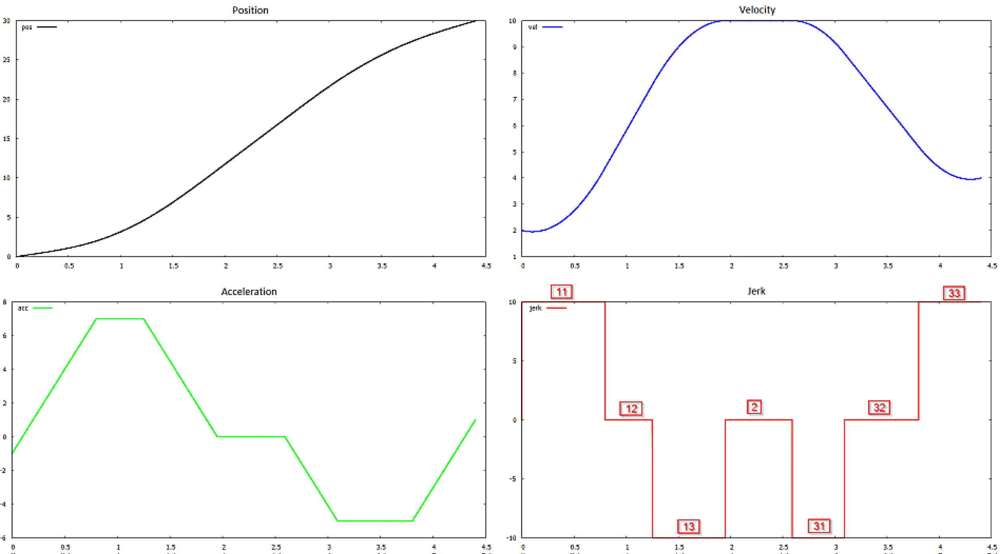
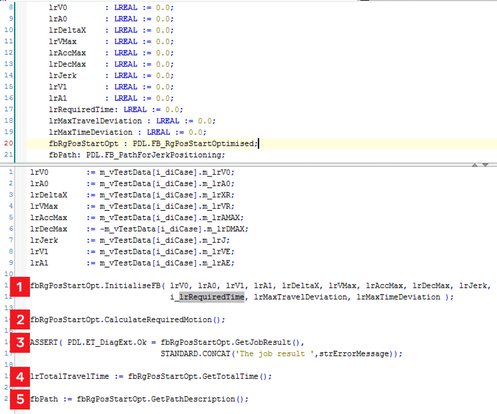

# Description

Description

A typical motion task is a positioning operation, for example, to change the velocity and acceleration within a specified movement distance.

During this motion some boundary conditions regarding the velocity, acceleration, and jerk must not be violated.

This task can be solved by applying 7 jerk phases. An example is shown in figure below.

The function block FB\_RgPosStartOptimised calculates the durations and the jerk values for these phases.

Example of a positioning path with all its phases

Usage

oThe usage of this function block (to calculate a positioning operation, with up to seven jerk phases) is explained by a simple project shown in figure below.

o 1. Initialize FB\_RgPosStartOptimised with the desired values of the positioning.

o2. Trigger the calculation of the positioning job.

o3. Check for errors via the method GetJobResult (shown here as example code within an ETEST project).

o4. With methods as GetTotalTime some information about the result can be accessed directly.

o5. By FB\_RgPosStartOptimised.GetPathDescription you can access the complete path information, which is available via the object oriented object [FB\_PathForJerkPositioning](../Function_Blocks_I_to_Q/Function_Blocks_I_to_Q-19.htm#XREF_D_SE_0087320_1) and its methods.

Example to create and access a positioning path

