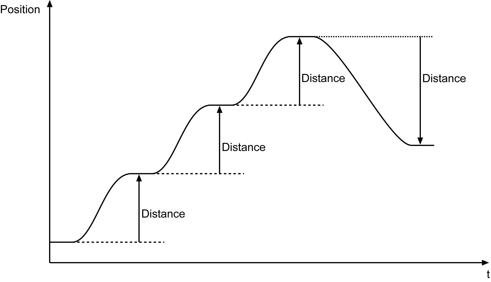

# Description

Description

A motion (positioning) to a position is possible using the function block. In doing so, the axis with a defined velocity and acceleration/deceleration is moved. The velocity profile of the motion development is trapezoidal as a default.

Velocity profile of the FB\_VarioPosTp function block.

Function block FB\_VarioPosTP / i\_etPosMode = 0 (endless)

Function block FB\_VarioPosTP / i\_etPosMode = 1 (relative)

Function block FB\_VarioPosTP / i\_etPosMode = 3 (absolute)

