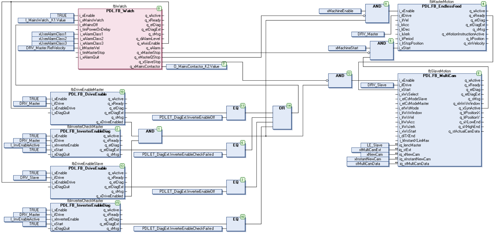

# Programming

Programming

The I\_MainsWatch feedback signal of the mains contactor is linked to the i\_xMainsWatch input of the [FB\_Watch](Function_Blocks_R_to_Z-36.htm#XREF_D_SE_0087381_1) function block.

The digital O\_MainsContactor output is linked to the q\_xMainsContactor output of the [FB\_Watch](Function_Blocks_R_to_Z-36.htm#XREF_D_SE_0087381_1).

The I\_InvEnable input is checked with the InverterEnable signal of the axes by means of the [FB\_InverterEnableDiag](../Function_Blocks_I_to_Q/Function_Blocks_I_to_Q-2.htm#XREF_D_SE_0087299_1) function block. The result is transferred to the i\_xMainsOff input of the [FB\_Watch](Function_Blocks_R_to_Z-36.htm#XREF_D_SE_0087381_1).

The q\_xMasterStop, the q\_xMasterQStop and the q\_xSlaveStop outputs of the [FB\_Watch](Function_Blocks_R_to_Z-36.htm#XREF_D_SE_0087381_1) are linked to controller signals of the master and slave axes of the machine.

The machine can then be stopped via the i\_xAlarmClass1 up to the i\_xAlarmClass3 input of the [FB\_Watch](Function_Blocks_R_to_Z-36.htm#XREF_D_SE_0087381_1).

NOTE: The displayed program example only serves as a demonstration for the use of the FB\_Watch function block and is not suitable for the direct use in production machines. It does not contain a logic to acklowledge alarms nor to control the machine, as it is usual for physical machines.