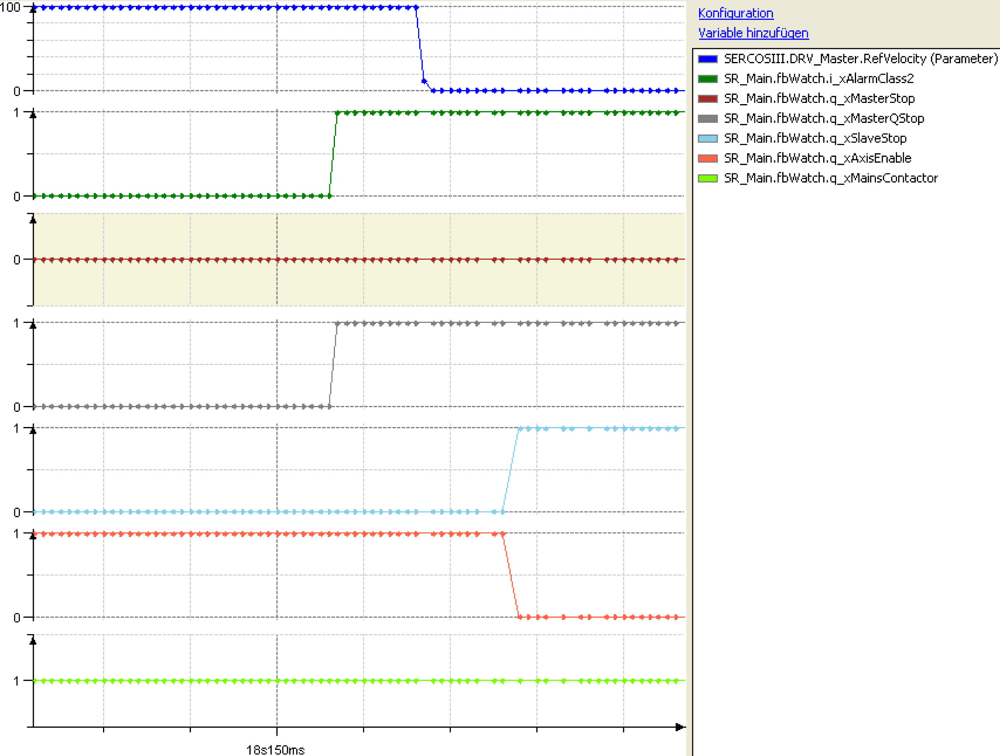

# Alarm Classes

Alarm Classes

The three following machine reactions can be realized via the i\_xAlarmClass1 up to the i\_xAlarmClass3 inputs.

Alarm class 1 has the highest priority, followed by class 2 and 3. This means that the execution of an alarm can be replaced by a higher priority alarm.

i\_xAlarmClass1:

oall axes are stopped in the best manner possible,

othe drives stop asynchronously to one another,

oq\_xAxisEnable is switched off,

owhen the safety wiring is used, the mains contactor is not de-energized.

i\_xAlarmClass2:

othe master axis is stopped immediately,

othe slave axes are stopped synchronously with the master axis

oq\_xAxisEnable is switched off,

owhen the safety wiring is used, the mains contactor is not de-energized.

i\_xAlarmClass3:

othe master axis is stopped at the end of the cycle,

othe slave axes are stopped synchronously with the master axis

oq\_xAxisEnable is not switched off,

owhen the safety wiring is used, the mains contactor is not de-energized.

