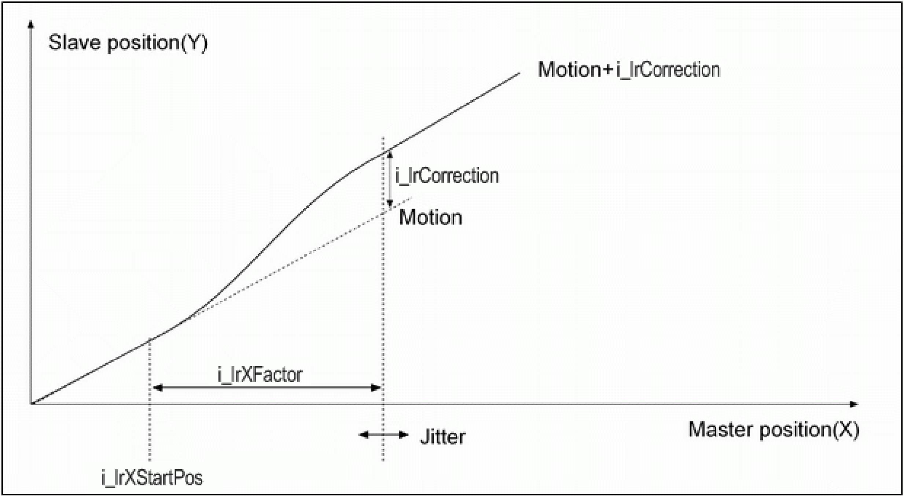

# Description

Description

The function block carries out a correction using the YOffset Generator (positioning) which has the beginning XStart and the duration XFactor, in conjunction with a master encoder Encoder.

NOTE: The positioning's velocity, acceleration and deceleration are determined in such a way that the correction is completed within the master encoder distance XFactor. This is only possible when the encoder velocity does not change during the position correction. Otherwise, the encoder distance within which the correction occurs changes.