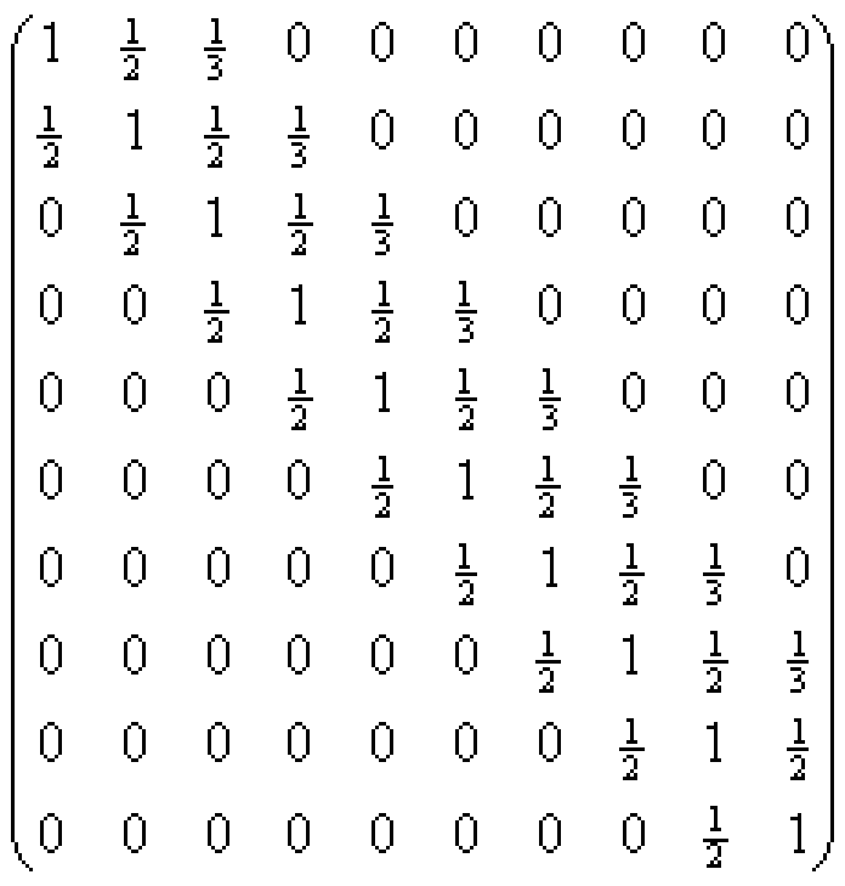

# Description

Description

A band matrix is a matrix that only contains the main diagonals and several secondary diagonals from zero different elements. Equation systems with band matrixes are commonly used (e.g. when calculating splines). They are frequently very large (> 1000 unknowns), so that the storage of the associated matrix in a square array would equate to an enormous waste of storage space (in the case of a 1000x1000 matrix for a spline, out of the 1000000 matrix elements only 3000 would be different from zero). Instead of this, one saves the matrix in an array that has the same number of lines as the matrix but only a few columns and respectively adapts itself to the Gauss Algorithm.

